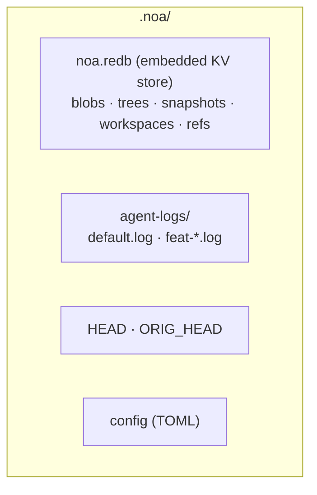

<div align="center"></div>
<h1 align="center">Noa</h1>
<div align="center">
 <strong>AI-native distributed version control system</strong>
</div>

<br />

<div align="center">
  <a href="https://github.com/celestia-island/noa/actions">
    
  </a>
  <a href="https://github.com/celestia-island/noa/actions">
    
  </a>
  <a href="https://crates.io/crates/libnoa">
    
  </a>
  <a href="https://docs.rs/libnoa">
    
  </a>
  <a href="LICENSE">
    
  </a>
  <a href="https://github.com/celestia-island/noa/releases">
    
  </a>
</div>

<br />

<div align="center">
  <strong>Docs</strong>:
  <a href="docs/en/README.md">English</a> ·
  <a href="docs/zh-hans/README.md">简体中文</a> ·
  <a href="docs/zh-hant/README.md">繁體中文</a> ·
  <a href="docs/ja/README.md">日本語</a> ·
  <a href="docs/ko/README.md">한국어</a> ·
  <a href="docs/fr/README.md">Français</a> ·
  <a href="docs/es/README.md">Español</a> ·
  <a href="docs/ru/README.md">Русский</a> ·
  <a href="docs/ar/README.md">العربية</a>
</div>

<br />

noa is an AI-native distributed version control system. It coexists with `.git` — git manages source code, noa manages AI agent iteration data — with per-agent zero-lock JSONL logs, snapshot-based history, and full git protocol compatibility.

## Why noa

| Challenge | Git | noa |
|-----------|-----|-----|
| **Concurrent writes** | Lock files, merge conflicts | Per-agent JSONL append-only logs |
| **Agent identity** | user.name/email per repo | Workspace-scoped agent_id |
| **Partial contributions** | All changes in working tree | Agent logs only touched files |
| **Iteration tracking** | Rebase/squash destroys history | Immutable snapshot chain per workspace |
| **Multi-agent merge** | Three-way text merge | Merge snapshots, file-level conflicts |
| **Git compatibility** | N/A | System git CLI bridge |

## Architecture



- **Workspace** — Isolated linear namespace for one agent, each with its own JSONL log
- **Snapshot** — Immutable point-in-time tree record (SHA-256 content-addressed)
- **Agent Log** — Append-only JSONL recording atomic file operations per workspace
- **Merge** — Three-way merge of workspace snapshots, upstream-wins default

## Quick Start

```bash
cd my-git-project
noa init                              # creates .noa/ alongside .git/
noa workspace create feat-auth -a agent-auth
noa snapshot create -m "add auth module"
noa push                              # export → git commit → git push
```

```toml
# Cargo dependency
[dependencies]
libnoa = { git = "https://github.com/celestia-island/noa" }
```

## Documentation

See [docs/](docs/) for design documents, user guides, and CLI reference — available in 9 languages.
[Design docs](docs/en/designs/) cover agent log, snapshot model, concurrency, merge strategy, object store, remote interop, and more.
[User guides](docs/en/guides/) cover getting started, architecture, workspace usage, CLI reference, and building from source.

## Related Projects

| Project | Role |
|---------|------|
| [entelecheia](https://github.com/celestia-island/entelecheia) | Multi-agent orchestration — consumes noa for workspace versioning |
| [tairitsu](https://github.com/celestia-island/tairitsu) | WASM component framework — future noa client as WASM component |
| [kirino](https://github.com/celestia-island/kirino) | Zero-trust auth/RBAC — used by noa-server |

## License

Apache-2.0. See [LICENSE](LICENSE).
