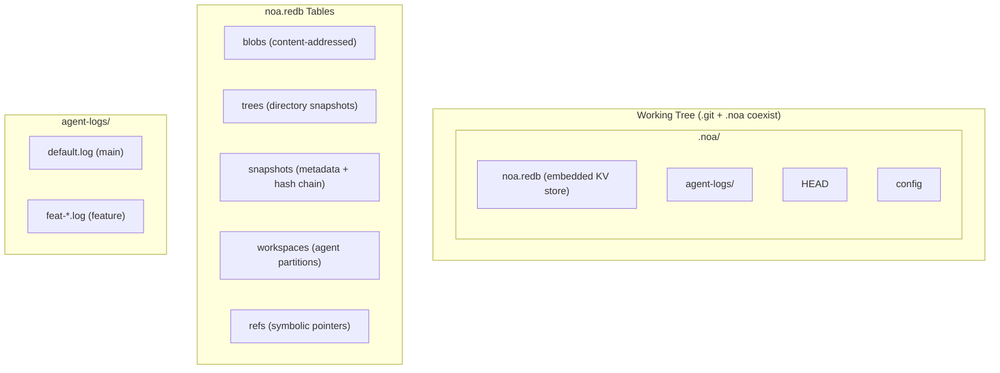
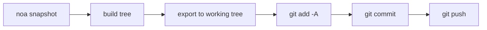
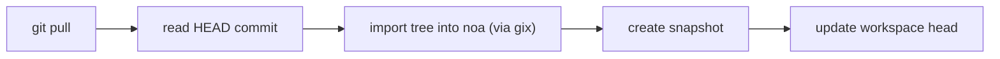
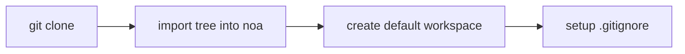

<div align="center"></div>
<h1 align="center">Noa</h1>
<div align="center">
 <strong>AI-native distributed version control system</strong>
</div>

<br />

<div align="center">
  <a href="https://github.com/celestia-island/noa/actions">
    
  </a>
  <a href="https://github.com/celestia-island/noa/actions">
    
  </a>
  <a href="https://crates.io/crates/libnoa">
    
  </a>
  <a href="https://docs.rs/libnoa">
    
  </a>
  <a href="LICENSE">
    
  </a>
  <a href="https://github.com/celestia-island/noa/releases">
    
  </a>
</div>

<br />

<div align="center">
  <strong>Documentation</strong>:
  <a href="docs/en/README.md">English</a> ·
  <a href="docs/zh-hans/README.md">简体中文</a> ·
  <a href="docs/zh-hant/README.md">繁體中文</a> ·
  <a href="docs/ja/README.md">日本語</a> ·
  <a href="docs/ko/README.md">한국어</a> ·
  <a href="docs/fr/README.md">Français</a> ·
  <a href="docs/es/README.md">Español</a> ·
  <a href="docs/ru/README.md">Русский</a> ·
  <a href="docs/ar/README.md">العربية</a>
</div>

<br />

noa is an AI-native distributed version control system. It coexists with `.git` — git manages source code, noa manages AI agent iteration data — with per-agent zero-lock JSONL logs, snapshot-based history, and full git protocol compatibility.

## Why noa

Traditional git treats all contributors the same — human or AI. But AI agents have fundamentally different needs:

| Challenge | Git's answer | noa's answer |
|-----------|-------------|--------------|
| **Concurrent writes** | Lock files, merge conflicts | Per-agent JSONL append-only logs |
| **Agent identity** | Config user.name/email per repo | Workspace-scoped agent_id with per-agent partitions |
| **Partial contributions** | One commit = all changes in working tree | Agent logs only the files it actually touched |
| **Iteration tracking** | Rebase/squash destroys history | Immutable snapshots chain per workspace |
| **Multi-agent merge** | Three-way merge on text | Merge snapshots, detect file-level conflicts |
| **Git protocol compatibility** | N/A | System git CLI bridge for clone/push/pull/fetch |

## Architecture



**Core concepts:**
- **Workspace**: Isolated linear namespace for one agent with its own JSONL log.
- **Snapshot**: Point-in-time record of a workspace tree (SHA-256 content-addressed).
- **Agent Log**: Append-only JSONL file recording atomic file operations.
- **Merge**: Three-way merge of two workspace snapshots against their common base.

## Quick Start

```bash
cd my-git-project
noa init                              # creates .noa/ alongside .git/
noa remote add origin "git@github.com:user/repo.git"
noa pull                              # import current git HEAD into noa

# Create agent workspaces and iterate
noa workspace create feat-auth -a agent-auth
noa workspace switch feat-auth
noa snapshot create -m "add auth module" -a agent-auth

# Merge and sync with git
noa workspace switch default
noa workspace merge feat-auth
noa push
```

## Git Integration

### Push Workflow



### Pull Workflow



### Clone Workflow



## Commands

| Category | Commands |
|----------|----------|
| **Workspace** | `create`, `switch`, `list`, `delete`, `merge` |
| **Snapshot** | `create -m <msg> [-a <author>]`, `list`, `diff <a> <b>` |
| **Remote** | `add`, `remove`, `list`, `fetch`, `pull`, `push` |
| **Repo** | `init`, `clone`, `clone --svn`, `status`, `log` |

See [CLI Reference](docs/en/guides/cli-reference.md) for full details.

## Compatibility

| Provider | Protocol | Push | Pull | Clone | LFS |
|----------|----------|------|------|-------|-----|
| **GitHub** | HTTPS, SSH | ✓ | ✓ | ✓ | ✓ |
| **Bitbucket** | HTTPS, SSH | ✓ | ✓ | ✓ | ✓ |
| **GitLab** | HTTPS, SSH | ✓ | ✓ | ✓ | ✓ |
| **Local bare repo** | file:// | ✓ | ✓ | ✓ | ✓ |
| **SVN** | svn:// | Import only | — | `--svn` | — |

## API (libnoa)

```toml
[dependencies]
libnoa = { git = "https://github.com/celestia-island/noa" }
```

```rust
use libnoa::repo::Repository;

let repo = Repository::open(&path)?;
let ws_mgr = repo.workspace_manager()?;
ws_mgr.create(&Workspace {
    name: "feat-x".into(),
    head: base_snap_id.clone(),
    base: base_snap_id.clone(),
    agent_id: Some("my-agent".into()),
    created_at: now, updated_at: now,
}).await?;

let snapshot = SnapshotEngine::new(
    FileAgentLog::new(&path, "my-agent")?,
    repo.snapshot_store()?, repo.object_store()?,
)
.with_repo_root(repo.root.clone())
.compute("feat-x", vec![], "author", "message").await?;
```

## Documentation

Full documentation is available in 9 languages. See:

- [Design Documents](docs/en/designs/) — Architecture, concurrency, merge strategy, object store, etc.
- [User Guides](docs/en/guides/) — Getting started, CLI reference, workspace guide, etc.

## Related Projects

| Project | Relationship |
|---------|-------------|
| [entelecheia](https://github.com/celestia-island/entelecheia) | Multi-agent orchestration platform. Consumes noa for agent workspace versioning. |
| [tairitsu](https://github.com/celestia-island/tairitsu) | WASM component model framework. Future: noa client as WASM component. |
| [kirino](https://github.com/celestia-island/kirino) | Zero-trust auth/RBAC. Used by noa-server for authentication. |

## License

Apache-2.0. See [LICENSE](LICENSE).
