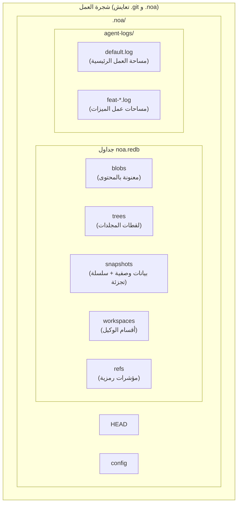
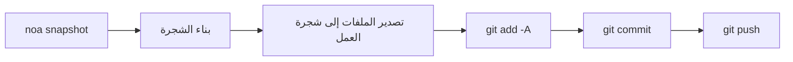
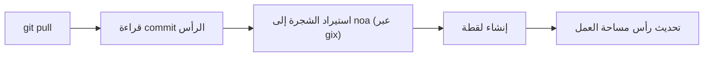
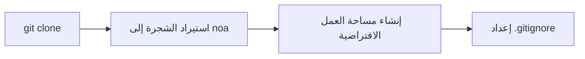

<div align="center"></div>
<h1 align="center">Noa</h1>
<div align="center">
  <strong>نظام تحكم بالإصدارات موزّع ومبني على الذكاء الاصطناعي</strong>
</div>

<br />

<div align="center">
  <a href="https://github.com/celestia-island/noa/actions">
    
  </a>
  <a href="https://github.com/celestia-island/noa/actions">
    
  </a>
  <a href="https://crates.io/crates/libnoa">
    
  </a>
  <a href="https://docs.rs/libnoa">
    
  </a>
  <a href="../../LICENSE">
    
  </a>
  <a href="https://github.com/celestia-island/noa/releases">
    
  </a>
</div>

noa هو نظام تحكم بالإصدارات موزّع ومبني على الذكاء الاصطناعي. يتعايش مع `.git` — حيث يدير git الشيفرة المصدرية، بينما يدير noa بيانات تكرار وكلاء الذكاء الاصطناعي — مع سجلات JSONL خالية من الأقفال لكل وكيل، وتاريخ قائم على اللقطات (snapshots)، وتوافق كامل مع بروتوكول git.

## جدول المحتويات

- [لماذا noa](#لماذا-noa)
- [الهندسة المعمارية](#الهندسة-المعمارية)
- [التثبيت](#التثبيت)
- [البدء السريع](#البدء-السريع)
- [الأوامر](#الأوامر)
- [التكامل مع Git](#التكامل-مع-git)
- [التوافق](#التوافق)
- [واجهة برمجة التطبيقات (libnoa)](#واجهة-برمجة-التطبيقات-libnoa)
- [البناء من المصدر](#البناء-من-المصدر)
- [مشاريع ذات صلة](#مشاريع-ذات-صلة)
- [الترخيص](#الترخيص)

## لماذا noa

يعامل git التقليدي جميع المساهمين بنفس الطريقة — سواء كانوا بشرًا أو وكلاء ذكاء اصطناعي. لكن وكلاء الذكاء الاصطناعي لديهم احتياجات مختلفة جوهريًا:

| التحدي | حل Git | حل noa |
|-----------|-------------|--------------|
| **الكتابة المتزامنة** | أقفال الملفات، تعارضات الدمج | سجلات JSONL إلحاقية لكل وكيل |
| **هوية الوكيل** | ضبط user.name/email لكل مستودع | agent_id بنطاق مساحة العمل مع أقسام لكل وكيل |
| **المساهمات الجزئية** | commit واحد = جميع التغييرات في شجرة العمل | يسجل سجل الوكيل الملفات التي لمسها فقط |
| **تتبع التكرارات** | rebase/squash يدمر التاريخ | سلسلة لقطات غير قابلة للتغيير لكل مساحة عمل |
| **الدمج متعدد الوكلاء** | دمج ثلاثي على النص | دمج اللقطات، اكتشاف التعارضات على مستوى الملف |
| **التوافق مع بروتوكول Git** | غير متاح | جسر CLI للنظام لعمليات clone/push/pull/fetch |

## الهندسة المعمارية



**المفاهيم الأساسية:**

- **مساحة العمل (Workspace)**: نطاق خطي معزول لوكيل واحد. لكل منها سجل JSONL خاص بها.
- **اللقطة (Snapshot)**: سجل لحظي لشجرة مساحة العمل (blobs + trees معنونة بالمحتوى باستخدام SHA-256).
- **سجل الوكيل (Agent Log)**: ملف JSONL إلحاقي يسجل عمليات الملفات الذرية (`write`، `delete`، `rename`) مع معرفات blobs والطوابع الزمنية.
- **الدمج (Merge)**: دمج ثلاثي للقطتي مساحة عمل مقابل القاعدة المشتركة بينهما.

## التثبيت

### من إصدارات GitHub

```bash
# حمّل أحدث إصدار ثنائي لمنصتك:
#   https://github.com/celestia-island/noa/releases

chmod +x noa
mv noa /usr/local/bin/
```

### من المصدر (يتطلب Rust 1.85+)

```bash
git clone https://github.com/celestia-island/noa.git
cd noa
cargo build --release
# الملفات الثنائية: target/release/noa, target/release/noa-server
```

### كمكتبة (Cargo)

```toml
[dependencies]
libnoa = { git = "https://github.com/celestia-island/noa" }
```

ملاحظة: اسم الحزمة على crates.io هو `libnoa` (الاسم `noa` كان محجوزًا مسبقًا). الملف الثنائي لا يزال اسمه `noa`.

## البدء السريع

### التهيئة في مستودع git موجود

```bash
cd my-git-project
noa init                              # ينشئ .noa/ بجانب .git/
noa remote add origin "git@github.com:user/repo.git"
noa pull                              # يستورد HEAD الحالي من git إلى noa
```

### إنشاء مساحات عمل للوكلاء والتكرار

```bash
# الوكيل A يعمل على ميزة المصادقة
noa workspace create feat-auth -a agent-auth
noa workspace switch feat-auth

# الوكيل يكتب إلى سجل الوكيل الخاص به
# (وكلاء الذكاء الاصطناعي يكتبون JSONL مباشرة؛ هذا مثال يدوي)
cat >> .noa/agent-logs/feat-auth.log << EOF
{"seq":1,"op":"write","path":"src/auth.rs","blob_id":"<sha256>","ts":1717000000000000}
EOF

# احفظ حالة مساحة العمل
noa snapshot create -m "add auth module" -a agent-auth
```

### دمج الميزات والمزامنة مع git

```bash
noa workspace switch default
noa workspace merge feat-auth          # يدمج في default
noa push                               # يصدر إلى git commit + git push
```

## الأوامر

### إدارة مساحات العمل

```bash
noa workspace create <name> [-a <agent-id>]   # إنشاء مساحة عمل جديدة
noa workspace switch <name>                    # تبديل مساحة العمل النشطة
noa workspace list                              # عرض جميع مساحات العمل
noa workspace delete <name>                     # حذف مساحة عمل
noa workspace merge <from>                      # دمج مساحة عمل أخرى في الحالية
```

### إدارة اللقطات

```bash
noa snapshot create -m <msg> [-a <author>]     # إنشاء لقطة من سجل الوكيل
noa snapshot list                               # عرض اللقطات
noa snapshot diff <id-a> <id-b>                # مقارنة لقطتين (على مستوى الملف)
```

### العمليات البعيدة

```bash
noa remote add <name> <url>                     # إضافة مستودع بعيد
noa remote remove <name>                        # إزالة مستودع بعيد
noa remote list                                 # عرض المستودعات البعيدة
noa fetch [-r <remote>]                         # عرض المراجع البعيدة
noa pull [-r <remote>]                          # git pull + إعادة استيراد إلى noa
noa push [-r <remote>]                          # تصدير اللقطة → git commit → git push
```

### عمليات المستودع

```bash
noa init [-p <path>] [--noa-remote <url>]      # تهيئة مستودع .noa/
noa clone <url> [-p <path>]                     # git clone + استيراد إلى noa
noa clone --svn <url> [-p <path>]              # تصدير SVN → git init → استيراد إلى noa
noa status                                       # عرض حالة مساحة العمل الحالية
noa log [-w <workspace>] [-n <limit>]          # عرض تاريخ اللقطات
```

## التكامل مع Git

يستخدم noa واجهة `git` CLI للنظام في جميع عمليات الشبكة. وهذا يضمن توافقًا بنسبة 100% مع أي مستودع git بعيد.

### سير عمل الدفع (Push)



### سير عمل السحب (Pull)



### سير عمل الاستنساخ (Clone)



### قرارات التصميم الرئيسية

- **التصدير تراكمي**: فقط الملفات الموجودة في لقطة noa تُكتب إلى شجرة العمل. ملفات git الموجودة مسبقًا والتي ليست في اللقطة تبقى دون تغيير.
- **الاستيراد يستخدم gix**: لاستعراض الشجرة المحلية (لا حاجة للشبكة). عمليات الشبكة تستخدم `git` CLI للنظام.
- **`.noa/` يُضاف تلقائيًا إلى gitignore**: الأمر `noa init` يُلحق `.noa/` إلى `.gitignore` حتى لا تتسرب بيانات الوكيل إلى تاريخ git.

## التوافق

### المنصات المُختبرة

| المزوّد | البروتوكول | Push | Pull | Clone | LFS |
|----------|----------|------|------|-------|-----|
| **GitHub** | HTTPS, SSH | ✓ | ✓ | ✓ | ✓ |
| **Bitbucket** | HTTPS, SSH | ✓ | ✓ | ✓ | ✓ |
| **GitLab** | HTTPS, SSH | ✓ | ✓ | ✓ | ✓ |
| **مستودع bare محلي** | file:// | ✓ | ✓ | ✓ | ✓ |
| **SVN** | svn:// | استيراد فقط | — | `--svn` | — |

### Git LFS

يكتشف noa تلقائيًا مستودعات Git LFS:

- `noa clone`: يشغل `git lfs install` + `git lfs pull` للمستودعات المتتبعة بـ LFS
- `noa push`: يشغل `git lfs push --all` بعد git push
- `noa pull`: يشغل `git lfs pull` بعد git pull
- ملفات مؤشرات LFS تُستورد كـ blobs عادية في noa

### SVN

```bash
noa clone --svn file:///path/to/svn/repo -p ./my-project
```

هذا ينفذ `svn export trunk → git init → noa import`. إنه **استيراد لمرة واحدة** — للمزامنة التزايدية، استخدم `svn export` + `noa snapshot create` بجدول زمني.

### Bitbucket

كلا نمطي SSH (`git@bitbucket.org:ws/repo.git`) و HTTPS (`https://user@bitbucket.org/ws/repo.git`) مدعومان بشكل أصلي عبر جسر git.

## واجهة برمجة التطبيقات (libnoa)

تعرض libnoa واجهة برمجة تطبيقات Rust لتضمين وظائف noa في أدوات أخرى:

```rust
use libnoa::repo::Repository;
use libnoa::snapshot::SnapshotEngine;
use libnoa::log::FileAgentLog;

// افتح مستودعًا
let repo = Repository::open(&path)?;

// أنشئ مساحة عمل
let ws_mgr = repo.workspace_manager()?;
ws_mgr.create(&Workspace {
    name: "feat-x".into(),
    head: base_snap_id.clone(),
    base: base_snap_id.clone(),
    agent_id: Some("my-agent".into()),
    created_at: now,
    updated_at: now,
}).await?;

// ابنِ لقطة من سجلات الوكيل
let engine = SnapshotEngine::new(
    FileAgentLog::new(&path, "my-agent")?,
    repo.snapshot_store()?,
    repo.object_store()?,
)
.with_repo_root(repo.root.clone());
let snapshot = engine.compute("feat-x", vec![], "author", "message").await?;

// صدّر اللقطة إلى git
libnoa::git::export_noa_to_git(&repo.root, repo.db.clone()).await?;
```

راجع `tests/smoke.rs` و `tests/compat.rs` لمزيد من أمثلة الاستخدام.

## البناء من المصدر

```bash
# المتطلبات الأساسية: Rust 1.85+, git, pkg-config (اختياري لـ LFS/SVN)
git clone https://github.com/celestia-island/noa.git
cd noa

# بناء
cargo build --release
# المخرجات: target/release/noa (CLI), target/release/noa-server (خادم API)

# تشغيل الاختبارات
cargo test -- --test-threads=1

# بدء خادم noa
NOA_PORT=3000 NOA_DB_PATH=/data/noa/server.redb target/release/noa-server
```

## مشاريع ذات صلة

| المشروع | العلاقة |
|---------|-------------|
| [entelecheia](https://github.com/celestia-island/entelecheia) | منصة تنسيق متعددة الوكلاء. تستهلك noa لتعيين إصدارات مساحات عمل الوكلاء. |
| [tairitsu](https://github.com/celestia-island/tairitsu) | إطار عمل مكونات WASM. مستقبلًا: عميل noa كمكون WASM. |
| [kirino](https://github.com/celestia-island/kirino) | مصادقة/RBAC بدون ثقة. يستخدمه noa-server للمصادقة. |

## الترخيص

Apache-2.0. راجع [LICENSE](../../LICENSE).
