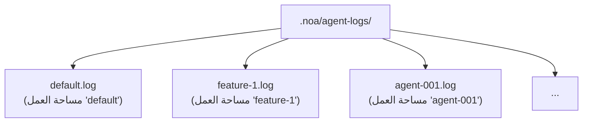
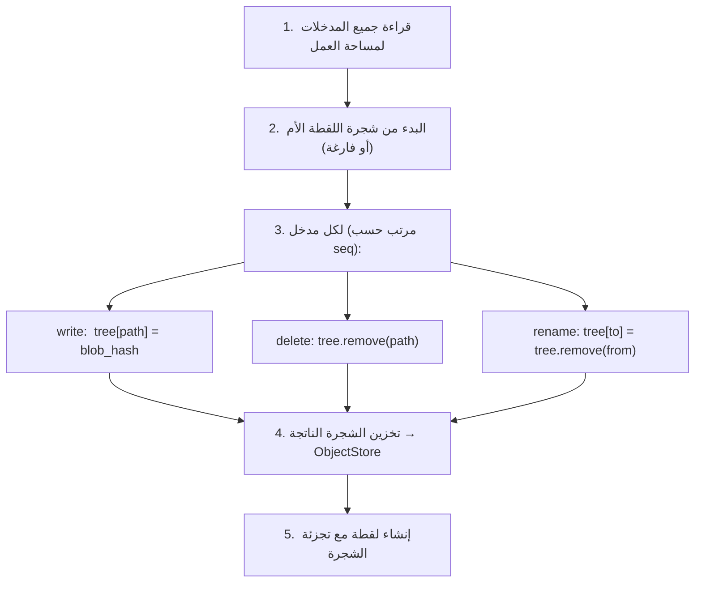
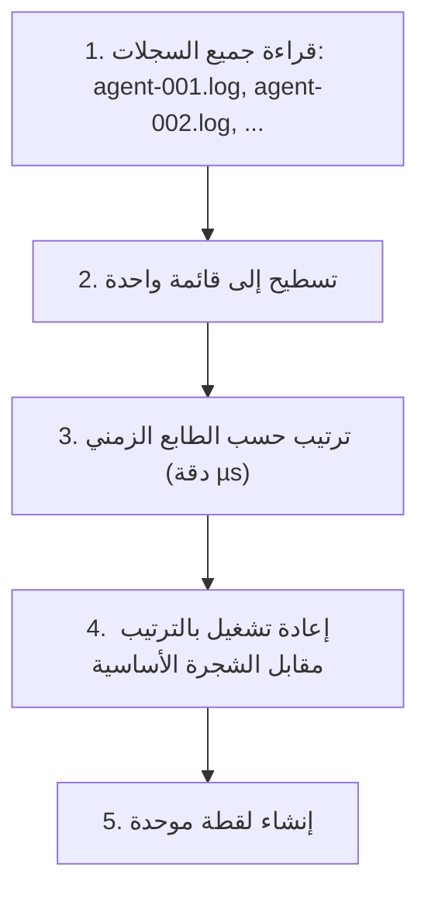

# تصميم سجل الوكيل

## نظرة عامة

سجل الوكيل (AgentLog) هو طبقة الكتابة عالية الإنتاجية في noa. يوفر ملفات JSONL إلحاقية لكل مساحة عمل، مما يتيح كتابة متزامنة بدون أقفال من وكلاء ذكاء اصطناعي متعددين.

## تنسيق مدخل السجل

كل سطر هو كائن JSON:

```jsonl
{"seq":1,"op":"write","path":"src/main.rs","blob":"a1b2c3...","ts":1717592400000000}
{"seq":2,"op":"delete","path":"src/old.rs","ts":1717592401000000}
{"seq":3,"op":"rename","from":"src/foo.rs","to":"src/bar.rs","ts":1717592402000000}
{"seq":4,"op":"snapshot","snapshot_id":"noa_z7x9","parent":"noa_y6w8","message":"feat","ts":1717592405000000}
{"seq":5,"op":"merge","from_workspace":"feature-1","from_snapshot":"noa_abc","base":"noa_def","ts":1717592408000000}
```

### الحقول

| الحقل | النوع | الوصف |
|-------|------|-------------|
| `seq` | u64 | رقم تسلسلي رتيب لكل مساحة عمل |
| `op` | string | نوع العملية: write, delete, rename, snapshot, merge |
| `path` | string | مسار الملف الهدف (write, delete) |
| `blob` | string | تجزئة blob (write) |
| `from` | string | مسار المصدر (rename) |
| `to` | string | مسار الوجهة (rename) |
| `ts` | u64 | طابع زمني Unix بدقة الميكروثانية |

## هيكل الملفات



كل مساحة عمل تحصل على ملف سجل واحد بالضبط. اسم الملف يطابق اسم مساحة العمل.

## مسار الكتابة

```rust
async fn append(&self, workspace: &str, entry: &LogEntry) -> Result<()> {
    let file = self.get_or_create_file(workspace)?;
    let line = serde_json::to_string(entry)? + "\n";
    file.write_all(line.as_bytes())?;
    file.sync_data()?;  // fdatasync للمتانة
    Ok(())
}
```

الخصائص الرئيسية:
- **O_APPEND**: يضمن النواة ذرية الإلحاقات
- **fsync لكل كتابة**: يضمن المتانة بعد العطل
- **واصف ملف واحد لكل مساحة عمل**: مخزن مؤقتًا في الذاكرة للأداء

## مسار القراءة

```rust
async fn read_all(&self, workspace: &str) -> Result<Vec<LogEntry>> {
    let path = self.log_dir.join(format!("{}.log", workspace));
    let content = tokio::fs::read_to_string(&path).await?;
    content.lines()
        .filter(|l| !l.is_empty())
        .map(|l| serde_json::from_str(l))
        .collect::<Result<Vec<_>, _>>()
        .map_err(|e| NoaError::Serialization(e.to_string()))
}
```

## حساب اللقطة

يقوم `SnapshotEngine` بإعادة تشغيل مدخلات السجل لبناء شجرة:



## التوحيد

عند الحاجة لدمج سجلات وكلاء متعددة:



## مقارنة: لماذا ليس...

### SQLite لسجلات الوكلاء؟

- **تضخيم الكتابة**: تحديثات SQLite B-tree للإلحاقات المتسلسلة
- **الأقفال**: SQLite يستخدم أقفال WAL (كاتب واحد)
- **عبء fsync**: SQLite يصدر fsync متعددة لكل معاملة
- **مبالغة**: سجلات الوكلاء إلحاقية فقط — لا قراءات أو تحديثات عشوائية

### redb لسجلات الوكلاء؟

- **كاتب واحد**: MVCC في redb يتطلب معاملة كتابة
- **تنازع**: وكلاء متعددون يكتبون إلى نفس قاعدة البيانات → متسلسلون
- **غير مُحسَّن للإلحاق**: redb هو مخزن KV عام الأغراض

### مخزن مؤقت في الذاكرة؟

- **المتانة**: عطل العملية يفقد جميع الكتابات المخزنة مؤقتًا
- **ضغط الذاكرة**: 100 وكيل × 1000 كتابة = 100K مدخل في الذاكرة
- **التعقيد**: يتطلب خيط تفريغ في الخلفية مع استرداد من الأعطال

### JSONL عادي مع O_APPEND؟

✅ هذا ما يستخدمه noa:
- **أدنى عبء**: كتابة واحدة + fsync واحد لكل مدخل
- **ذرية مضمونة من النواة**: O_APPEND على POSIX
- **استرداد من الأعطال**: فقط آخر مدخل قد يكون جزئيًا (يُكتشف بسطر جديد لاحق)
- **مقروء بشريًا**: JSONL قابل للفحص بأدوات قياسية
- **صفر تنازع على الأقفال**: ملف واحد لكل مساحة عمل

## الأداء

قياس الأداء (ext4, SSD, Linux):

| المقياس | القيمة |
|--------|-------|
| زمن كتابة واحدة | ~0.05ms (إلحاق + fdatasync) |
| الإنتاجية (مساحة عمل واحدة) | ~20,000 كتابة/ثانية |
| الإنتاجية (100 مساحة عمل) | ~10,000+ كتابة/ثانية |
| حجم الملف لكل 1M مدخل | ~200MB (متوسط 200 بايت/مدخل) |

## استرداد من الأعطال

عند بدء التشغيل، فحص كل ملف سجل:
1. قراءة جميع الأسطر الكاملة (المنتهية بـ `\n`)
2. تجاهل آخر سطر إذا كان مبتورًا (كتابة غير مكتملة)
3. التحقق من أن `seq` يتزايد بشكل رتيب
4. إعادة بناء الحالة في الذاكرة من المدخلات الصالحة

هذا يضمن عدم استخدام مدخلات جزئية أو تالفة لحساب اللقطات.
