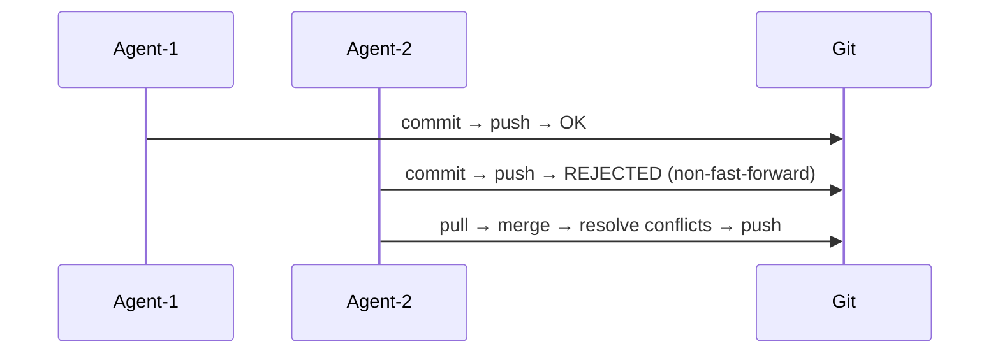
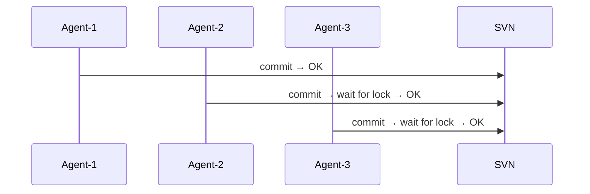
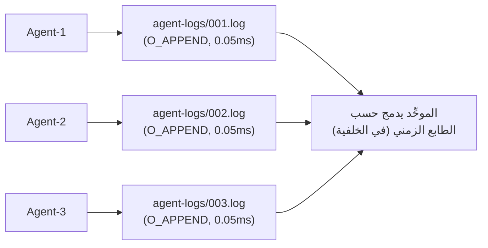
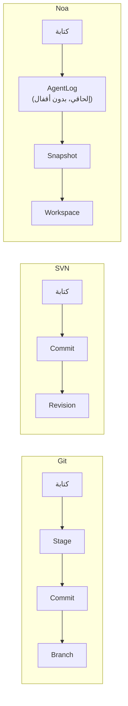
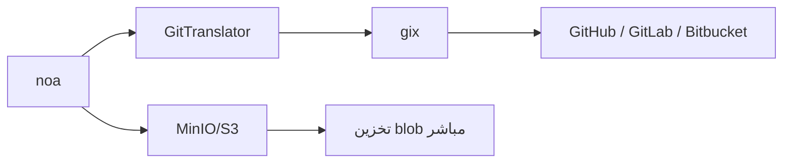

# noa مقابل Git مقابل SVN مقابل Bitbucket: تحليل مقارن

## ملخص تنفيذي

noa هو نظام تحكم بالإصدارات مصمم خصيصًا لسير عمل وكلاء الذكاء الاصطناعي. على عكس Git و SVN و Bitbucket (التي تغلف Git/SVN)، يُحسِّن noa **الكتابة المتزامنة عالية التواتر من جهات غير بشرية** — عشرات إلى مئات وكلاء الذكاء الاصطناعي يعدلون الملفات في وقت واحد دون تنازع على الأقفال.

---

## مصفوفة مقارنة الميزات

| الميزة | noa | Git | SVN | Bitbucket |
|---------|-----|-----|-----|-----------|
| **الهندسة** | KV مدمج + سجلات إلحاقية | DAG معنون بالمحتوى | مخزن دلتا مركزي | استضافة Git/SVN |
| **نموذج التزامن** | سجلات إلحاقية لكل مساحة عمل (بدون أقفال) | أقفال على مستوى الفروع (تعارضات دمج) | خادم مركزي يتسلسل | مثل Git/SVN |
| **استراتيجية الدمج** | ثلاثية، upstream-wins افتراضيًا | ثلاثية، حل يدوي | دمج يدوي | مثل Git/SVN |
| **دقة اللقطات** | طوابع زمنية بالميكروثانية، لكل وكيل | لكل commit (إيقاع بشري) | لكل مراجعة | مثل Git/SVN |
| **أصلي للوكلاء** | نعم — مساحة عمل لكل وكيل، سجلات وكيل | لا — مصمم لسير العمل البشري | لا | لا |
| **خلفية التخزين** | قابلة للتوصيل (redb محلي، MinIO/S3 عن بعد) | ملفات pack + كائنات مفردة | Berkeley DB / FSFS | تخزين جانب الخادم |
| **موزع** | نعم (دفع/سحب عن بعد عبر جسر Git) | نعم (أصلي) | لا (مركزي) | نعم (مستضاف) |
| **مقارنة ثنائية** | blobs معنونة بالمحتوى (بدون دلتا) | ضغط دلتا على مستوى pack | دلتا جانب الخادم | مثل Git/SVN |
| **الأقفال** | لا شيء للكتابة (سجلات إلحاقية) | أقفال استشارية فقط | `svn:needs-lock` | مثل Git/SVN |
| **HTTP API** | مدمج (noa-server) | git-http-backend | WebDAV | REST API |
| **منحنى التعلم** | أدنى (6 أوامر) | حاد (~40 أمرًا) | متوسط | متوسط |

---

## مقارنة مفصلة

### 1. التزامن

**Git**: فرع واحد = كاتب واحد في كل مرة. الكتّاب المتزامنون ينشئون تواريخ متباعدة يجب تسويتها عبر الدمج. تتطلب تعارضات الدمج تدخلًا بشريًا.



**SVN**: الخادم المركزي يتسلسل جميع الـ commits. يتوفر قفل على مستوى الملف لكنه يخلق اختناقات.



**noa**: كل وكيل يكتب إلى ملف سجل إلحاقي خاص به. لا تنازع على الأقفال بالتصميم. الدمج يحدث بشكل غير متزامن.



### 2. نموذج البيانات

**Git**: Blob → Tree → Commit → Branch → Ref. معنون بالمحتوى بـ SHA-1. كائنات غير قابلة للتغيير. الفروع مؤشرات قابلة للتغيير.

**SVN**: ملف/مجلد → مراجعة. أرقام مراجعة خطية. المسارات كيانات من الدرجة الأولى.

**noa**: Blob → Tree → Snapshot → Workspace. معنون بالمحتوى بـ SHA-256. اللقطات غير قابلة للتغيير. مساحات العمل مؤشرات قابلة للتغيير مع تحديثات CAS.

الفرق الرئيسي: طبقة **AgentLog** في noa تقع بين كتابات الوكيل وطبقة اللقطات غير القابلة للتغيير، موفرة مخزنًا مؤقتًا للعمليات عالية التواتر.



### 3. فلسفة الدمج

**Git**: دمج ثلاثي مع حل تعارضات بشري. التعارضات تعيق التقدم حتى تُحل.

**SVN**: تتبع دمج يدوي. حل التعارضات على مستوى الملف.

**noa**: دمج ثلاثي مع حل تلقائي قابل للتكوين (الافتراضي: upstream-wins). مصمم لوكلاء الذكاء الاصطناعي الذين يمكنهم إعادة تطبيق التغييرات بدلاً من حل التعارضات يدويًا.

الأساس المنطقي: وكلاء الذكاء الاصطناعي لا يحتاجون لرؤية علامات التعارض — يمكنهم إعادة توليد تغييراتهم مقابل أحدث حالة. استراتيجية "upstream-wins" تضمن التقدم المستمر.

### 4. كفاءة التخزين

**Git**: ملفات pack مع ضغط دلتا. مُحسَّن لتواتر commit بمقياس بشري (~10-100 commit/يوم).

**SVN**: تخزين دلتا جانب الخادم. كفء للملفات الثنائية الكبيرة.

**noa**: blobs معنونة بالمحتوى بدون ضغط دلتا. اللقطات مشفرة بـ msgpack. المقايضة: تنفيذ أبسط، كتابات أسرع، تخزين أكبر. مقبول لأن:
- مخرجات وكيل الذكاء الاصطناعي غالبًا ما تُعاد توليدها (الإصدارات القديمة مؤقتة)
- التخزين رخيص؛ إنتاجية الوكيل مكلفة
- خلفية MinIO/S3 تتعامل مع إلغاء التكرار

### 5. التوافق البُعدي

**Git**: بروتوكول أصلي (git://, https://, ssh://). عالمي.

**SVN**: svn://, http://. مرتبط بـ Apache/Subversion.

**noa**: جسر Git عبر `gix` (gitoxide). يمكن الدفع/السحب من أي مستودع Git بعيد. كما يدعم خلفية MinIO/S3 الأصلية لتخزين الكائنات المباشر.



### 6. التحكم بالوصول

**Git**: صلاحيات نظام الملفات أو hooks جانب الخادم (pre-receive، إلخ).

**SVN**: ACLs مبنية على المسار ومدمجة في البروتوكول.

**Bitbucket**: صلاحيات الفروع، فحوصات الدمج، متطلبات مراجعة الشيفرة.

**noa**: عزل على مستوى مساحة العمل. كل وكيل يمكنه فقط الكتابة إلى مساحة العمل المخصصة له. الدمج إلى الفروع المشتركة يتطلب إجراءً صريحًا. مصادقة جانب الخادم عبر noa-server.

---

## متى تستخدم ماذا

| السيناريو | الخيار الأفضل | السبب |
|----------|-------------|--------|
| تطوير برمجيات بشري | Git | نظام بيئي ناضج، أدوات عالمية |
| توليد شيفرة بوكلاء ذكاء اصطناعي (10+ وكلاء) | noa | كتابة متزامنة بدون أقفال |
| امتثال مؤسسي + تدقيق | SVN | مركزي، ACLs مبنية على المسار |
| تعاون فريق + CI/CD | Bitbucket | خطوط أنابيب مدمجة، PRs، مراجعات |
| تنسيق وكلاء ذكاء اصطناعي + مراجعة بشرية | noa → جسر Git | الوكلاء يعملون في noa، البشر يراجعون عبر Git |
| موارد ثنائية كبيرة | SVN أو Git LFS | ضغط دلتا للثنائيات |
| أجهزة مدمجة / طرفية | noa | ثنائي واحد، redb مدمج، بدون خادم |

---

## مسارات الانتقال

### noa ↔ Git

```bash
# تصدير لقطات noa إلى Git
noa remote add origin https://github.com/example/repo.git
noa push --remote origin

# استيراد تاريخ Git إلى noa
noa clone https://github.com/example/repo.git
```

يحول `GitTranslator` بين تنسيق blob/tree في noa وتنسيق كائنات Git. تُعيّن اللقطات إلى Git commits؛ وتُعيّن مساحات العمل إلى فروع.

### Git → noa

ليس بديلاً — noa هو **مكمل** لـ Git لسير عمل وكلاء الذكاء الاصطناعي. استخدم كليهما:
1. يعمل وكلاء الذكاء الاصطناعي في مساحات عمل noa
2. التغييرات المعتمدة تندمج إلى Git عبر push
3. يستمر المطورون البشر في استخدام Git كما كان من قبل
