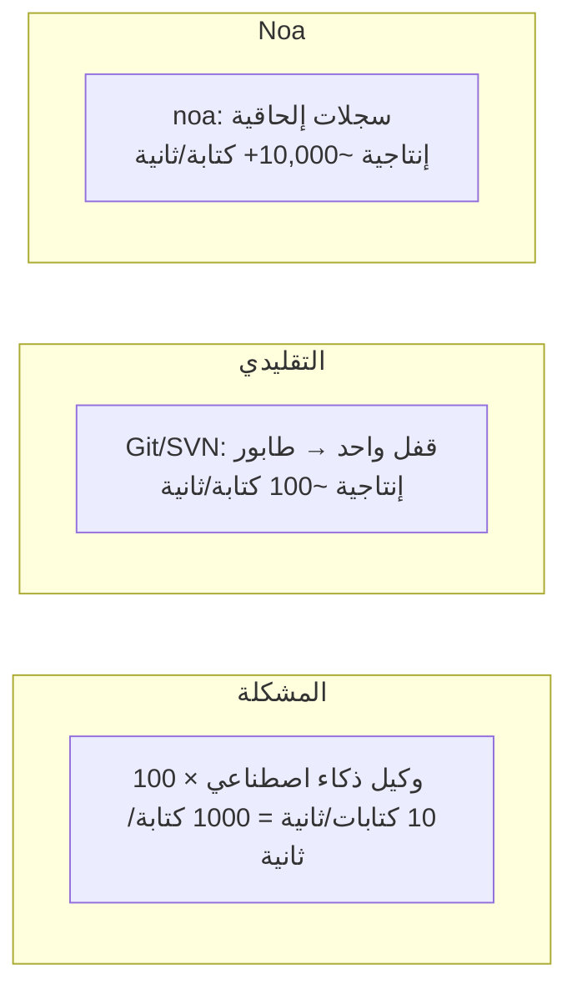
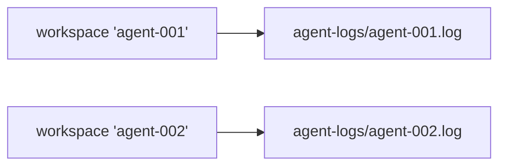
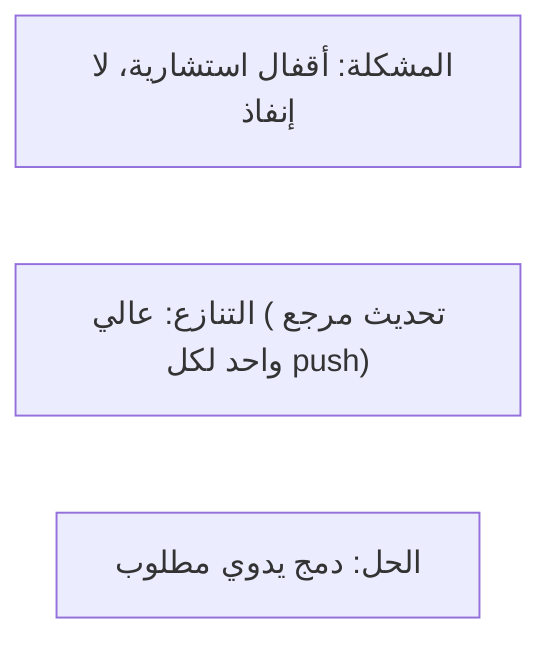
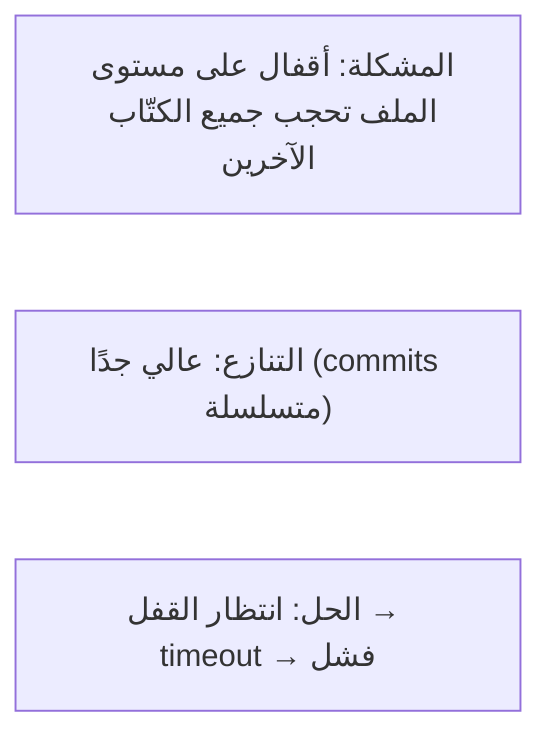
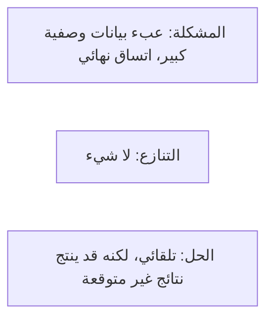
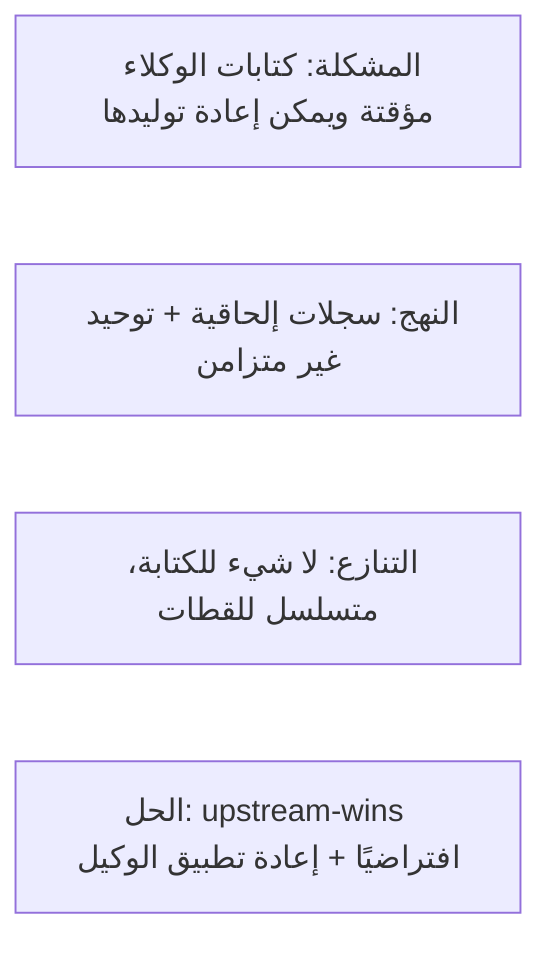

# تصميم التزامن

## بيان المشكلة

أنظمة VCS التقليدية تتسلسل الكتابات من خلال قفل واحد أو طابور دمج. هذا يعمل لسير العمل بمقياس بشري (10-100 commit/يوم) لكنه ينهار مع وكلاء الذكاء الاصطناعي الذين ينتجون آلاف التعديلات على الملفات في الدقيقة.



## الهندسة

### الطبقة 1: AgentLog (مسار الكتابة)

لكل مساحة عمل ملف JSONL مخصص تحت `.noa/agent-logs/`.



تستخدم الكتابات علامة `O_APPEND`، التي توفر:
- **ذرية**: يضمن النواة ذرية الكتابة الكاملة للإلحاقات
- **ترتيب**: الكتابات متسلسلة لكل ملف (لكل مساحة عمل)
- **بدون أقفال**: لا حاجة لـ fcntl/flock بين الملفات المختلفة

```rust
pub trait AgentLog: Send + Sync {
    async fn append(&self, workspace: &str, entry: &LogEntry) -> Result<()>;
    async fn read_all(&self, workspace: &str) -> Result<Vec<LogEntry>>;
}
```

### الطبقة 2: مخزن اللقطات (مسار القراءة)

تُخزن اللقطات في redb مع MVCC (تحكم بالتزامن متعدد الإصدارات):
- الكتابات متسلسلة عبر معاملة الكاتب الوحيد في redb
- القراءات لا تحجب الكتابات أبدًا (عزل اللقطة)
- يمكن لقراء متعددين الوصول في وقت واحد

### الطبقة 3: التوحيد (مسار الدمج)

يقرأ `Consolidator` جميع سجلات الوكلاء عبر مساحات العمل، ويرتب حسب الطابع الزمني، وينتج سلسلة لقطات موحدة:

```mermaid
graph TD
    subgraph الإدخال
        L1["agent-001.log: [write A@t1, write B@t3]"]
        L2["agent-002.log: [write C@t2, write D@t4]"]
    end
    subgraph الموحَّد
        C1["write A@t1 → write C@t2 → write B@t3 → write D@t4"]
    end
    L1 --> C1
    L2 --> C1
```

هذا يعمل بشكل غير متزامن ولا يعيق كتابات الوكلاء.

## ضمانات التزامن

| الضمان | الآلية |
|-----------|-----------|
| لا فقدان للبيانات | O_APPEND + fsync لكل كتابة |
| ترتيب لكل مساحة عمل | ملف واحد لكل مساحة عمل |
| ترتيب عبر مساحات العمل | طوابع زمنية بالميكروثانية |
| اتساق القراءة | عزل لقطة MVCC في redb |
| أمان رأس مساحة العمل | تحديثات CAS (مقارنة-وتبديل) |

## تحليل قابلية التوسع

### عملية واحدة (مدمج)

| الوكلاء | 1-100 (نفس العملية) |
| الإنتاجية | ~10,000 كتابة/ثانية |
| عنق الزجاجة | I/O القرص (fsync لكل كتابة) |

### متعدد العمليات (noa-server)

| الوكلاء | 100-1000 (عمليات منفصلة) |
| الإنتاجية | ~5,000 كتابة/ثانية |
| عنق الزجاجة | تسلسل الكتابة جانب الخادم |

يحتفظ الخادم باتصال قاعدة بيانات واحد ويتسلسل الكتابات. تبقى سجلات الوكلاء لكل ملف للاستيعاب المتوازي.

### موزع (خلفية MinIO)

| الوكلاء | 1000+ |
| الإنتاجية | حد معدل S3 PUT (~3,500/ثانية لكل بادئة) |
| عنق الزجاجة | الشبكة + حدود معدل S3 |

## مقارنة مع البدائل

### Git + أقفال الملفات



### SVN + svn:needs-lock



### التحويل التشغيلي (OT)


### CRDT (أنواع البيانات المنسوخة بدون تعارض)



### نهج noa



## استراتيجية fsync

كل كتابة في سجل الوكيل تتبع هذا النمط:

```rust
file.write_all(data)?;   // إلحاق بالملف
file.flush()?;           // تفريغ مخزن userspace المؤقت
file.sync_data()?;       // fsync — ضمان المتانة على القرص
```

على Linux، يتخطى `sync_data()` مزامنة البيانات الوصفية (fdatasync)، مما يقلل زمن الانتظار بنسبة ~30% مقارنة بـ fsync الكامل.

## المستقبل: تجميع سجل الكتابة المسبقة (WAL Batching)

الحالي: fsync واحد لكل كتابة. المخطط: تجميع كتابات متعددة في fsync واحد:

```rust
// الوكيل يخزن الكتابات مؤقتًا في الذاكرة
agent.buffer(write_a);
agent.buffer(write_b);
agent.buffer(write_c);
agent.flush(); // fsync واحد للثلاثة
```

تحسين الإنتاجية المتوقع: 3-5x للكتابات المتدفقة.
