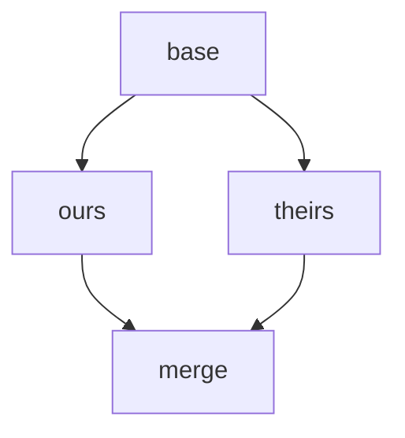
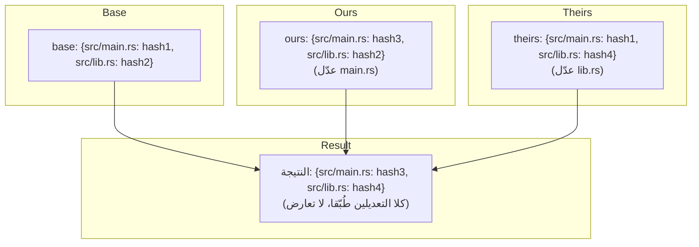
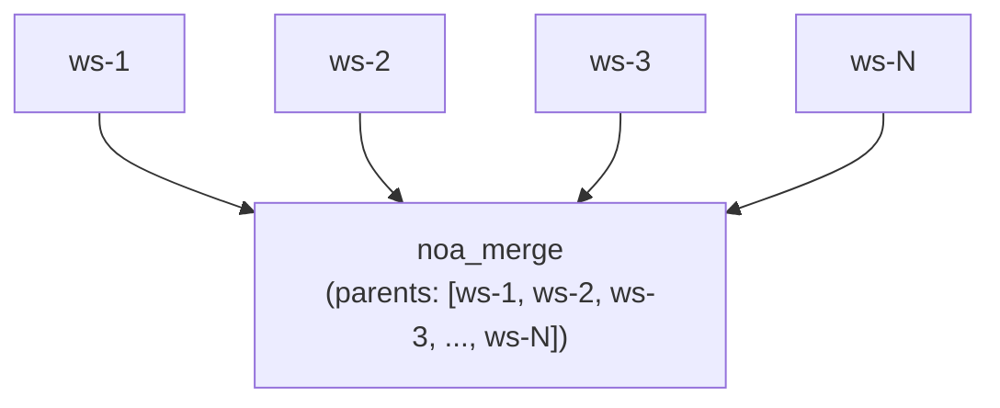
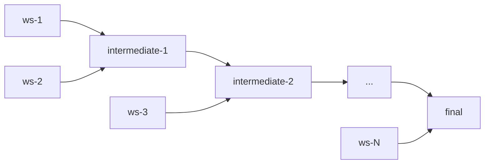

# تصميم استراتيجية الدمج

## نظرة عامة

يستخدم noa خوارزمية دمج ثلاثية مع حل تعارضات قابل للتكوين. يعطي التصميم الأولوية **للتقدم المستمر** على التدخل البشري، مما يعكس حالة استخدام وكيل الذكاء الاصطناعي حيث يمكن إعادة توليد التغييرات.

## الدمج الثلاثي

### الخوارزمية

بوجود لقطتين (ours, theirs) مع سلف مشترك (base):



1. مقارنة `base` مقابل `ours` → changes_A
2. مقارنة `base` مقابل `theirs` → changes_B
3. لكل مسار تم لمسه من قبل أي منهما:
   - نفس التغيير في كلا الجانبين → تطبيق (لا تعارض)
   - تغيير فقط في A → تطبيق A
   - تغيير فقط في B → تطبيق B
   - تغييرات مختلفة لنفس المسار → **تعارض**

### التنفيذ

```rust
pub fn three_way_merge(
    base_tree: &Vec<TreeEntry>,
    ours_tree: &Vec<TreeEntry>,
    theirs_tree: &Vec<TreeEntry>,
) -> (Vec<TreeEntry>, Vec<Conflict>)
```

تُسوَّى مدخلات الشجرة إلى خرائط مسطحة (مسار → تجزئة) للمقارنة:



## اكتشاف التعارضات

```rust
pub struct Conflict {
    pub path: String,
    pub base_hash: Option<String>,
    pub ours_hash: Option<String>,
    pub theirs_hash: Option<String>,
}
```

أنواع التعارضات:
- **تعديل/تعديل**: غيّر كلا الجانبين نفس الملف بشكل مختلف
- **إضافة/إضافة**: أضاف كلا الجانبين ملفًا في نفس المسار بمحتوى مختلف
- **حذف/تعديل**: حذف أحد الجانبين، وعدّل الآخر

## استراتيجيات الحل

### upstream-wins (الافتراضية)

عند اكتشاف تعارض، تؤخذ نسخة theirs:

```rust
ConflictResolution::UpstreamWins => theirs_hash,
```

الأساس المنطقي: في سير عمل وكلاء الذكاء الاصطناعي، يمثل "upstream" (مساحة العمل main/default) الحالة المعيارية. يمكن للوكلاء إعادة تطبيق تغييراتهم مقابل القاعدة المحدثة.

### ours-wins

تؤخذ نسختنا:

```rust
ConflictResolution::OursWins => ours_hash,
```

### fail (مخطط لها)

إحباط الدمج وإعادة التعارضات للحل اليدوي:

```rust
ConflictResolution::Fail => return Err(MergeError::Conflict(conflicts)),
```

## سير دمج مساحات العمل

```bash
noa workspace switch default          # تعيين ours = default
noa workspace merge feature-1         # theirs = feature-1
```

الخطوات الداخلية:
1. تحميل لقطة ours (رأس default)
2. تحميل لقطة theirs (رأس feature-1)
3. إيجاد قاعدة الدمج (أحدث سلف مشترك في DAG)
4. إذا لم يوجد سلف مشترك، استخدم `noa_empty` كقاعدة
5. تنفيذ الدمج الثلاثي
6. تطبيق استراتيجية حل التعارضات
7. إنشاء لقطة دمج مع parents = [ours, theirs]
8. تحديث رأس default إلى لقطة الدمج

## الدمج متعدد الآباء

تدعم لقطات noa عددًا غير محدود من الآباء، مما يتيح دمجًا بأسلوب الأخطبوط:



للدمج N-ي الاتجاه، تنفذ الخوارزمية عمليات دمج زوجية:



## مقارنة مع دمج Git

| الجانب | noa | Git |
|--------|-----|-----|
| الخوارزمية | ثلاثية | ثلاثية (نفس الخوارزمية الأساسية) |
| علامات التعارض | لا شيء (حل تلقائي) | `<<<<<<<` / `=======` / `>>>>>>>` |
| الحل الافتراضي | upstream-wins | لا شيء (يتطلب بشريًا) |
| متعدد الآباء | غير محدود | عادة ≤2 |
| Rebase | غير مدعوم | مدعوم |
| Cherry-pick | غير مدعوم | مدعوم |
| Fast-forward | تلقائي | اختياري (–no-ff) |

## مقارنة مع دمج SVN

| الجانب | noa | SVN |
|--------|-----|-----|
| تتبع الدمج | مدمج (DAG الآباء) | يدوي (خصائص mergeinfo) |
| حل التعارضات | تلقائي | يدوي (ملفات تعارض) |
| نموذج الفروع | مساحة عمل (خفيفة الوزن) | مبني على المجلدات (ثقيل) |
| اتجاه الدمج | أي ← أي (DAG) | عادة فرع ← جذع |

## الأساس المنطقي للتصميم: لماذا الحل التلقائي؟

يتطلب VCS التقليدي حل تعارضات بشريًا لأن:
1. الشيفرة المكتوبة بشريًا لها معنى دلالي لا يفهمه سوى البشر
2. قد تمثل التعارضات خلافات تصميمية جوهرية
3. الحل اليدوي يضمن الصحة

تغييرات وكيل الذكاء الاصطناعي لها خصائص مختلفة:
1. **قابلة لإعادة التوليد**: يمكن للوكلاء إعادة تطبيق التغييرات مقابل أحدث حالة
2. **عالية التواتر**: التوقف للحل البشري يعطل جميع الأعمال اللاحقة
3. **غير دلالية**: التغييرات على مستوى الملف لا تتطلب تفسيرًا بشريًا

لذلك، الحل التلقائي بسياسة واضحة (upstream-wins) هو المقايضة الصحيحة لحالة استخدام noa.
