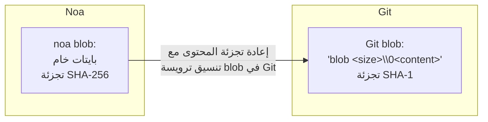
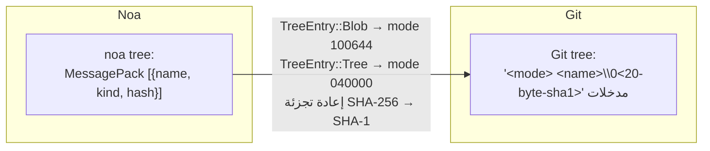
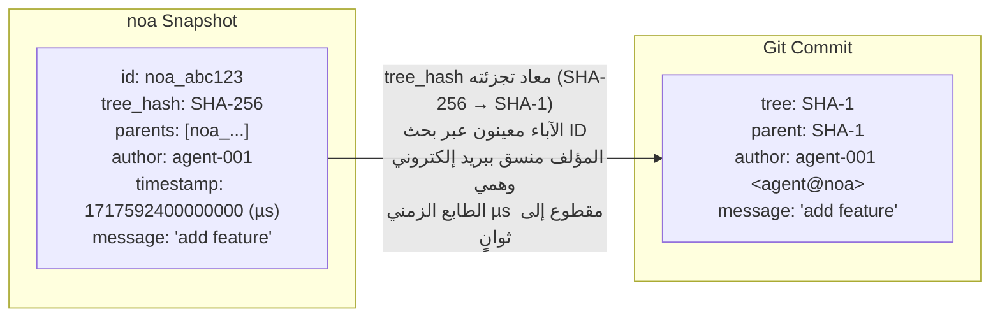
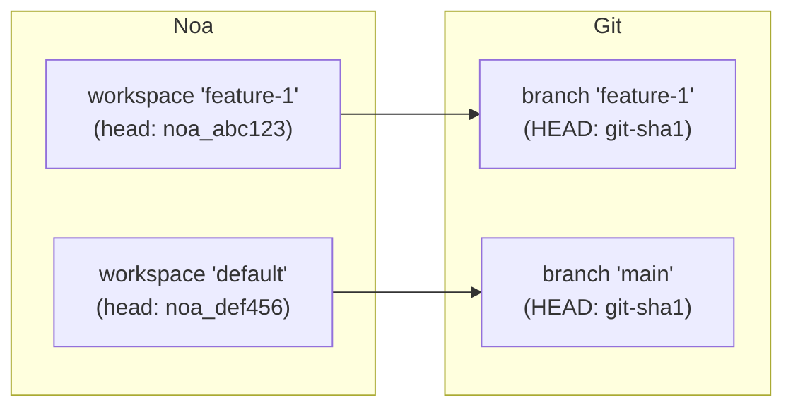
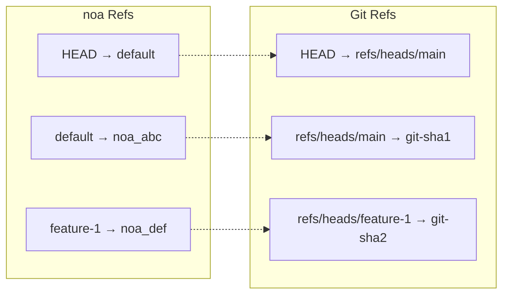
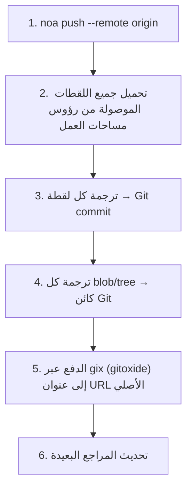
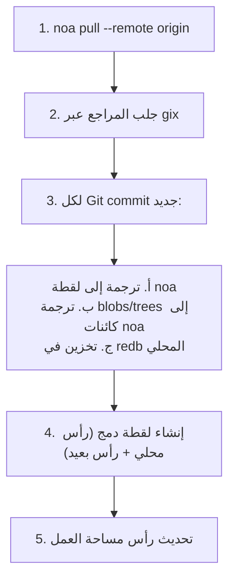
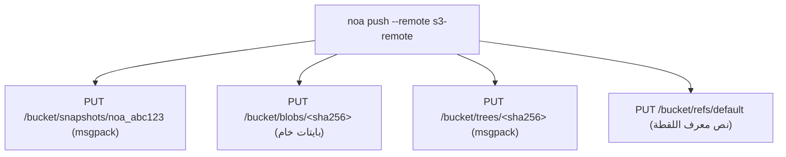

# تصميم التوافق البُعدي

## نظرة عامة

يدعم noa خلفيات بعيدة متعددة لمزامنة اللقطات والكائنات عبر الأجهزة والفرق. الهدف الأساسي للتوافق هو Git، مما يتيح تكاملًا سلسًا مع سير العمل الحالي على GitHub و GitLab و Bitbucket.

## واجهة الخلفية البعيدة (RemoteBackend Trait)

```rust
#[async_trait]
pub trait RemoteBackend: Send + Sync {
    async fn push_snapshots(&self, ids: &[SnapshotId]) -> Result<()>;
    async fn fetch_snapshots(&self, ids: &[SnapshotId]) -> Result<Vec<Snapshot>>;
    async fn push_objects(&self, ids: &[String]) -> Result<()>;
    async fn fetch_objects(&self, ids: &[String]) -> Result<()>;
    async fn list_refs(&self) -> Result<HashMap<String, SnapshotId>>;
    async fn update_ref(&self, name: &str, old: Option<&SnapshotId>, new: &SnapshotId) -> Result<()>;
}
```

## طبقة الترجمة إلى Git

يحول `GitTranslator` بين نموذج كائنات noa ونموذج Git:

### Blob ↔ Git Blob



### Tree ↔ Git Tree



### Snapshot ↔ Git Commit



### Workspace ↔ Git Branch



### تعيين المراجع (Ref Mapping)



## سير الدفع (Push)



## سير السحب (Pull)



## خلفية MinIO/S3

للنشر بدون بنية Git التحتية:



مزايا مقارنة بـ Git remote:
- لا حاجة لترجمة الشجرة/اللقطة (تنسيق noa الأصلي)
- تخزين blob مباشر (بدون عبء ملفات pack)
- متوافق مع S3 (يعمل مع AWS, GCS, MinIO, Cloudflare R2)

## إعدادات المستودعات البعيدة

مخزنة في `.noa/config` (TOML):

```toml
[[remotes]]
name = "origin"
url = "https://github.com/example/repo.git"
backend = "git"

[[remotes]]
name = "s3"
url = "s3://my-bucket/noa-repo"
backend = "minio"
endpoint = "https://s3.amazonaws.com"
region = "us-east-1"
```

## المصادقة

| الخلفية | الطريقة |
|---------|--------|
| Git HTTPS | بيانات الاعتماد من `~/.git-credentials` أو مطالبة |
| Git SSH | وكيل SSH أو ملف مفتاح |
| MinIO/S3 | مفتاح وصول + مفتاح سري (متغيرات بيئة أو إعدادات) |

## مقارنة: طرق التوافق البُعدي

| الطريقة | مستخدمة من قبل | الإيجابيات | السلبيات |
|----------|---------|------|------|
| جسر Git (gix) | noa | توافق عالمي | عبء الترجمة، عدم تطابق SHA-1/SHA-256 |
| بروتوكول أصلي | Git | سريع، بدون ترجمة | يعمل فقط مع Git |
| WebDAV | SVN | معياري HTTP | محدود، خاص بـ SVN |
| REST API | Bitbucket | حديث، مرن | يتطلب خدمة مستضافة |
| تخزين متوافق مع S3 | noa | قابل للتوسع، سحابي أصلي | لا توافق مع Git بدون جسر |

يدعم noa كلاً من جسر Git (للتوافق) و S3 الأصلي (للتوسع).
