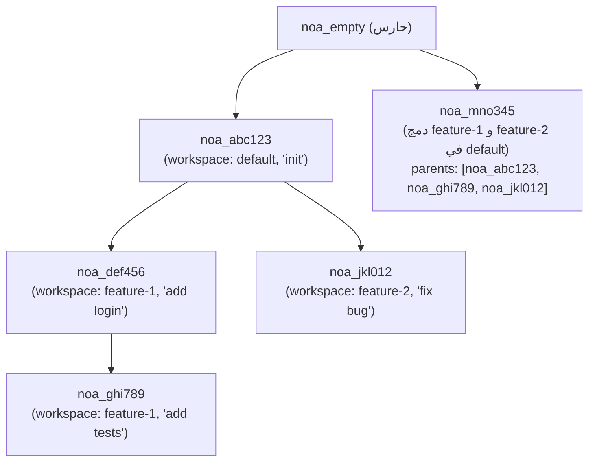
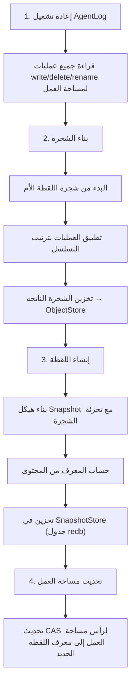

# تصميم نموذج اللقطات

## نظرة عامة

اللقطة هي سجل غير قابل للتغيير ومعنون بالمحتوى لحالة شجرة الملفات الكاملة لمساحة العمل في نقطة زمنية معينة. تشكل اللقطات رسمًا بيانيًا لا دوريًا موجّهًا (DAG) من خلال مراجع الآباء.

## هيكل اللقطة

```rust
pub struct SnapshotId(pub String);  // "noa_<12-char-base62>"

pub struct Snapshot {
    pub id: SnapshotId,
    pub tree_hash: String,           // SHA-256 للشجرة الجذرية
    pub parents: Vec<SnapshotId>,    // 0-N لقطات آباء
    pub workspace: String,           // مساحة العمل المنشئة
    pub author: String,              // معرف الوكيل أو البشر
    pub timestamp: u64,              // ميكروثانية منذ العصر
    pub message: String,             // وصف مقروء بشريًا
}
```

## توليد المعرف

تستخدم معرفات اللقطات سلسلة base62 مكونة من 12 حرفًا مسبوقة بـ `noa_`:

```
noa_3kF8x2mP9aB1
```

التوليد: `SHA256(tree_hash || parents || workspace || timestamp)[0..9]` مشفرة كـ base62. هذا يوفر:
- 62^12 ≈ 3.2 × 10^21 معرفًا محتملاً
- احتمال التصادم صفر فعليًا
- حتمي: نفس المدخلات → نفس المعرف (يتيح إلغاء التكرار)

## DAG اللقطات



## سير إنشاء اللقطة



## مخزن اللقطات

تُخزن اللقطات في جدول redb مفهرس بالمعرف:

```
Table: snapshots
  Key:   "noa_abc123" (SnapshotId كـ &str)
  Value: msgpack(Snapshot) كـ &[u8]
```

## خوارزمية المقارنة (Diff)

ينتج `diff_snapshots(base, other)` قائمة بتغييرات على مستوى الملف:

```rust
pub struct FileDiff {
    pub path: String,
    pub kind: DiffKind, // Added, Removed, Modified
    pub old_blob: Option<String>,
    pub new_blob: Option<String>,
}
```

الخوارزمية:
1. تحميل الأشجار الجذرية لكلتا اللقطتين
2. استعراض كلتا الشجرتين بشكل متكرر ومتزامن
3. مقارنة تجزئات blob في كل مسار
4. تجزئة مختلفة → Modified؛ موجودة فقط في واحدة → Added/Removed

تعقيد زمني: O(n) حيث n = إجمالي الملفات في كلتا الشجرتين.

## اللقطة الحارسة (Sentinel Snapshot)

`noa_empty` هو معرف لقطة محجوز يمثل شجرة فارغة. تبدأ جميع المستودعات الجديدة بهذا كقاعدة لها. لا يُخزن صراحةً أبدًا — يتعرف عليه مدير مساحة العمل كـ "لا لقطات بعد".

## مقارنة مع Git Commits

| الجانب | لقطة noa | Git Commit |
|--------|-------------|------------|
| تنسيق المعرف | `noa_<base62>` | SHA-1 hex |
| حد الآباء | غير محدود (DAG دمج) | عادة 1-2 |
| تنسيق الشجرة | MessagePack | ثنائي مخصص |
| الطابع الزمني | دقة الميكروثانية | دقة الثانية + منطقة زمنية |
| حقل المؤلف | معرف الوكيل أو البشر | اسم + بريد إلكتروني |
| عدم القابلية للتغيير | مفروضة من قبل المخزن | مفروضة من قبل التجزئة |
| توقيع GPG | غير مدعوم | مدعوم |
