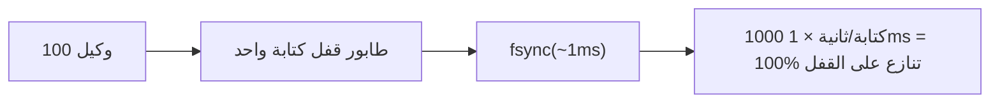
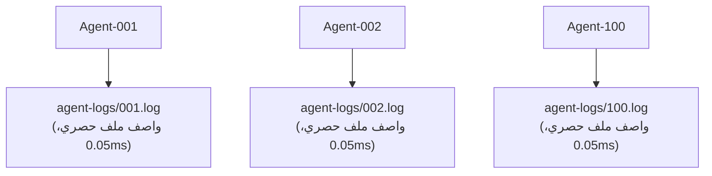

# نموذج تزامن الوكلاء

## أهداف التصميم

يدعم noa عشرات إلى مئات وكلاء الذكاء الاصطناعي الذين يكتبون في وقت واحد **بدون تنازع على الأقفال**.

## المشكلة: عنق زجاجة الكاتب الوحيد

قواعد البيانات المدمجة التقليدية (بما في ذلك redb) تستخدم قفل كتابة واحد:



## الحل: سجلات وكيل لكل مساحة عمل

كل مساحة عمل تحصل على ملف JSONL خاص بها. تستخدم الكتابات `O_APPEND` وهو ذري على أنظمة POSIX:



الإجمالي: 0.05ms لكل كتابة، صفر تنازع على الأقفال.

## تنسيق AgentLog

```jsonl
{"seq":1,"op":"write","path":"src/main.rs","blob":"abc123...","ts":1717592400000000}
{"seq":2,"op":"delete","path":"src/old.rs","ts":1717592401000000}
{"seq":3,"op":"rename","from":"src/foo.rs","to":"src/bar.rs","ts":1717592402000000}
{"seq":4,"op":"snapshot","snapshot_id":"noa_z7x9","parent":"noa_y6w8","message":"feat","ts":1717592405000000}
```

- `seq`: عداد رتيب لكل مساحة عمل
- `ts`: طابع زمني بدقة الميكروثانية
- التوحيد يرتب عالميًا حسب `ts`

## متى تستخدم redb مقابل AgentLog

| المكون | التخزين | السبب |
|-----------|---------|--------|
| blobs, trees | redb | معنونة بالمحتوى، غير قابلة للتغيير، كثيفة القراءة |
| snapshots, refs, workspaces | redb | بيانات وصفية، تواتر كتابة منخفض |
| سجلات الوكيل التزايدية | ملف JSONL | كتابات متزامنة عالية التواتر |

## التوحيد

يقرأ `Consolidator` جميع سجلات الوكلاء، ويرتب حسب الطابع الزمني، وينشئ سلسلة لقطات موحدة:

```rust
Consolidator::new(&engine)
    .consolidate("default", parent_ids, "agent", "batch update")
    .await?;
```

## noa-server للتزامن متعدد العمليات

لسيناريوهات تعدد العمليات الحقيقية (عمليات CLI متعددة أو وكلاء موزعون)، استخدم noa-server HTTP API:

```bash
noa-server  # يبدأ على المنفذ 3000

# الوكلاء يتفاعلون عبر REST:
POST /api/v1/repo/my-project/blobs
POST /api/v1/repo/my-project/snapshots
POST /api/v1/repo/my-project/agent-log
```

يحتفظ الخادم باتصال قاعدة بيانات واحد ويتسلسل الكتابات داخليًا، بينما يتعامل مع القراءات المتزامنة عبر MVCC.
