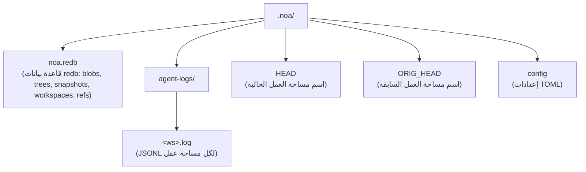
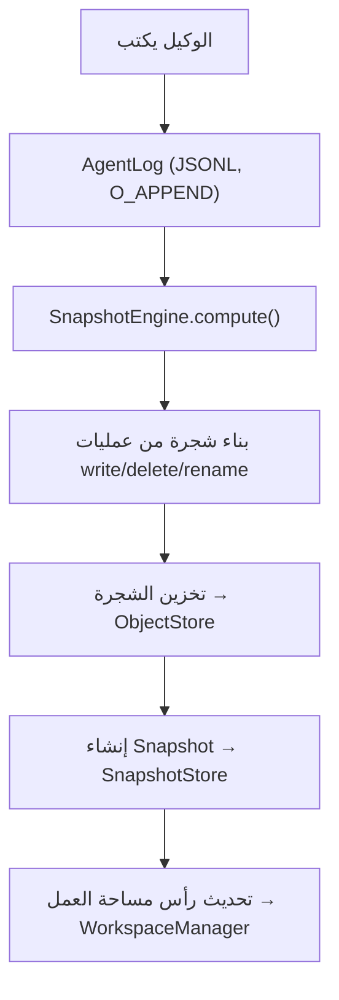

# الهندسة المعمارية

## المكونات الأساسية

### ObjectStore

تخزين معنون بالمحتوى للـ blobs والأشجار. يُعنون المحتوى بتجزئة SHA-256.

```
BlobId = SHA256(content)
TreeId = SHA256(msgpack(TreeEntries))
```

التنفيذات:
- **RedbObjectStore**: تخزين محلي باستخدام مخزن KV المدمج redb
- **MinioObjectStore**: تخزين عن بعد باستخدام MinIO المتوافق مع S3

### AgentLog

سجل إلحاقي لكل مساحة عمل للكتابة المتزامنة بدون أقفال. كل مساحة عمل تحصل على ملف JSONL خاص بها تحت `.noa/agent-logs/<ws>.log`.

العمليات:
- **write**: تسجيل كتابة ملف مع مرجع blob
- **delete**: تسجيل حذف ملف
- **rename**: تسجيل إعادة تسمية ملف
- **snapshot**: تسجيل إنشاء لقطة
- **merge**: تسجيل دمج من مساحة عمل أخرى

### Snapshot

حالة غير قابلة للتغيير لحظية لمساحة عمل. تحتوي على تجزئة شجرة، ولقطات آباء، ومؤلف، ورسالة.

```
Snapshot = {
    id: "noa_<12-char-base62>"
    tree_hash: SHA256 لمحتوى الشجرة
    parents: [SnapshotId, ...]
    workspace: اسم مساحة العمل
    author: معرف الوكيل
    timestamp: دقة الميكروثانية
    message: وصف مقروء بشريًا
}
```

### Workspace

سياق عمل معزول لوكيل. يتتبع لقطة الرأس ولقطة القاعدة.

### RefStore

مؤشرات مسماة إلى لقطات مع دلالات مقارنة-وتبديل (CAS) للتحديثات المتزامنة الآمنة.

### محرك الدمج (Merge Engine)

دمج ثلاثي يقارن أشجار base و ours و theirs:
- نفس التغيير في كلا الجانبين → لا تعارض
- تغيير في جانب واحد فقط → تطبيق
- تغييرات مختلفة لنفس الملف → تعارض (الافتراضي: upstream-wins)

## تخطيط التخزين



## تدفق البيانات


