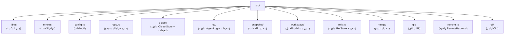

# بناء noa

## المتطلبات الأساسية

- Rust 1.75+ (مستقر)
- Python 3.8+ (لسكربتات البناء)
- مشغّل الأوامر `just`

## الإعداد

```bash
git clone https://github.com/celestia-island/noa.git
cd noa
just init          # جلب اعتماديات Rust
just build-dev     # بناء تطويري
```

## التطوير

```bash
just fmt            # تنسيق الشيفرة
just clippy         # تدقيق الشيفرة
just test           # تشغيل الاختبارات
just check          # فحص الأنواع
```

## هيكل المشروع


