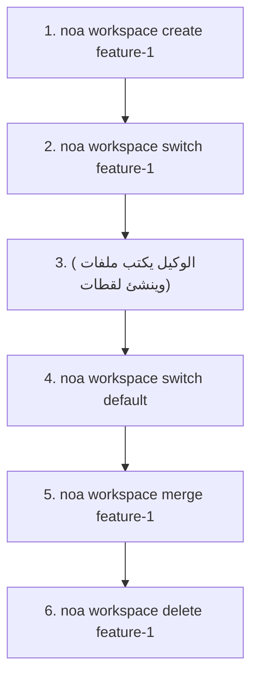
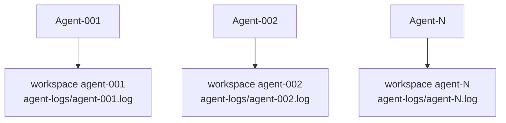

# دليل مساحات العمل

مساحات العمل هي سياقات عمل معزولة، مشابهة لفروع Git. لكل مساحة عمل لقطة رأس وسجل وكيل خاص بها.

## إنشاء مساحات العمل

```bash
noa workspace create feature-1
noa workspace create agent-debug --agent bot-42
```

علامة `--agent` تربط مساحة العمل بمعرف وكيل محدد.

## تبديل مساحات العمل

```bash
noa workspace switch feature-1
noa status
# On workspace: feature-1 (head: noa_abc123)
```

## عرض مساحات العمل

```bash
noa workspace list
#   default             head: noa_abc123 base: noa_empty
# * feature-1           head: noa_def456 base: noa_abc123
```

علامة `*` تشير إلى مساحة العمل النشطة.

## دمج مساحات العمل

```bash
noa workspace switch default
noa workspace merge feature-1
# Merged feature-1 into default -> noa_ghi789
```

إذا تم اكتشاف تعارضات:

```
Conflicts detected:
  CONFLICT: src/main.rs
Merged feature-1 into default -> noa_ghi789
```

استراتيجية الحل الافتراضية هي upstream-wins (theirs). ستدعم الإصدارات المستقبلية حل التعارضات اليدوي.

## حذف مساحات العمل

```bash
noa workspace delete feature-1
# Deleted workspace 'feature-1'
```

لا يمكنك حذف مساحة العمل النشطة.

## نمط سير العمل



## نمط تعدد الوكلاء

يحصل كل وكيل على مساحة عمل خاصة به:



لكل مساحة عمل سجل وكيل مستقل (`.noa/agent-logs/agent-001.log`)، مما يتيح كتابة متزامنة بدون أقفال. خطوة التوحيد تدمج جميع السجلات حسب الطابع الزمني لإنشاء تاريخ موحد.

> **ملاحظة**: يستخدم redb قفل ملف حصري، لذا لا يمكن لعدة عمليات CLI فتح نفس قاعدة البيانات بشكل متزامن. للتزامن الحقيقي متعدد العمليات، استخدم noa-server HTTP API.
