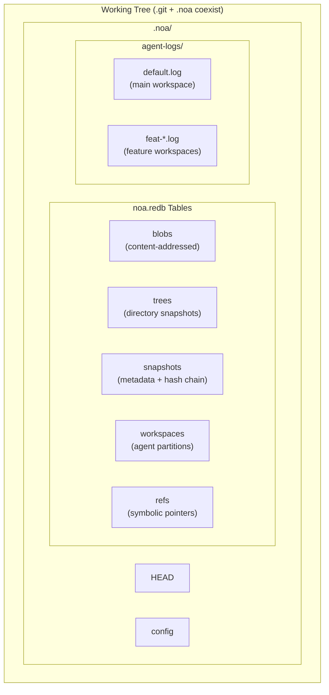
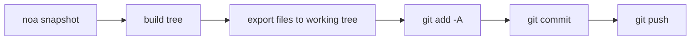
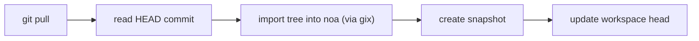
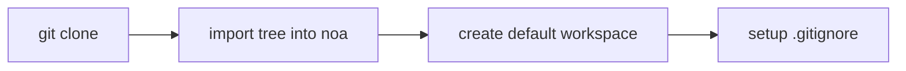

<div align="center"></div>
<h1 align="center">Noa</h1>
<div align="center">
 <strong>AI-native distributed version control system</strong>
</div>

<br />

<div align="center">
  <a href="https://github.com/celestia-island/noa/actions">
    
  </a>
  <a href="https://github.com/celestia-island/noa/actions">
    
  </a>
  <a href="https://crates.io/crates/libnoa">
    
  </a>
  <a href="https://docs.rs/libnoa">
    
  </a>
  <a href="../../LICENSE">
    
  </a>
  <a href="https://github.com/celestia-island/noa/releases">
    
  </a>
</div>

<div align="center">

**[English]** &bull; **[简体中文](../zh-hans/README.md)** &bull;
**[繁體中文](../zh-hant/README.md)** &bull; **[日本語](../ja/README.md)** &bull;
**[한국어](../ko/README.md)** &bull; **[Français](../fr/README.md)** &bull;
**[Español](../es/README.md)** &bull; **[Русский](../ru/README.md)** &bull;
**[العربية](../ar/README.md)**

</div>

<br />

noa is an AI-native distributed version control system. It coexists with `.git` — git manages source code, noa manages AI agent iteration data — with per-agent zero-lock JSONL logs, snapshot-based history, and full git protocol compatibility.

## Why noa

| Challenge | Git | noa |
|-----------|-----|-----|
| **Concurrent writes** | Lock files, merge conflicts | Per-agent JSONL append-only logs |
| **Agent identity** | user.name/email per repo | Workspace-scoped agent_id |
| **Partial contributions** | All changes in working tree | Agent logs only touched files |
| **Iteration tracking** | Rebase/squash destroys history | Immutable snapshot chain per workspace |
| **Multi-agent merge** | Three-way text merge | Merge snapshots, file-level conflicts |
| **Git compatibility** | N/A | System git CLI bridge |

## Table of Contents

- [Why noa](#why-noa)
- [Architecture](#architecture)
- [Installation](#installation)
- [Quick Start](#quick-start)
- [Commands](#commands)
- [Git Integration](#git-integration)
- [Compatibility](#compatibility)
- [API (libnoa)](#api-libnoa)
- [Building from Source](#building-from-source)
- [Related Projects](#related-projects)
- [License](#license)

## Architecture



**Core concepts:**

- **Workspace**: An isolated linear namespace for one agent. Each has its own JSONL log.
- **Snapshot**: A point-in-time record of a workspace tree (SHA-256 content-addressed blobs + trees).
- **Agent Log**: Append-only JSONL file recording atomic file operations (`write`, `delete`, `rename`) with blob IDs and timestamps.
- **Merge**: Three-way merge of two workspace snapshots against their common base.

## Installation

### From GitHub Releases

```bash
# Download the latest release binary for your platform:
#   https://github.com/celestia-island/noa/releases

chmod +x noa
mv noa /usr/local/bin/
```

### From Source (Requires Rust 1.85+)

```bash
git clone https://github.com/celestia-island/noa.git
cd noa
cargo build --release
# Binaries: target/release/noa, target/release/noa-server
```

### As a Library (Cargo)

```toml
[dependencies]
libnoa = { git = "https://github.com/celestia-island/noa" }
```

Note: The package name on crates.io is `libnoa` (the name `noa` was already taken). The binary is still named `noa`.

## Quick Start

### Initialize in an existing git repo

```bash
cd my-git-project
noa init                              # creates .noa/ alongside .git/
noa remote add origin "git@github.com:user/repo.git"
noa pull                              # import current git HEAD into noa
```

### Create agent workspaces and iterate

```bash
# Agent A works on auth feature
noa workspace create feat-auth -a agent-auth
noa workspace switch feat-auth

# Agent writes to its agent log
# (AI agents write JSONL directly; here is a manual example)
cat >> .noa/agent-logs/feat-auth.log << EOF
{"seq":1,"op":"write","path":"src/auth.rs","blob_id":"<sha256>","ts":1717000000000000}
EOF

# Save the workspace state
noa snapshot create -m "add auth module" -a agent-auth
```

### Merge features and sync with git

```bash
noa workspace switch default
noa workspace merge feat-auth          # merge into default
noa push                               # export to git commit + git push
```

## Commands

### Workspace Management

```bash
noa workspace create <name> [-a <agent-id>]   # Create a new workspace
noa workspace switch <name>                    # Switch active workspace
noa workspace list                              # List all workspaces
noa workspace delete <name>                     # Delete a workspace
noa workspace merge <from>                      # Merge another workspace into current
```

### Snapshot Management

```bash
noa snapshot create -m <msg> [-a <author>]     # Create a snapshot from agent log
noa snapshot list                               # List snapshots
noa snapshot diff <id-a> <id-b>                # Diff two snapshots (file-level)
```

### Remote Operations

```bash
noa remote add <name> <url>                     # Add a remote
noa remote remove <name>                        # Remove a remote
noa remote list                                 # List remotes
noa fetch [-r <remote>]                         # List remote refs
noa pull [-r <remote>]                          # Git pull + re-import into noa
noa push [-r <remote>]                          # Export snapshot → git commit → git push
```

### Repository Operations

```bash
noa init [-p <path>] [--noa-remote <url>]      # Initialize a .noa/ repository
noa clone <url> [-p <path>]                     # Git clone + import into noa
noa clone --svn <url> [-p <path>]              # SVN export → git init → import into noa
noa status                                       # Show current workspace status
noa log [-w <workspace>] [-n <limit>]          # Show snapshot history
```

## Git Integration

noa uses the system `git` CLI for all network operations. This ensures 100% compatibility with any git remote.

### Push Workflow



### Pull Workflow



### Clone Workflow



### Key Design Decisions

- **Export is additive**: Only files in the noa snapshot are written to the working tree. Existing git-tracked files not in the snapshot are left unchanged.
- **Import uses gix**: For local tree traversal (no network needed). Network operations use system `git` CLI.
- **`.noa/` auto-gitignored**: `noa init` appends `.noa/` to `.gitignore` so agent data never leaks into git history.

## Compatibility

### Platforms Tested

| Provider | Protocol | Push | Pull | Clone | LFS |
|----------|----------|------|------|-------|-----|
| **GitHub** | HTTPS, SSH | ✓ | ✓ | ✓ | ✓ |
| **Bitbucket** | HTTPS, SSH | ✓ | ✓ | ✓ | ✓ |
| **GitLab** | HTTPS, SSH | ✓ | ✓ | ✓ | ✓ |
| **Local bare repo** | file:// | ✓ | ✓ | ✓ | ✓ |
| **SVN** | svn:// | Import only | — | `--svn` | — |

### Git LFS

noa automatically detects Git LFS repositories:

- `noa clone`: runs `git lfs install` + `git lfs pull` for LFS-tracked repos
- `noa push`: runs `git lfs push --all` after git push
- `noa pull`: runs `git lfs pull` after git pull
- LFS pointer files are imported as regular blobs into noa

### SVN

```bash
noa clone --svn file:///path/to/svn/repo -p ./my-project
```

This does `svn export trunk → git init → noa import`. It's a **one-time import** — for incremental sync, use `svn export` + `noa snapshot create` on a schedule.

### Bitbucket

Both SSH (`git@bitbucket.org:ws/repo.git`) and HTTPS (`https://user@bitbucket.org/ws/repo.git`) URLs are supported natively through the git bridge.

## API (libnoa)

libnoa exposes a Rust API for embedding noa functionality into other tools:

```rust
use libnoa::repo::Repository;
use libnoa::snapshot::SnapshotEngine;
use libnoa::log::FileAgentLog;
use libnoa::workspace::Workspace;
use libnoa::snapshot::SnapshotId;

// Open a repository
let repo = Repository::open(&path)?;

// Create a workspace
let ws_mgr = repo.workspace_manager()?;
let now = chrono::Utc::now().timestamp_micros() as u64;
ws_mgr.create(&Workspace {
    name: "feat-x".into(),
    head: SnapshotId("noa_empty".into()),
    base: SnapshotId("noa_empty".into()),
    agent_id: Some("my-agent".into()),
    last_seq: 0,
    created_at: now,
    updated_at: now,
}).await?;

// Build a snapshot from agent logs
let engine = SnapshotEngine::new(
    repo.agent_log("feat-x")?,
    repo.snapshot_store()?,
    repo.object_store()?,
)
.with_repo_root(repo.root.clone());
let snapshot = engine.compute("feat-x", vec![], 0, "author", "message").await?;

// Export snapshot to git
libnoa::git::export_noa_to_git(&repo.root, repo.db.clone()).await?;
```

See `tests/smoke.rs` and `tests/compat.rs` for more usage examples.

## Building from Source

```bash
# Prerequisites: Rust 1.85+, git, pkg-config (optional for LFS/SVN)
git clone https://github.com/celestia-island/noa.git
cd noa

# Build
cargo build --release
# Output: target/release/noa (CLI), target/release/noa-server (API server)

# Run tests
cargo test -- --test-threads=1

# Start the noa server
NOA_PORT=3000 NOA_DB_PATH=/data/noa/server.redb target/release/noa-server
```

## Related Projects

| Project | Relationship |
|---------|-------------|
| [entelecheia](https://github.com/celestia-island/entelecheia) | Multi-agent orchestration platform. Consumes noa for agent workspace versioning. |
| [tairitsu](https://github.com/celestia-island/tairitsu) | WASM component model framework. Future: noa client as WASM component. |
| [kirino](https://github.com/celestia-island/kirino) | Zero-trust auth/RBAC. Used by noa-server for authentication. |

## License

Apache-2.0. See [LICENSE](../../LICENSE).
