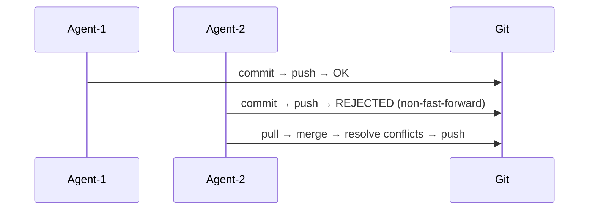
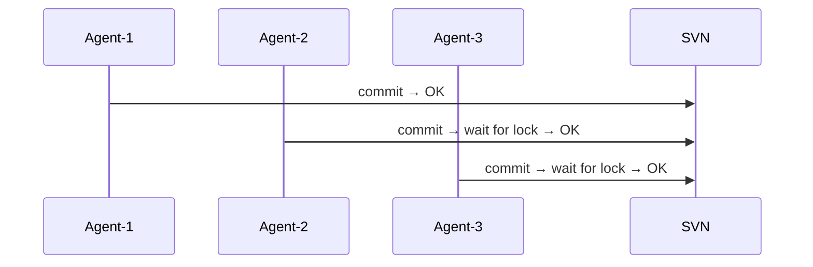
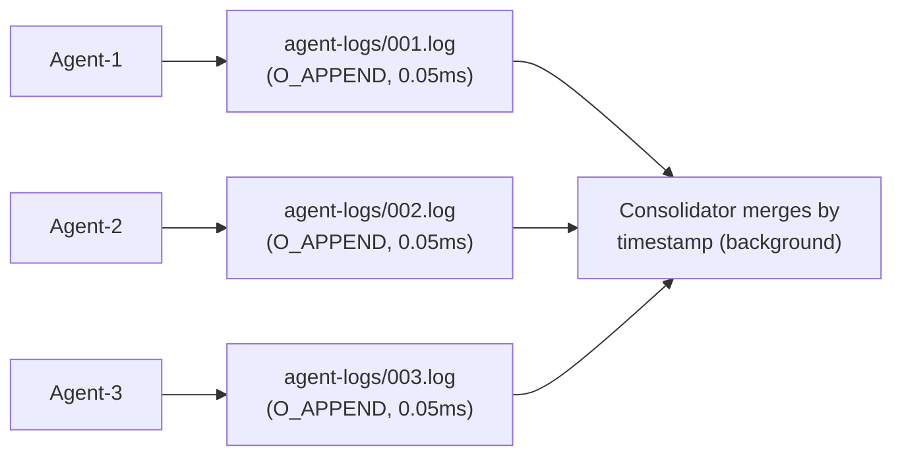
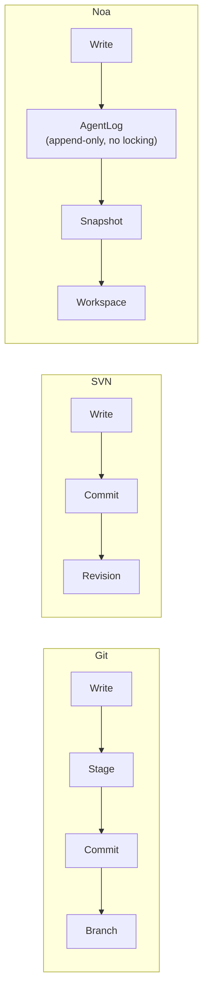
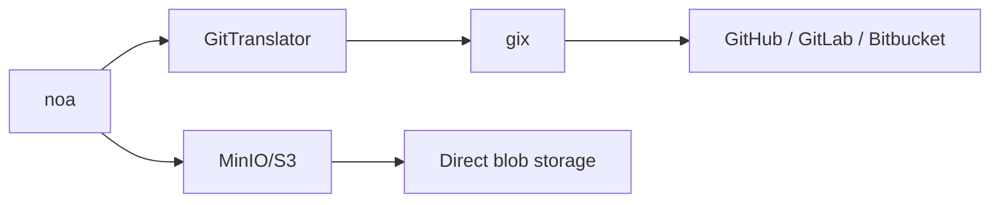

# noa vs Git vs SVN vs Bitbucket: A Comparative Analysis

## Executive Summary

noa is a version control system designed specifically for AI agent workflows.
Unlike Git, SVN, and Bitbucket (which wrap Git/SVN), noa optimizes for
**high-frequency concurrent writes from non-human actors** — tens to hundreds
of AI agents modifying files simultaneously without lock contention.

---

## Feature Comparison Matrix

| Feature | noa | Git | SVN | Bitbucket |
|---------|-----|-----|-----|-----------|
| **Architecture** | Embedded KV + append-only logs | Content-addressed DAG | Centralized delta store | Git/SVN hosting |
| **Concurrency model** | Per-workspace append-only logs (zero-lock) | Branch-level locking (merge conflicts) | Central server serializes | Same as Git/SVN |
| **Merge strategy** | Three-way, upstream-wins default | Three-way, manual resolution | Manual merge | Same as Git/SVN |
| **Snapshot granularity** | Microsecond timestamps, per-agent | Per-commit (human cadence) | Per-revision | Same as Git/SVN |
| **Agent-native** | Yes — workspace per agent, agent logs | No — designed for human workflows | No | No |
| **Storage backend** | Pluggable (redb local, MinIO/S3 remote) | Pack files + loose objects | Berkeley DB / FSFS | Server-side storage |
| **Distributed** | Yes (remote push/pull via Git bridge) | Yes (native) | No (centralized) | Yes (hosted) |
| **Binary diff** | Content-addressed blobs (no delta) | Pack-level delta compression | Server-side delta | Same as Git/SVN |
| **Locking** | None for writes (append-only logs) | Advisory locks only | `svn:needs-lock` | Same as Git/SVN |
| **HTTP API** | Built-in (noa-server) | git-http-backend | WebDAV | REST API |
| **Learning curve** | Minimal (6 commands) | Steep (~40 commands) | Moderate | Moderate |

---

## Detailed Comparison

### 1. Concurrency

**Git**: One branch = one writer at a time. Concurrent writers create
divergent histories that must be reconciled via merge. Merge conflicts
require human intervention.



**SVN**: Central server serializes all commits. File-level locking available
but creates bottlenecks.



**noa**: Each agent writes to its own append-only log file. Zero lock
contention by design. Consolidation happens asynchronously.



### 2. Data Model

**Git**: Blob → Tree → Commit → Branch → Ref. Content-addressed by SHA-1.
Immutable objects. Branches are mutable pointers.

**SVN**: File/Directory → Revision. Linear revision numbers. Paths are
first-class entities.

**noa**: Blob → Tree → Snapshot → Workspace. Content-addressed by SHA-256.
Snapshots are immutable. Workspaces are mutable pointers with CAS updates.

Key difference: noa's **AgentLog** layer sits between the agent's writes
and the immutable snapshot layer, providing a buffer for high-frequency
operations.



### 3. Merge Philosophy

**Git**: Three-way merge with human conflict resolution. Conflicts block
progress until resolved.

**SVN**: Manual merge tracking. Conflict resolution is file-level.

**noa**: Three-way merge with configurable auto-resolution (default:
upstream-wins). Designed for AI agents that can re-apply changes rather
than manually resolve conflicts.

Rationale: AI agents don't need to see conflict markers — they can
re-generate their changes against the latest state. The "upstream-wins"
strategy ensures forward progress.

### 4. Storage Efficiency

**Git**: Pack files with delta compression. Optimized for human-scale
commit frequency (~10-100 commits/day).

**SVN**: Server-side delta storage. Efficient for large binary files.

**noa**: Content-addressed blobs without delta compression. Snapshots
are msgpack-encoded. Trade-off: simpler implementation, faster writes,
larger storage. Acceptable because:
- AI agent artifacts are often regenerated (old versions are ephemeral)
- Storage is cheap; agent throughput is expensive
- MinIO/S3 backend handles deduplication

### 5. Remote Interoperability

**Git**: Native protocol (git://, https://, ssh://). Universal.

**SVN**: svn://, http://. Tied to Apache/Subversion.

**noa**: Git bridge via `gix` (gitoxide). Can push/pull from any Git remote.
Also supports native MinIO/S3 backend for direct object storage.



### 6. Access Control

**Git**: Filesystem permissions or server-side hooks (pre-receive, etc.).

**SVN**: Path-based ACLs built into the protocol.

**Bitbucket**: Branch permissions, merge checks, code review requirements.

**noa**: Workspace-level isolation. Each agent can only write to its
assigned workspace. Merge to shared branches requires explicit action.
Server-side authentication via noa-server.

---

## When to Use What

| Scenario | Best choice | Reason |
|----------|-------------|--------|
| Human software development | Git | Mature ecosystem, universal tooling |
| AI agent code generation (10+ agents) | noa | Zero-lock concurrent writes |
| Enterprise compliance + audit | SVN | Centralized, path-based ACLs |
| Team collaboration + CI/CD | Bitbucket | Built-in pipelines, PRs, reviews |
| AI agent orchestration + human review | noa → Git bridge | Agents work in noa, humans review via Git |
| Large binary assets | SVN or Git LFS | Delta compression for binaries |
| Embedded / edge devices | noa | Single binary, redb embedded, no daemon |

---

## Migration Paths

### noa ↔ Git

```bash
# Export noa snapshots to Git
noa remote add origin https://github.com/example/repo.git
noa push --remote origin

# Import Git history to noa
noa clone https://github.com/example/repo.git
```

The `GitTranslator` converts between noa's blob/tree format and Git's
object format. Snapshots map to Git commits; workspaces map to branches.

### Git → noa

Not a replacement — noa is a **complement** to Git for AI agent workflows.
Use both:
1. AI agents work in noa workspaces
2. Approved changes merge to Git via push
3. Human developers continue using Git as before
