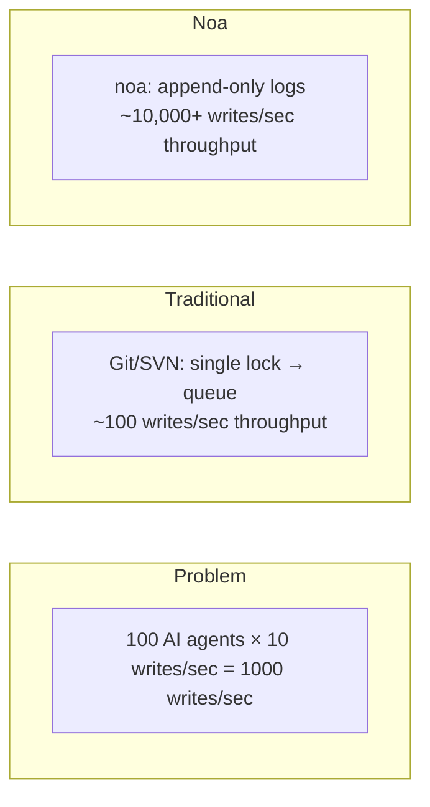
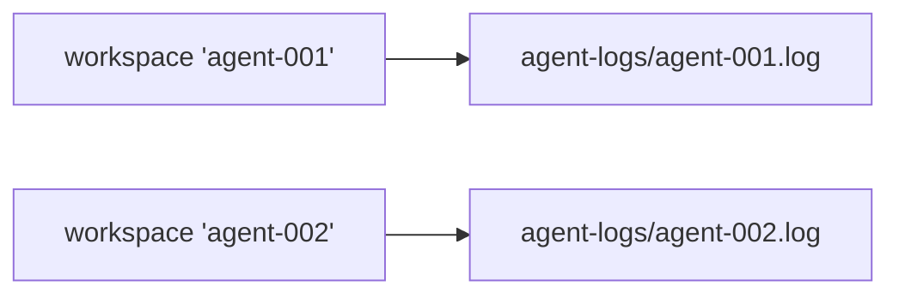
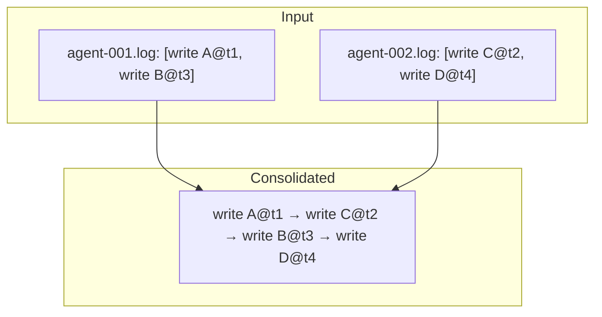
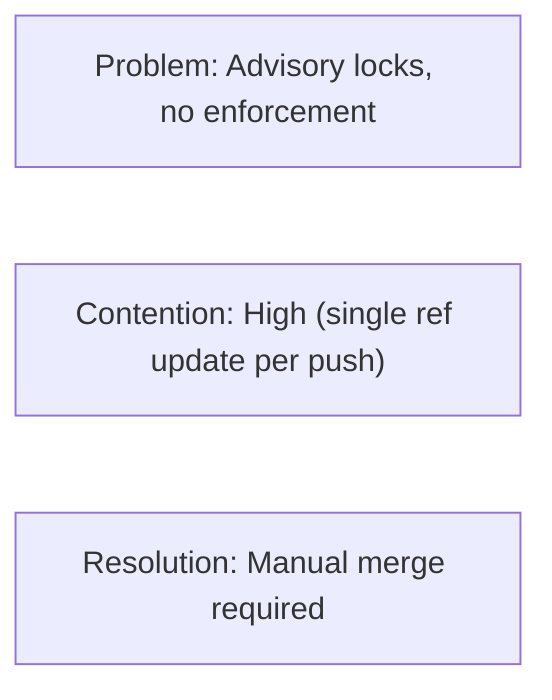
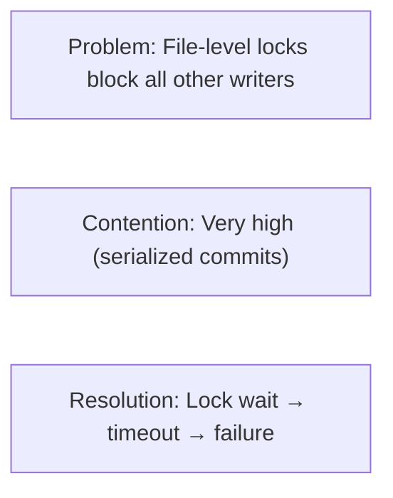
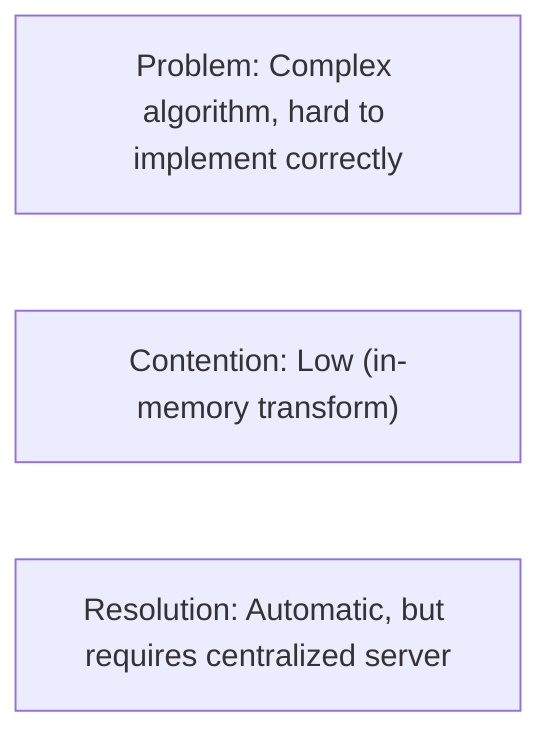
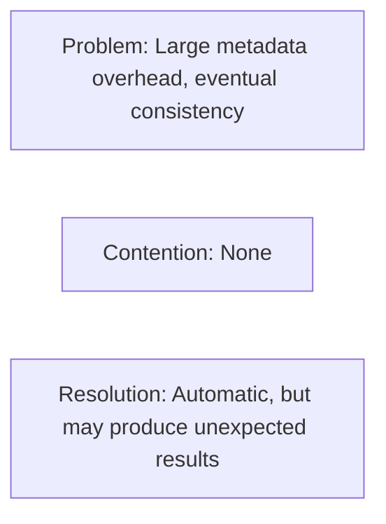
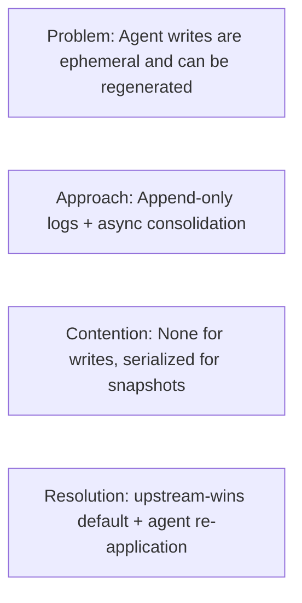

# Concurrency Design

## Problem Statement

Traditional VCS systems serialize writes through a single lock or merge queue.
This works for human-scale workflows (10-100 commits/day) but breaks down
with AI agents producing thousands of file modifications per minute.



## Architecture

### Layer 1: AgentLog (Write Path)

Each workspace has a dedicated JSONL file under `.noa/agent-logs/`.



Writes use `O_APPEND` flag, which provides:
- **Atomicity**: Kernel guarantees whole-write atomicity for appends
- **Ordering**: Writes are serialized per-file (per-workspace)
- **No locking**: No fcntl/flock required between different files

```rust
pub trait AgentLog: Send + Sync {
    async fn append(&self, workspace: &str, entry: &LogEntry) -> Result<()>;
    async fn read_all(&self, workspace: &str) -> Result<Vec<LogEntry>>;
}
```

### Layer 2: Snapshot Store (Read Path)

Snapshots are stored in redb with MVCC (multi-version concurrency control):
- Writes are serialized through redb's single-writer transaction
- Reads never block writes (snapshot isolation)
- Multiple readers can access simultaneously

### Layer 3: Consolidation (Merge Path)

The `Consolidator` reads all agent logs across workspaces, sorts by
timestamp, and produces a unified snapshot chain:



This runs asynchronously and does not block agent writes.

## Concurrency Guarantees

| Guarantee | Mechanism |
|-----------|-----------|
| No data loss | O_APPEND + fsync per write |
| Per-workspace ordering | Single file per workspace |
| Cross-workspace ordering | Microsecond timestamps |
| Read consistency | redb MVCC snapshot isolation |
| Workspace head safety | CAS (compare-and-swap) updates |

## Scalability Analysis

### Single-Process (Embedded)

| Agents | 1-100 (same process) |
| Throughput | ~10,000 writes/sec |
| Bottleneck | disk I/O (fsync per write) |

### Multi-Process (noa-server)

| Agents | 100-1000 (separate processes) |
| Throughput | ~5,000 writes/sec |
| Bottleneck | server-side write serialization |

The server holds a single database connection and serializes writes.
Agent logs remain per-file for parallel ingestion.

### Distributed (MinIO Backend)

| Agents | 1000+ |
| Throughput | S3 PUT rate limit (~3,500/sec per prefix) |
| Bottleneck | network + S3 rate limits |

## Comparison with Alternatives

### Git + File Locking



### SVN + svn:needs-lock



### Operational Transformation (OT)



### CRDT (Conflict-free Replicated Data Types)



### noa's Approach



## fsync Strategy

Every agent log write follows this pattern:

```rust
file.write_all(data)?;   // append to file
file.flush()?;           // flush userspace buffer
file.sync_data()?;       // fsync — ensure on-disk durability
```

On Linux, `sync_data()` skips metadata sync (fdatasync), reducing latency
by ~30% compared to full fsync.

## Future: Write-Ahead Log Batching

Current: one fsync per write.
Planned: batch multiple writes into a single fsync:

```rust
// Agent buffers writes in memory
agent.buffer(write_a);
agent.buffer(write_b);
agent.buffer(write_c);
agent.flush(); // single fsync for all three
```

Expected throughput improvement: 3-5x for bursty writes.
