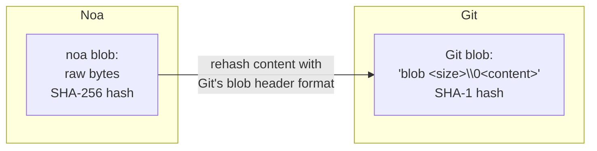
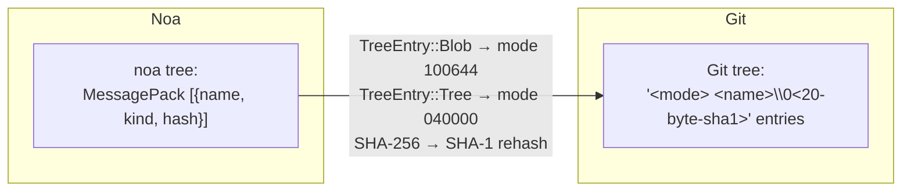
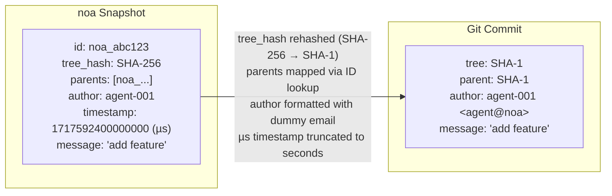
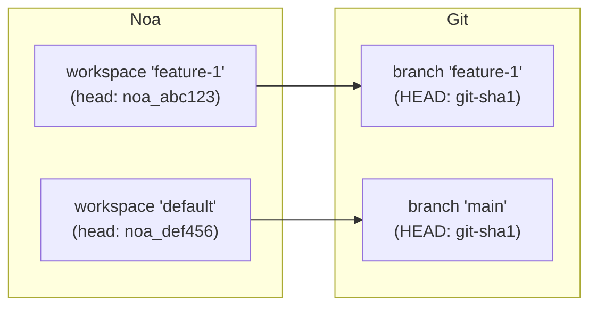
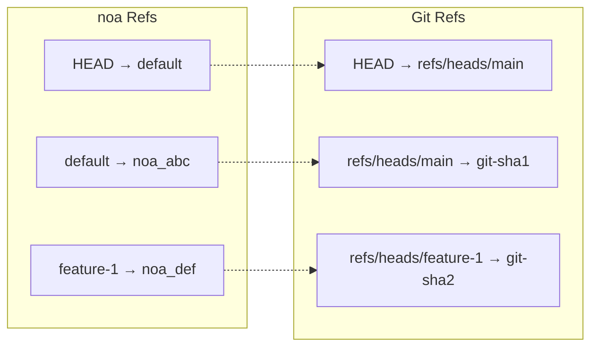
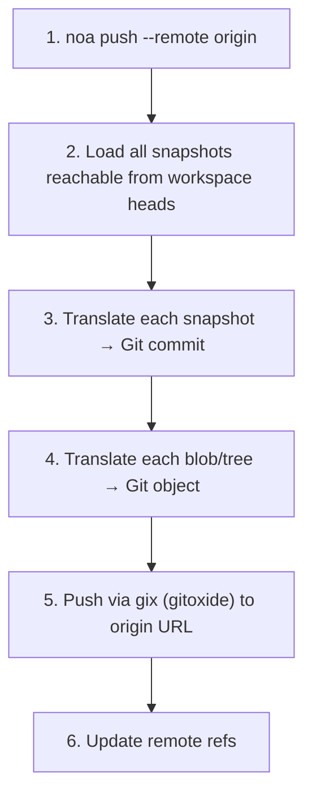
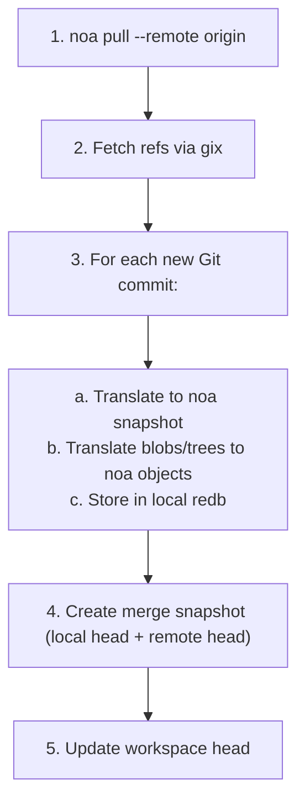
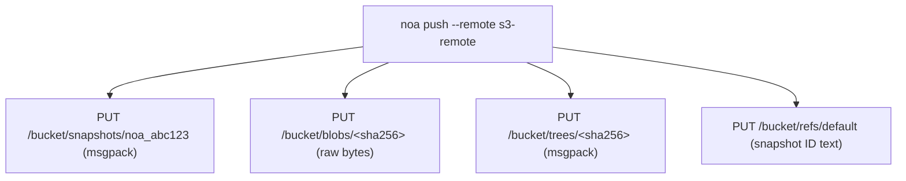

# Remote Interoperability Design

## Overview

noa supports multiple remote backends for syncing snapshots and objects
across machines and teams. The primary interoperability target is Git,
enabling seamless integration with existing workflows on GitHub, GitLab,
and Bitbucket.

## Remote Backend Trait

```rust
#[async_trait]
pub trait RemoteBackend: Send + Sync {
    async fn push_snapshots(&self, ids: &[SnapshotId]) -> Result<()>;
    async fn fetch_snapshots(&self, ids: &[SnapshotId]) -> Result<Vec<Snapshot>>;
    async fn push_objects(&self, ids: &[String]) -> Result<()>;
    async fn fetch_objects(&self, ids: &[String]) -> Result<()>;
    async fn list_refs(&self) -> Result<HashMap<String, SnapshotId>>;
    async fn update_ref(&self, name: &str, old: Option<&SnapshotId>, new: &SnapshotId) -> Result<()>;
}
```

## Git Translation Layer

The `GitTranslator` converts between noa's object model and Git's:

### Blob ↔ Git Blob



### Tree ↔ Git Tree



### Snapshot ↔ Git Commit



### Workspace ↔ Git Branch



### Ref Mapping



## Push Flow



## Pull Flow



## MinIO/S3 Backend

For deployments without Git infrastructure:



Advantages over Git remote:
- No tree/Snapshot translation needed (native noa format)
- Direct blob storage (no pack file overhead)
- S3-compatible (works with AWS, GCS, MinIO, Cloudflare R2)

## Remote Configuration

Stored in `.noa/config` (TOML):

```toml
[[remotes]]
name = "origin"
url = "https://github.com/example/repo.git"
backend = "git"

[[remotes]]
name = "s3"
url = "s3://my-bucket/noa-repo"
backend = "minio"
endpoint = "https://s3.amazonaws.com"
region = "us-east-1"
```

## Authentication

| Backend | Method |
|---------|--------|
| Git HTTPS | Credentials from `~/.git-credentials` or prompt |
| Git SSH | SSH agent or key file |
| MinIO/S3 | Access key + secret key (env vars or config) |

## Comparison: Remote Interop Approaches

| Approach | Used by | Pros | Cons |
|----------|---------|------|------|
| Git bridge (gix) | noa | Universal compatibility | Translation overhead, SHA-1/SHA-256 mismatch |
| Native protocol | Git | Fast, no translation | Only works with Git |
| WebDAV | SVN | HTTP-standard | Limited, SVN-specific |
| REST API | Bitbucket | Modern, flexible | Requires hosted service |
| S3-compatible storage | noa | Scalable, cloud-native | No Git interop without bridge |

noa supports both Git bridge (for compatibility) and native S3 (for scale).
