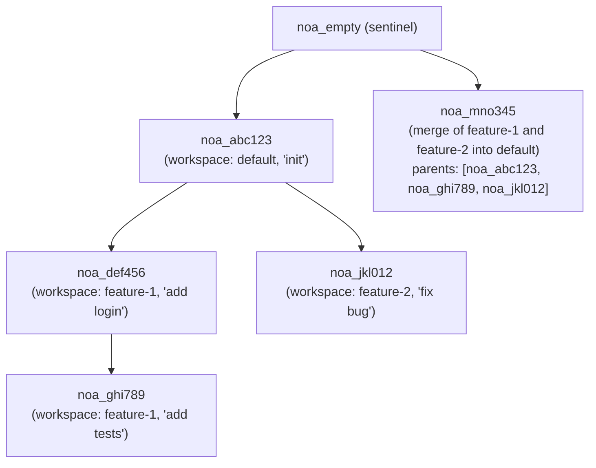
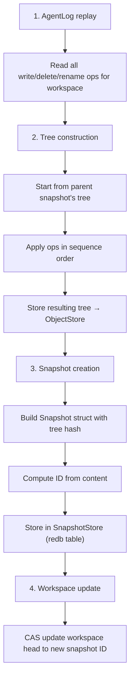

# Snapshot Model Design

## Overview

A snapshot is an immutable, content-addressed record of a workspace's
complete file tree state at a point in time. Snapshots form a directed
acyclic graph (DAG) through parent references.

## Snapshot Structure

```rust
pub struct SnapshotId(pub String);  // "noa_<12-char-base62>"

pub struct Snapshot {
    pub id: SnapshotId,
    pub tree_hash: String,           // SHA-256 of root tree
    pub parents: Vec<SnapshotId>,    // 0-N parent snapshots
    pub workspace: String,           // originating workspace
    pub author: String,              // agent or human identifier
    pub timestamp: u64,              // microseconds since epoch
    pub message: String,             // human-readable description
}
```

## ID Generation

Snapshot IDs use a 12-character base62 string prefixed with `noa_`:

```
noa_3kF8x2mP9aB1
```

Generation: `SHA256(tree_hash || parents || workspace || timestamp)[0..9]`
encoded as base62. This provides:
- 62^12 ≈ 3.2 × 10^21 possible IDs
- Collision probability effectively zero
- Deterministic: same inputs → same ID (enables deduplication)

## Snapshot DAG



## Snapshot Creation Flow



## Snapshot Store

Snapshots are stored in a redb table keyed by ID:

```
Table: snapshots
  Key:   "noa_abc123" (SnapshotId as &str)
  Value: msgpack(Snapshot) as &[u8]
```

## Diff Algorithm

`diff_snapshots(base, other)` produces a list of file-level changes:

```rust
pub struct FileDiff {
    pub path: String,
    pub kind: DiffKind, // Added, Removed, Modified
    pub old_blob: Option<String>,
    pub new_blob: Option<String>,
}
```

Algorithm:
1. Load root trees for both snapshots
2. Recursively walk both trees simultaneously
3. Compare blob hashes at each path
4. Different hash → Modified; only in one → Added/Removed

Time complexity: O(n) where n = total files in both trees.

## Sentinel Snapshot

`noa_empty` is a reserved snapshot ID representing an empty tree. All
new repositories start with this as their base. It is never explicitly
stored — the workspace manager recognizes it as "no snapshots yet."

## Comparison with Git Commits

| Aspect | noa Snapshot | Git Commit |
|--------|-------------|------------|
| ID format | `noa_<base62>` | SHA-1 hex |
| Parent limit | Unlimited (merge DAG) | Typically 1-2 |
| Tree format | MessagePack | Custom binary |
| Timestamp | Microsecond precision | Second precision + timezone |
| Author field | Agent ID or human | name + email |
| Immutability | Enforced by store | Enforced by hash |
| GPG signing | Not supported | Supported |
