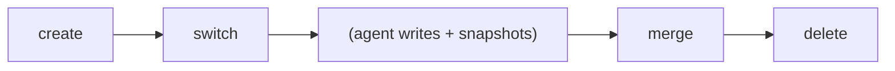

# Workspace Isolation Design

## Overview

Workspaces provide isolated working contexts for agents and humans.
Each workspace has independent state (head snapshot, agent log) while
sharing the underlying object store.

## Workspace Structure

```rust
pub struct Workspace {
    pub name: String,
    pub head: SnapshotId,     // current snapshot
    pub base: SnapshotId,     // fork point from parent workspace
    pub agent_id: Option<String>,  // associated agent
    pub created_at: u64,
    pub updated_at: u64,
}
```

## Workspace Lifecycle



### Creation

```bash
noa workspace create feature-1
```

1. Read current workspace's head snapshot → becomes `base`
2. New workspace: `head = base` (inherits current state)
3. Create agent log file: `agent-logs/feature-1.log`
4. Register in WorkspaceStore

### Switching

```bash
noa workspace switch feature-1
```

1. Verify workspace exists
2. Write workspace name to `.noa/HEAD`
3. Save previous workspace to `.noa/ORIG_HEAD`

### Merging

```bash
noa workspace merge feature-1
```

1. Three-way merge: base → ours (current) vs theirs (feature-1)
2. Create merge snapshot with both as parents
3. Update current workspace head

### Deletion

```bash
noa workspace delete feature-1
```

1. Verify not the active workspace
2. Remove workspace entry from store
3. Delete agent log file
4. Objects remain (shared, content-addressed)

## HEAD File

`.noa/HEAD` contains the active workspace name:

```
feature-1
```

`.noa/ORIG_HEAD` contains the previous workspace (for undo):

```
default
```

## Workspace Store

Workspaces are stored in redb:

```
Table: workspaces
  Key:   "feature-1" (workspace name as &str)
  Value: msgpack(Workspace) as &[u8]
```

Head updates use CAS (compare-and-swap):

```rust
async fn update_head(&self, name: &str, expected: &SnapshotId, new: &SnapshotId) -> Result<()>
```

This prevents lost updates when multiple processes try to update the same
workspace concurrently.

## Comparison with Git Branches

| Aspect | noa Workspace | Git Branch |
|--------|---------------|------------|
| Storage | redb table entry | ref file (`.git/refs/heads/`) |
| Isolation | Own agent log file | Shared index + working tree |
| Switching | Atomic HEAD write | Working tree checkout (file I/O) |
| Creation | O(1) — just metadata | O(1) — lightweight |
| Deletion | Remove from store | Delete ref, optionally prune |
| Agent binding | Optional agent_id field | No equivalent |
| Base tracking | Explicit base field | Implicit (merge base) |

## Comparison with SVN Branches

| Aspect | noa Workspace | SVN Branch |
|--------|---------------|------------|
| Storage | KV entry | Full directory copy |
| Creation | O(1) metadata | O(n) file copy |
| Isolation | Logical (shared objects) | Physical (separate directories) |
| Merge tracking | Parent DAG | svn:mergeinfo properties |

## Design Rationale

### Why workspaces instead of branches?

1. **Agent identity**: Workspaces carry an `agent_id` field for attribution
2. **Agent log isolation**: Each workspace has a dedicated log file
3. **No working tree**: noa doesn't maintain a checkout — only snapshots
4. **Explicit base**: The `base` field enables fast merge-base computation

### Why no working tree checkout?

Git branches require a working tree checkout (file I/O for every switched file).
noa workspaces only switch a pointer — the agent log and snapshot reference.
This is O(1) regardless of repository size.

File materialization (checkout) happens separately when an agent needs to
read or write actual files, using the snapshot's tree as the source of truth.
