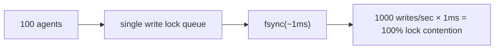
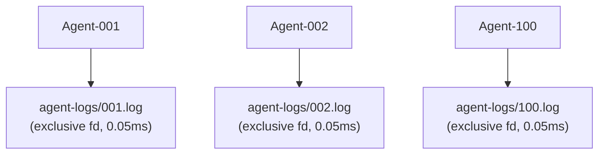

# Agent Concurrency Model

## Design Goals

noa supports tens to hundreds of AI agents writing simultaneously with
**zero lock contention**.

## Problem: Single-Writer Bottleneck

Traditional embedded databases (including redb) use a single write lock:



## Solution: Per-Workspace Agent Logs

Each workspace gets its own JSONL file. Writes use `O_APPEND` which is
atomic on POSIX systems:



Total: 0.05ms per write, zero lock contention.

## AgentLog Format

```jsonl
{"seq":1,"op":"write","path":"src/main.rs","blob":"abc123...","ts":1717592400000000}
{"seq":2,"op":"delete","path":"src/old.rs","ts":1717592401000000}
{"seq":3,"op":"rename","from":"src/foo.rs","to":"src/bar.rs","ts":1717592402000000}
{"seq":4,"op":"snapshot","snapshot_id":"noa_z7x9","parent":"noa_y6w8","message":"feat","ts":1717592405000000}
```

- `seq`: monotonic counter per workspace
- `ts`: microsecond-precision timestamp
- Consolidation sorts globally by `ts`

## When to Use redb vs AgentLog

| Component | Storage | Reason |
|-----------|---------|--------|
| blobs, trees | redb | Content-addressed, immutable, read-heavy |
| snapshots, refs, workspaces | redb | Metadata, low write frequency |
| agent incremental logs | File JSONL | High-frequency concurrent writes |

## Consolidation

The `Consolidator` reads all agent logs, sorts by timestamp, and creates
a unified snapshot chain:

```rust
Consolidator::new(&engine)
    .consolidate("default", parent_ids, "agent", "batch update")
    .await?;
```

## noa-server for Multi-Process Concurrency

For true multi-process scenarios (multiple CLI processes or distributed
agents), use the noa-server HTTP API:

```bash
noa-server  # starts on port 3000

# Agents interact via REST:
POST /api/v1/repo/my-project/blobs
POST /api/v1/repo/my-project/snapshots
POST /api/v1/repo/my-project/agent-log
```

The server holds a single database connection and serializes writes
internally, while handling concurrent reads via MVCC.
