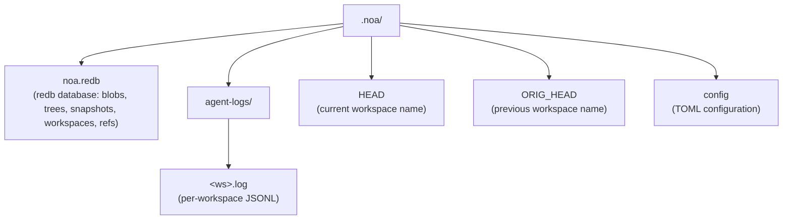
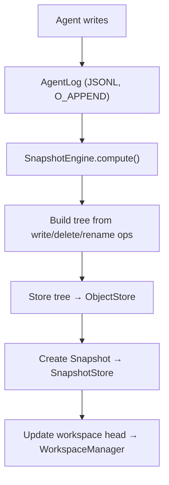

# Architecture

## Core Components

### ObjectStore

Content-addressed storage for blobs and trees. Content is addressed by SHA-256 hash.

```
BlobId = SHA256(content)
TreeId = SHA256(msgpack(TreeEntries))
```

Implementations:
- **RedbObjectStore**: Local storage using redb embedded KV store
- **MinioObjectStore**: Remote storage using S3-compatible MinIO

### AgentLog

Per-workspace append-only log for zero-lock concurrent writes. Each workspace
gets its own JSONL file under `.noa/agent-logs/<ws>.log`.

Operations:
- **write**: Record a file write with blob reference
- **delete**: Record a file deletion
- **rename**: Record a file rename
- **snapshot**: Record a snapshot creation
- **merge**: Record a merge from another workspace

### Snapshot

Immutable point-in-time state of a workspace. Contains a tree hash, parent
snapshots, author, and message.

```
Snapshot = {
    id: "noa_<12-char-base62>"
    tree_hash: SHA256 of tree content
    parents: [SnapshotId, ...]
    workspace: workspace name
    author: agent identifier
    timestamp: microsecond precision
    message: human-readable description
}
```

### Workspace

Isolated working context for an agent. Tracks head snapshot and base snapshot.

### RefStore

Named pointers to snapshots with compare-and-swap (CAS) semantics for safe
concurrent updates.

### Merge Engine

Three-way merge comparing base, ours, and theirs trees:
- Same change on both sides → no conflict
- Change on one side only → apply
- Different changes to same file → conflict (default: upstream-wins)

## Storage Layout



## Data Flow


