# Building noa

## Prerequisites

- Rust 1.75+ (stable)
- Python 3.8+ (for build scripts)
- `just` command runner

## Setup

```bash
git clone https://github.com/celestia-island/noa.git
cd noa
just init          # fetch Rust dependencies
just build-dev     # development build
```

## Development

```bash
just fmt            # format code
just clippy         # lint
just test           # run tests
just check          # type-check
```

## Project Structure

```mermaid
graph TD
    SRC["src/"] --> LIB["lib.rs<br/>(Library root)"]
    SRC --> ERR["error.rs<br/>(Error types)"]
    SRC --> CFG["config.rs<br/>(Configuration)"]
    SRC --> REPO["repo.rs<br/>(Repository lifecycle)"]
    SRC --> OBJ["object/<br/>(ObjectStore trait + impls)"]
    SRC --> LOG["log/<br/>(AgentLog trait + impls)"]
    SRC --> SNAP["snapshot/<br/>(Snapshot engine)"]
    SRC --> WS["workspace/<br/>(Workspace manager)"]
    SRC --> REFS["refs.rs<br/>(RefStore trait + impl)"]
    SRC --> MERGE["merge/<br/>(Merge engine)"]
    SRC --> GIT["git/<br/>(Git compatibility)"]
    SRC --> REMOTE["remote.rs<br/>(RemoteBackend trait)"]
    SRC --> CLI["cli/<br/>(CLI commands)"]
```


