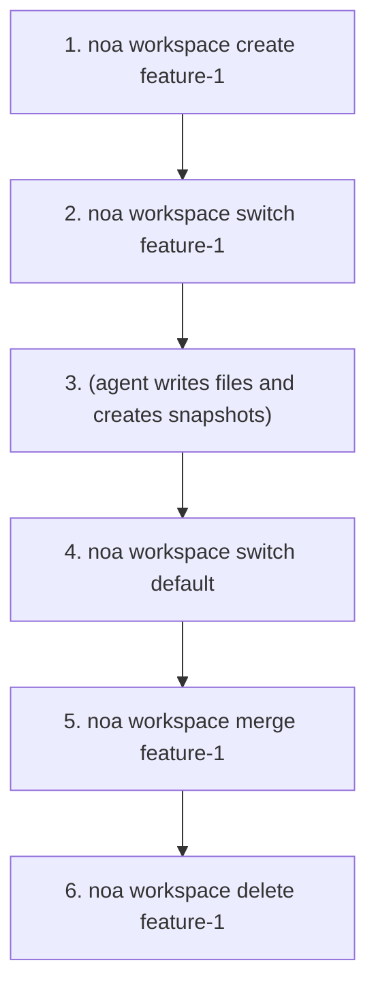
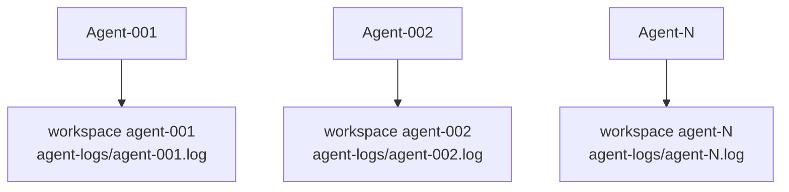

# Workspace Guide

Workspaces are isolated working contexts, similar to Git branches. Each
workspace has its own head snapshot and agent log.

## Creating Workspaces

```bash
noa workspace create feature-1
noa workspace create agent-debug --agent bot-42
```

The `--agent` flag associates the workspace with a specific agent ID.

## Switching Workspaces

```bash
noa workspace switch feature-1
noa status
# On workspace: feature-1 (head: noa_abc123)
```

## Listing Workspaces

```bash
noa workspace list
#   default             head: noa_abc123 base: noa_empty
# * feature-1           head: noa_def456 base: noa_abc123
```

The `*` marker shows the active workspace.

## Merging Workspaces

```bash
noa workspace switch default
noa workspace merge feature-1
# Merged feature-1 into default -> noa_ghi789
```

If conflicts are detected:

```
Conflicts detected:
  CONFLICT: src/main.rs
Merged feature-1 into default -> noa_ghi789
```

The default resolution strategy is upstream-wins (theirs). Future versions
will support manual conflict resolution.

## Deleting Workspaces

```bash
noa workspace delete feature-1
# Deleted workspace 'feature-1'
```

You cannot delete the active workspace.

## Workflow Pattern



## Multi-Agent Pattern

Each agent gets its own workspace:



Each workspace has an independent agent log (`.noa/agent-logs/agent-001.log`),
allowing zero-lock concurrent writes. A consolidation step merges all logs
by timestamp to create a unified history.

> **Note**: redb uses an exclusive file lock, so multiple CLI processes
> cannot open the same database concurrently. For true multi-process
> concurrency, use the noa-server HTTP API.
