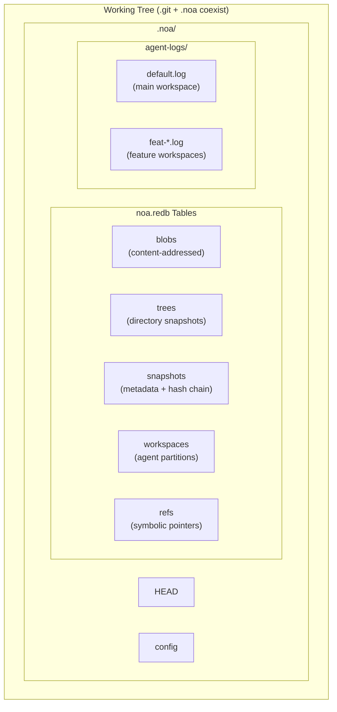
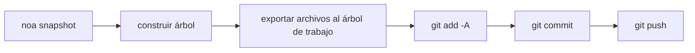
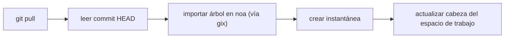
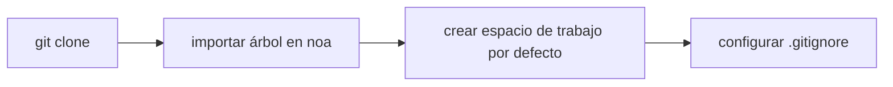

<div align="center"></div>
<h1 align="center">Noa</h1>
<div align="center">
 <strong>Sistema de control de versiones distribuido nativo para IA</strong>
</div>

<br />

<div align="center">
  <a href="https://github.com/celestia-island/noa/actions">
    
  </a>
  <a href="https://github.com/celestia-island/noa/actions">
    
  </a>
  <a href="https://crates.io/crates/libnoa">
    
  </a>
  <a href="https://docs.rs/libnoa">
    
  </a>
  <a href="../../LICENSE">
    
  </a>
  <a href="https://github.com/celestia-island/noa/releases">
    
  </a>
</div>

noa es un sistema de control de versiones distribuido nativo para IA. Coexiste con `.git` — git gestiona el código fuente, noa gestiona los datos de iteración de agentes de IA — con registros JSONL sin bloqueo por agente, historial basado en instantáneas y compatibilidad total con el protocolo git.

## Tabla de Contenidos

- [Por qué noa](#por-qué-noa)
- [Arquitectura](#arquitectura)
- [Instalación](#instalación)
- [Inicio Rápido](#inicio-rápido)
- [Comandos](#comandos)
- [Integración con Git](#integración-con-git)
- [Compatibilidad](#compatibilidad)
- [API (libnoa)](#api-libnoa)
- [Compilación desde el Código Fuente](#compilación-desde-el-código-fuente)
- [Proyectos Relacionados](#proyectos-relacionados)
- [Licencia](#licencia)

## Por qué noa

El git tradicional trata a todos los contribuyentes por igual — humanos o IAs. Pero los agentes de IA tienen necesidades fundamentalmente diferentes:

| Desafío | Respuesta de Git | Respuesta de noa |
|-----------|-------------|--------------|
| **Escrituras concurrentes** | Archivos de bloqueo, conflictos de fusión | Registros JSONL de solo anexión por agente |
| **Identidad del agente** | Configurar user.name/email por repositorio | agent_id con alcance de espacio de trabajo y particiones por agente |
| **Contribuciones parciales** | Un commit = todos los cambios en el árbol de trabajo | Los registros del agente solo contienen los archivos que realmente modificó |
| **Seguimiento de iteraciones** | Rebase/squash destruye el historial | Cadena de instantáneas inmutables por espacio de trabajo |
| **Fusión multi-agente** | Fusión a tres vías sobre texto | Fusionar instantáneas, detectar conflictos a nivel de archivo |
| **Compatibilidad con protocolo Git** | N/A | Puente CLI de git del sistema para clone/push/pull/fetch |

## Arquitectura



**Conceptos centrales:**

- **Espacio de trabajo**: Un espacio de nombres lineal aislado para un agente. Cada uno tiene su propio registro JSONL.
- **Instantánea**: Un registro puntual del estado del árbol de un espacio de trabajo (blobs y árboles direccionados por contenido SHA-256).
- **Registro de agente**: Archivo JSONL de solo anexión que registra operaciones atómicas de archivos (`write`, `delete`, `rename`) con IDs de blob y marcas de tiempo.
- **Fusión**: Fusión a tres vías de dos instantáneas de espacios de trabajo contra su base común.

## Instalación

### Desde GitHub Releases

```bash
# Descargar el binario de la última versión para tu plataforma:
#   https://github.com/celestia-island/noa/releases

chmod +x noa
mv noa /usr/local/bin/
```

### Desde el Código Fuente (Requiere Rust 1.85+)

```bash
git clone https://github.com/celestia-island/noa.git
cd noa
cargo build --release
# Binarios: target/release/noa, target/release/noa-server
```

### Como Biblioteca (Cargo)

```toml
[dependencies]
libnoa = { git = "https://github.com/celestia-island/noa" }
```

Nota: El nombre del paquete en crates.io es `libnoa` (el nombre `noa` ya estaba ocupado). El binario sigue llamándose `noa`.

## Inicio Rápido

### Inicializar en un repositorio git existente

```bash
cd my-git-project
noa init                              # crea .noa/ junto a .git/
noa remote add origin "git@github.com:user/repo.git"
noa pull                              # importa el HEAD actual de git a noa
```

### Crear espacios de trabajo de agentes e iterar

```bash
# El Agente A trabaja en la funcionalidad de autenticación
noa workspace create feat-auth -a agent-auth
noa workspace switch feat-auth

# El agente escribe en su registro de agente
# (los agentes de IA escriben JSONL directamente; aquí hay un ejemplo manual)
cat >> .noa/agent-logs/feat-auth.log << EOF
{"seq":1,"op":"write","path":"src/auth.rs","blob_id":"<sha256>","ts":1717000000000000}
EOF

# Guardar el estado del espacio de trabajo
noa snapshot create -m "añadir módulo auth" -a agent-auth
```

### Fusionar funcionalidades y sincronizar con git

```bash
noa workspace switch default
noa workspace merge feat-auth          # fusionar en default
noa push                               # exportar a commit git + git push
```

## Comandos

### Gestión de Espacios de Trabajo

```bash
noa workspace create <name> [-a <agent-id>]   # Crear un nuevo espacio de trabajo
noa workspace switch <name>                    # Cambiar el espacio de trabajo activo
noa workspace list                              # Listar todos los espacios de trabajo
noa workspace delete <name>                     # Eliminar un espacio de trabajo
noa workspace merge <from>                      # Fusionar otro espacio de trabajo en el actual
```

### Gestión de Instantáneas

```bash
noa snapshot create -m <msg> [-a <author>]     # Crear una instantánea desde el registro del agente
noa snapshot list                               # Listar instantáneas
noa snapshot diff <id-a> <id-b>                # Comparar dos instantáneas (a nivel de archivo)
```

### Operaciones Remotas

```bash
noa remote add <name> <url>                     # Añadir un remoto
noa remote remove <name>                        # Eliminar un remoto
noa remote list                                 # Listar remotos
noa fetch [-r <remote>]                         # Listar referencias remotas
noa pull [-r <remote>]                          # Git pull + reimportar en noa
noa push [-r <remote>]                          # Exportar instantánea → commit git → git push
```

### Operaciones de Repositorio

```bash
noa init [-p <path>] [--noa-remote <url>]      # Inicializar un repositorio .noa/
noa clone <url> [-p <path>]                     # Git clone + importar en noa
noa clone --svn <url> [-p <path>]              # Exportar SVN → git init → importar en noa
noa status                                       # Mostrar estado del espacio de trabajo actual
noa log [-w <workspace>] [-n <limit>]          # Mostrar historial de instantáneas
```

## Integración con Git

noa utiliza la CLI de `git` del sistema para todas las operaciones de red. Esto garantiza una compatibilidad del 100% con cualquier remoto git.

### Flujo de Push



### Flujo de Pull



### Flujo de Clone



### Decisiones Clave de Diseño

- **La exportación es aditiva**: Solo los archivos en la instantánea de noa se escriben en el árbol de trabajo. Los archivos existentes rastreados por git que no están en la instantánea se dejan sin cambios.
- **La importación usa gix**: Para el recorrido local de árboles (sin necesidad de red). Las operaciones de red usan la CLI de `git` del sistema.
- **`.noa/` se añade automáticamente a .gitignore**: `noa init` añade `.noa/` a `.gitignore` para que los datos del agente nunca se filtren al historial de git.

## Compatibilidad

### Plataformas Probadas

| Proveedor | Protocolo | Push | Pull | Clone | LFS |
|----------|----------|------|------|-------|-----|
| **GitHub** | HTTPS, SSH | ✓ | ✓ | ✓ | ✓ |
| **Bitbucket** | HTTPS, SSH | ✓ | ✓ | ✓ | ✓ |
| **GitLab** | HTTPS, SSH | ✓ | ✓ | ✓ | ✓ |
| **Repo bare local** | file:// | ✓ | ✓ | ✓ | ✓ |
| **SVN** | svn:// | Solo importación | — | `--svn` | — |

### Git LFS

noa detecta automáticamente repositorios Git LFS:

- `noa clone`: ejecuta `git lfs install` + `git lfs pull` para repositorios rastreados con LFS
- `noa push`: ejecuta `git lfs push --all` después de git push
- `noa pull`: ejecuta `git lfs pull` después de git pull
- Los archivos puntero LFS se importan como blobs normales en noa

### SVN

```bash
noa clone --svn file:///path/to/svn/repo -p ./my-project
```

Esto hace `svn export trunk → git init → noa import`. Es una **importación única** — para sincronización incremental, usa `svn export` + `noa snapshot create` programáticamente.

### Bitbucket

Tanto las URLs SSH (`git@bitbucket.org:ws/repo.git`) como HTTPS (`https://user@bitbucket.org/ws/repo.git`) son soportadas de forma nativa a través del puente git.

## API (libnoa)

libnoa expone una API de Rust para integrar la funcionalidad de noa en otras herramientas:

```rust
use libnoa::repo::Repository;
use libnoa::snapshot::SnapshotEngine;
use libnoa::log::FileAgentLog;

// Abrir un repositorio
let repo = Repository::open(&path)?;

// Crear un espacio de trabajo
let ws_mgr = repo.workspace_manager()?;
ws_mgr.create(&Workspace {
    name: "feat-x".into(),
    head: base_snap_id.clone(),
    base: base_snap_id.clone(),
    agent_id: Some("my-agent".into()),
    created_at: now,
    updated_at: now,
}).await?;

// Construir una instantánea desde los registros del agente
let engine = SnapshotEngine::new(
    FileAgentLog::new(&path, "my-agent")?,
    repo.snapshot_store()?,
    repo.object_store()?,
)
.with_repo_root(repo.root.clone());
let snapshot = engine.compute("feat-x", vec![], "author", "message").await?;

// Exportar instantánea a git
libnoa::git::export_noa_to_git(&repo.root, repo.db.clone()).await?;
```

Consulta `tests/smoke.rs` y `tests/compat.rs` para más ejemplos de uso.

## Compilación desde el Código Fuente

```bash
# Prerrequisitos: Rust 1.85+, git, pkg-config (opcional para LFS/SVN)
git clone https://github.com/celestia-island/noa.git
cd noa

# Compilar
cargo build --release
# Salida: target/release/noa (CLI), target/release/noa-server (servidor API)

# Ejecutar pruebas
cargo test -- --test-threads=1

# Iniciar el servidor noa
NOA_PORT=3000 NOA_DB_PATH=/data/noa/server.redb target/release/noa-server
```

## Proyectos Relacionados

| Proyecto | Relación |
|---------|-------------|
| [entelecheia](https://github.com/celestia-island/entelecheia) | Plataforma de orquestación multi-agente. Consume noa para el versionado de espacios de trabajo de agentes. |
| [tairitsu](https://github.com/celestia-island/tairitsu) | Framework de modelo de componentes WASM. Futuro: cliente noa como componente WASM. |
| [kirino](https://github.com/celestia-island/kirino) | Auth/RBAC de confianza cero. Usado por noa-server para autenticación. |

## Licencia

Apache-2.0. Consulta [LICENSE](../../LICENSE).
