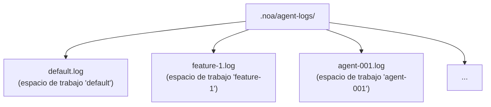
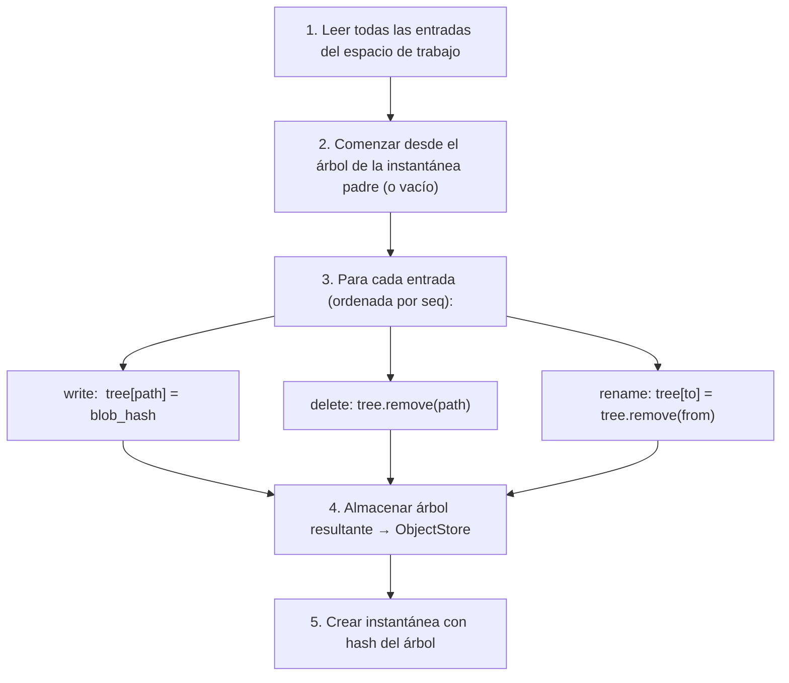
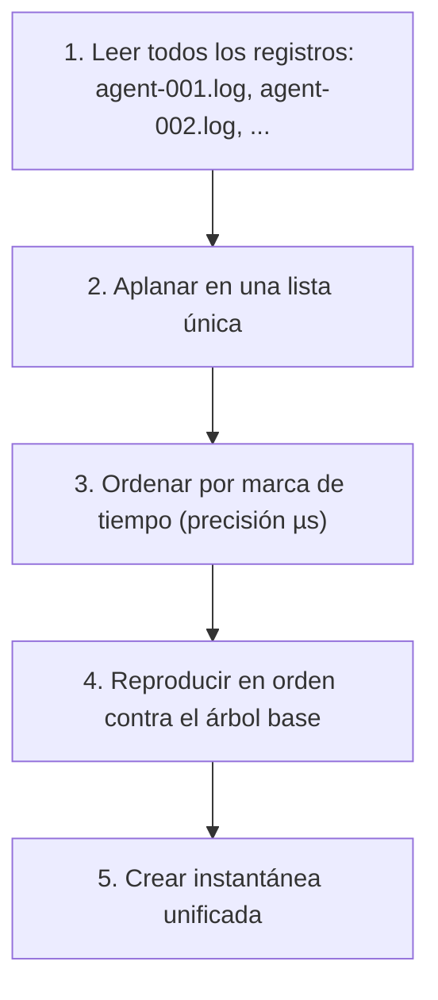

# Diseño del Registro de Agente

## Descripción General

El AgentLog es la capa de escritura de alto rendimiento de noa. Proporciona archivos
JSONL de solo anexión para cada espacio de trabajo, permitiendo escrituras concurrentes sin bloqueo desde
múltiples agentes IA.

## Formato de Entrada del Registro

Cada línea es un objeto JSON:

```jsonl
{"seq":1,"op":"write","path":"src/main.rs","blob":"a1b2c3...","ts":1717592400000000}
{"seq":2,"op":"delete","path":"src/old.rs","ts":1717592401000000}
{"seq":3,"op":"rename","from":"src/foo.rs","to":"src/bar.rs","ts":1717592402000000}
{"seq":4,"op":"snapshot","snapshot_id":"noa_z7x9","parent":"noa_y6w8","message":"feat","ts":1717592405000000}
{"seq":5,"op":"merge","from_workspace":"feature-1","from_snapshot":"noa_abc","base":"noa_def","ts":1717592408000000}
```

### Campos

| Campo | Tipo | Descripción |
|-------|------|-------------|
| `seq` | u64 | Número de secuencia monótono por espacio de trabajo |
| `op` | string | Tipo de operación: write, delete, rename, snapshot, merge |
| `path` | string | Ruta del archivo de destino (write, delete) |
| `blob` | string | Hash del blob (write) |
| `from` | string | Ruta de origen (rename) |
| `to` | string | Ruta de destino (rename) |
| `ts` | u64 | Marca de tiempo Unix con precisión de microsegundos |

## Estructura de Archivos



Cada espacio de trabajo recibe exactamente un archivo de registro. El nombre del archivo coincide con el nombre del espacio de trabajo.

## Ruta de Escritura

```rust
async fn append(&self, workspace: &str, entry: &LogEntry) -> Result<()> {
    let file = self.get_or_create_file(workspace)?;
    let line = serde_json::to_string(entry)? + "\n";
    file.write_all(line.as_bytes())?;
    file.sync_data()?;  // fdatasync para durabilidad
    Ok(())
}
```

Propiedades clave:
- **O_APPEND**: El kernel garantiza anexiones atómicas
- **fsync por escritura**: Asegura durabilidad después de un fallo
- **Un fd por espacio de trabajo**: Almacenado en caché en memoria para rendimiento

## Ruta de Lectura

```rust
async fn read_all(&self, workspace: &str) -> Result<Vec<LogEntry>> {
    let path = self.log_dir.join(format!("{}.log", workspace));
    let content = tokio::fs::read_to_string(&path).await?;
    content.lines()
        .filter(|l| !l.is_empty())
        .map(|l| serde_json::from_str(l))
        .collect::<Result<Vec<_>, _>>()
        .map_err(|e| NoaError::Serialization(e.to_string()))
}
```

## Cálculo de Instantáneas

El `SnapshotEngine` reproduce las entradas del registro para construir un árbol:



## Consolidación

Cuando múltiples registros de agentes necesitan fusionarse:



## Comparación: Por Qué No...

### ¿SQLite para registros de agentes?

- **Amplificación de escritura**: Actualizaciones del árbol B de SQLite para anexiones secuenciales
- **Bloqueo**: SQLite usa bloqueos WAL (escritor único)
- **Sobrecarga de fsync**: SQLite emite múltiples fsyncs por transacción
- **Excesivo**: Los registros de agentes son de solo anexión — sin lecturas aleatorias ni actualizaciones

### ¿redb para registros de agentes?

- **Escritor único**: El MVCC de redb requiere una transacción de escritura
- **Contención**: Múltiples agentes escribiendo en la misma BD → serializado
- **No optimizado para anexión**: redb es un almacén KV de propósito general

### ¿Búfer en memoria?

- **Durabilidad**: Un fallo del proceso pierde todas las escrituras en búfer
- **Presión de memoria**: 100 agentes × 1000 escrituras = 100K entradas en memoria
- **Complejidad**: Requiere hilo de volcado en segundo plano con recuperación ante fallos

### ¿JSONL simple con O_APPEND?

✅ Esto es lo que usa noa:
- **Sobrecarga mínima**: Una escritura + un fsync por entrada
- **Atomicidad garantizada por el kernel**: O_APPEND en POSIX
- **Recuperación ante fallos**: Solo la última entrada puede estar parcial (detectar por nueva línea final)
- **Legible por humanos**: JSONL es inspeccionable con herramientas estándar
- **Cero contención de bloqueos**: Un archivo por espacio de trabajo

## Rendimiento

Benchmark (ext4, SSD, Linux):

| Métrica | Valor |
|--------|-------|
| Latencia de escritura única | ~0.05ms (anexión + fdatasync) |
| Rendimiento (1 espacio de trabajo) | ~20,000 escrituras/seg |
| Rendimiento (100 espacios de trabajo) | ~10,000+ escrituras/seg |
| Tamaño de archivo por 1M entradas | ~200MB (promedio 200 bytes/entrada) |

## Recuperación ante Fallos

Al iniciar, escanear cada archivo de registro:
1. Leer todas las líneas completas (que terminan con `\n`)
2. Descartar la última línea si está truncada (escritura incompleta)
3. Verificar que `seq` es monótonamente creciente
4. Reconstruir el estado en memoria a partir de las entradas válidas

Esto asegura que no se usen entradas parciales o corruptas para el cálculo de instantáneas.
