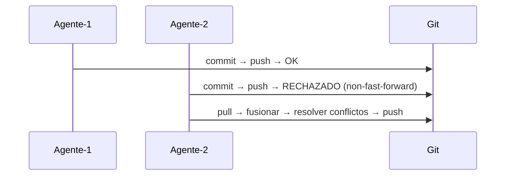
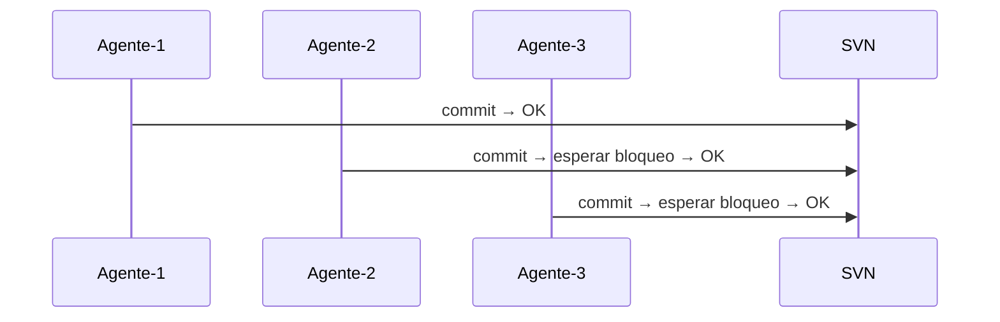
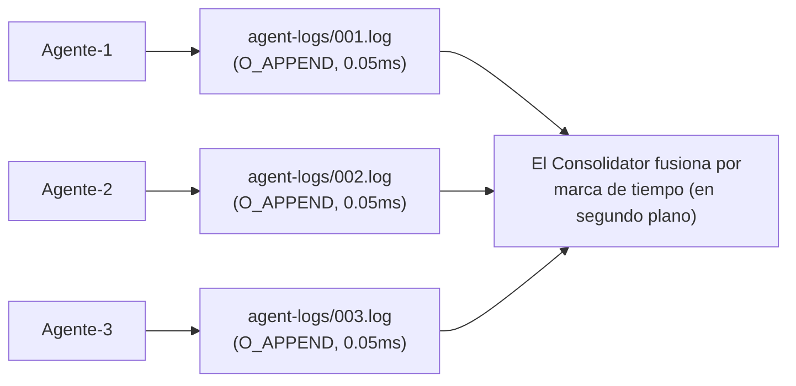
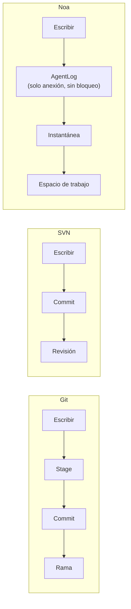
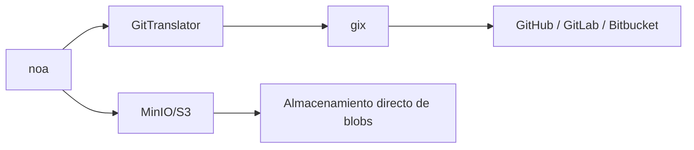

# noa vs Git vs SVN vs Bitbucket: Un Análisis Comparativo

## Resumen Ejecutivo

noa es un sistema de control de versiones diseñado específicamente para flujos de trabajo de agentes IA.
A diferencia de Git, SVN y Bitbucket (que envuelven Git/SVN), noa optimiza para
**escrituras concurrentes de alta frecuencia desde actores no humanos** — decenas a cientos
de agentes IA modificando archivos simultáneamente sin contención de bloqueos.

---

## Matriz de Comparación de Características

| Característica | noa | Git | SVN | Bitbucket |
|---------|-----|-----|-----|-----------|
| **Arquitectura** | KV embebido + registros de solo anexión | DAG direccionado por contenido | Almacén delta centralizado | Alojamiento Git/SVN |
| **Modelo de concurrencia** | Registros de solo anexión por espacio de trabajo (sin bloqueo) | Bloqueo a nivel de rama (conflictos de fusión) | El servidor central serializa | Igual que Git/SVN |
| **Estrategia de fusión** | Tres vías, upstream-wins por defecto | Tres vías, resolución manual | Fusión manual | Igual que Git/SVN |
| **Granularidad de instantánea** | Marcas de tiempo en microsegundos, por agente | Por commit (cadencia humana) | Por revisión | Igual que Git/SVN |
| **Nativo para agentes** | Sí — espacio de trabajo por agente, registros de agente | No — diseñado para flujos humanos | No | No |
| **Backend de almacenamiento** | Intercambiable (redb local, MinIO/S3 remoto) | Archivos pack + objetos sueltos | Berkeley DB / FSFS | Almacenamiento del lado del servidor |
| **Distribuido** | Sí (push/pull remoto mediante puente Git) | Sí (nativo) | No (centralizado) | Sí (alojado) |
| **Diff binario** | Blobs direccionados por contenido (sin delta) | Compresión delta a nivel de pack | Delta del lado del servidor | Igual que Git/SVN |
| **Bloqueo** | Ninguno para escrituras (registros de solo anexión) | Solo bloqueos advisory | `svn:needs-lock` | Igual que Git/SVN |
| **API HTTP** | Integrada (noa-server) | git-http-backend | WebDAV | API REST |
| **Curva de aprendizaje** | Mínima (6 comandos) | Pronunciada (~40 comandos) | Moderada | Moderada |

---

## Comparación Detallada

### 1. Concurrencia

**Git**: Una rama = un escritor a la vez. Los escritores concurrentes crean
historias divergentes que deben reconciliarse mediante fusión. Los conflictos de fusión
requieren intervención humana.



**SVN**: El servidor central serializa todos los commits. El bloqueo a nivel de archivo está disponible
pero crea cuellos de botella.



**noa**: Cada agente escribe en su propio archivo de registro de solo anexión. Cero contención
de bloqueos por diseño. La consolidación ocurre de forma asíncrona.



### 2. Modelo de Datos

**Git**: Blob → Tree → Commit → Branch → Ref. Direccionado por contenido mediante SHA-1.
Objetos inmutables. Las ramas son punteros mutables.

**SVN**: Archivo/Directorio → Revisión. Números de revisión lineales. Las rutas son
entidades de primera clase.

**noa**: Blob → Árbol → Instantánea → Espacio de trabajo. Direccionado por contenido mediante SHA-256.
Las instantáneas son inmutables. Los espacios de trabajo son punteros mutables con actualizaciones CAS.

Diferencia clave: la capa **AgentLog** de noa se sitúa entre las escrituras del agente
y la capa de instantáneas inmutables, proporcionando un búfer para operaciones
de alta frecuencia.



### 3. Filosofía de Fusión

**Git**: Fusión a tres vías con resolución humana de conflictos. Los conflictos bloquean
el progreso hasta que se resuelven.

**SVN**: Seguimiento manual de fusiones. La resolución de conflictos es a nivel de archivo.

**noa**: Fusión a tres vías con auto-resolución configurable (por defecto:
upstream-wins). Diseñado para agentes IA que pueden reaplicar cambios en lugar de
resolver conflictos manualmente.

Justificación: Los agentes IA no necesitan ver marcadores de conflicto — pueden
regenerar sus cambios contra el estado más reciente. La estrategia "upstream-wins"
garantiza el progreso hacia adelante.

### 4. Eficiencia de Almacenamiento

**Git**: Archivos pack con compresión delta. Optimizado para frecuencia
de commits a escala humana (~10-100 commits/día).

**SVN**: Almacenamiento delta del lado del servidor. Eficiente para archivos binarios grandes.

**noa**: Blobs direccionados por contenido sin compresión delta. Las instantáneas
están codificadas en msgpack. Compensación: implementación más simple, escrituras más rápidas,
almacenamiento más grande. Aceptable porque:
- Los artefactos de agentes IA se regeneran frecuentemente (las versiones antiguas son efímeras)
- El almacenamiento es barato; el rendimiento del agente es caro
- El backend MinIO/S3 maneja la deduplicación

### 5. Interoperabilidad Remota

**Git**: Protocolo nativo (git://, https://, ssh://). Universal.

**SVN**: svn://, http://. Vinculado a Apache/Subversion.

**noa**: Puente Git mediante `gix` (gitoxide). Puede hacer push/pull desde cualquier remoto Git.
También soporta backend nativo MinIO/S3 para almacenamiento directo de objetos.



### 6. Control de Acceso

**Git**: Permisos del sistema de archivos o hooks del lado del servidor (pre-receive, etc.).

**SVN**: ACLs basadas en rutas integradas en el protocolo.

**Bitbucket**: Permisos de rama, verificaciones de fusión, requisitos de revisión de código.

**noa**: Aislamiento a nivel de espacio de trabajo. Cada agente solo puede escribir en su
espacio de trabajo asignado. La fusión a ramas compartidas requiere acción explícita.
Autenticación del lado del servidor mediante noa-server.

---

## Cuándo Usar Qué

| Escenario | Mejor opción | Razón |
|----------|-------------|--------|
| Desarrollo de software humano | Git | Ecosistema maduro, herramientas universales |
| Generación de código por agentes IA (10+ agentes) | noa | Escrituras concurrentes sin bloqueo |
| Cumplimiento empresarial + auditoría | SVN | Centralizado, ACLs basadas en rutas |
| Colaboración en equipo + CI/CD | Bitbucket | Pipelines integrados, PRs, revisiones |
| Orquestación de agentes IA + revisión humana | noa → puente Git | Los agentes trabajan en noa, los humanos revisan mediante Git |
| Activos binarios grandes | SVN o Git LFS | Compresión delta para binarios |
| Dispositivos embebidos / edge | noa | Binario único, redb embebido, sin demonio |

---

## Rutas de Migración

### noa ↔ Git

```bash
# Exportar instantáneas de noa a Git
noa remote add origin https://github.com/example/repo.git
noa push --remote origin

# Importar historial de Git a noa
noa clone https://github.com/example/repo.git
```

El `GitTranslator` convierte entre el formato blob/árbol de noa y el formato
de objetos de Git. Las instantáneas se mapean a commits Git; los espacios de trabajo a ramas.

### Git → noa

No es un reemplazo — noa es un **complemento** a Git para flujos de trabajo de agentes IA.
Usa ambos:
1. Los agentes IA trabajan en espacios de trabajo de noa
2. Los cambios aprobados se fusionan a Git mediante push
3. Los desarrolladores humanos continúan usando Git como antes
