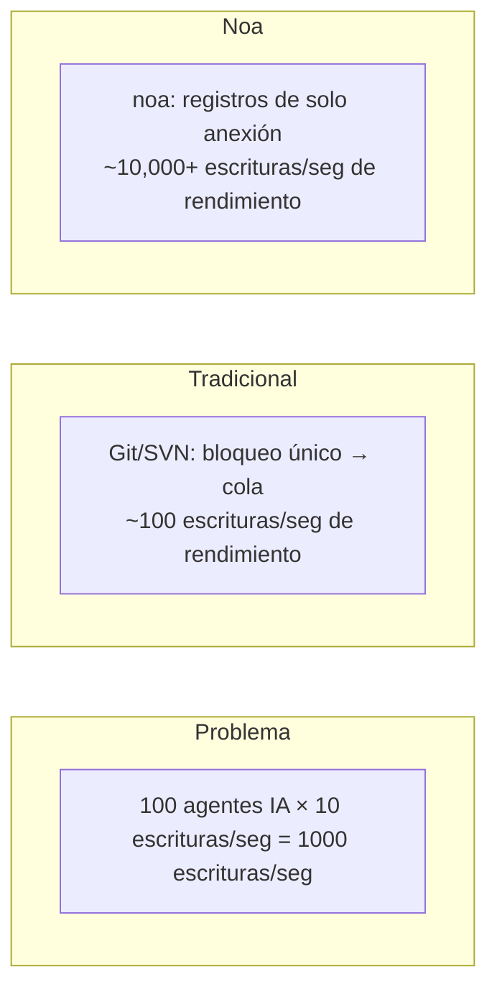
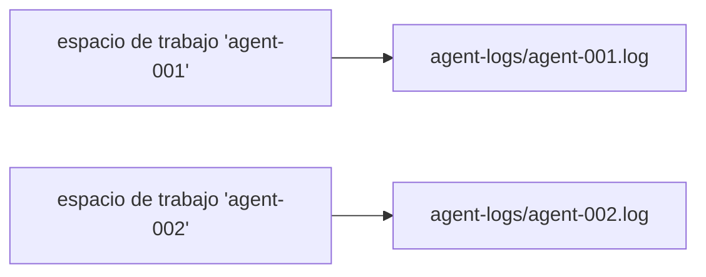
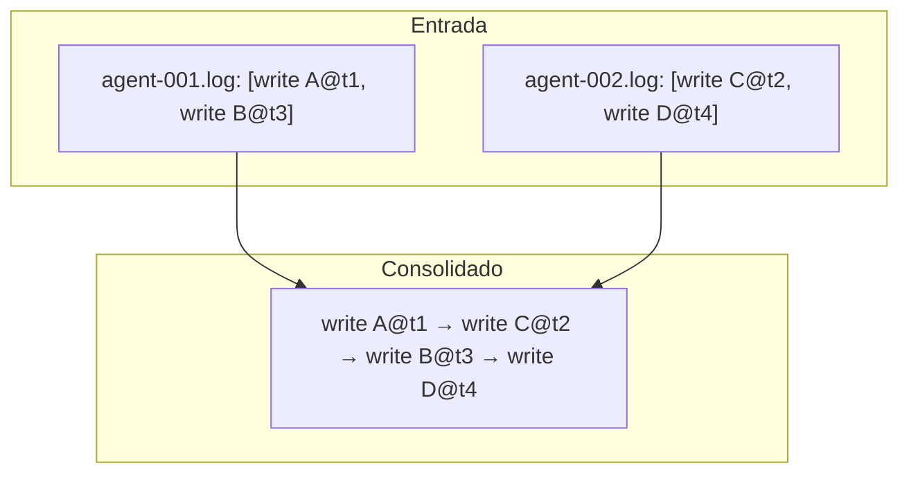
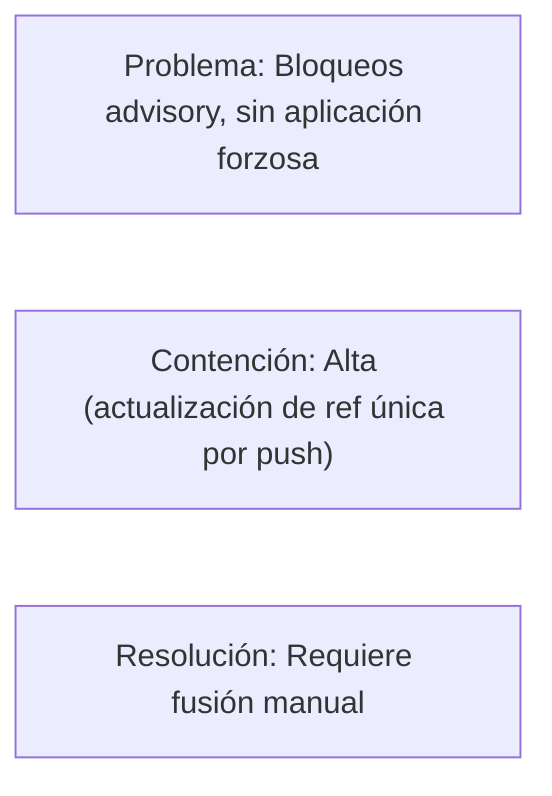
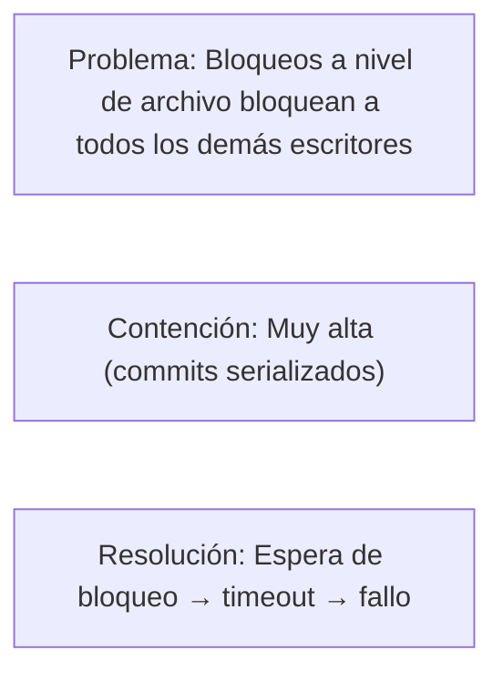
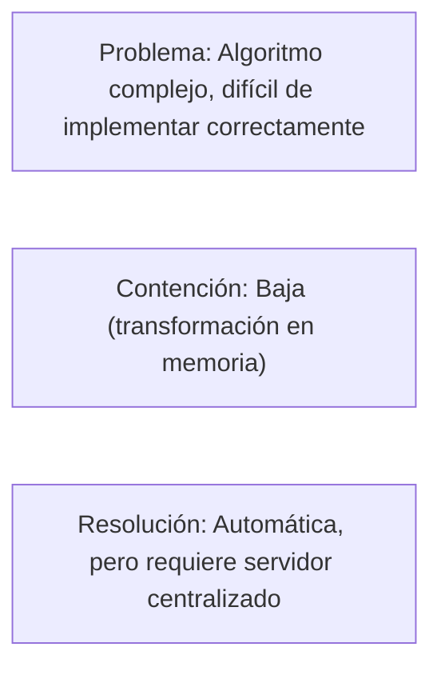
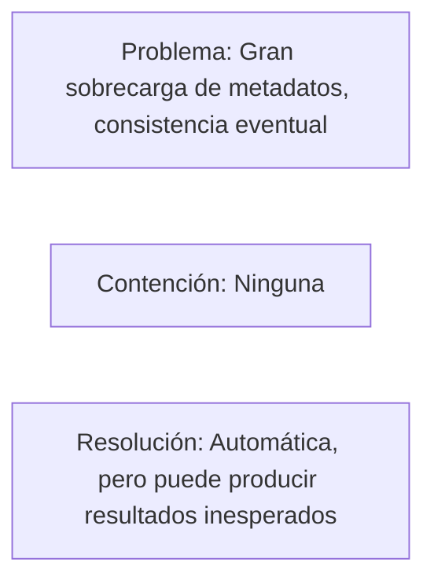
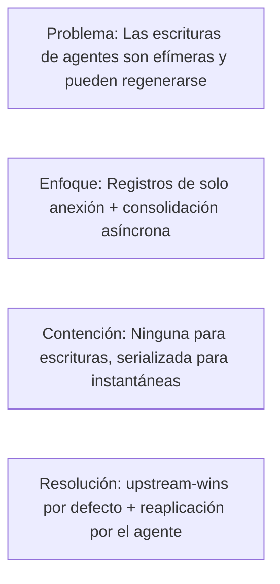

# Diseño de Concurrencia

## Planteamiento del Problema

Los sistemas VCS tradicionales serializan las escrituras a través de un único bloqueo o cola de fusión.
Esto funciona para flujos de trabajo a escala humana (10-100 commits/día) pero se rompe
con agentes IA que producen miles de modificaciones de archivos por minuto.



## Arquitectura

### Capa 1: AgentLog (Ruta de Escritura)

Cada espacio de trabajo tiene un archivo JSONL dedicado bajo `.noa/agent-logs/`.



Las escrituras usan la bandera `O_APPEND`, que proporciona:
- **Atomicidad**: El kernel garantiza atomicidad de escritura completa para anexiones
- **Ordenación**: Las escrituras se serializan por archivo (por espacio de trabajo)
- **Sin bloqueo**: No se requiere fcntl/flock entre archivos diferentes

```rust
pub trait AgentLog: Send + Sync {
    async fn append(&self, workspace: &str, entry: &LogEntry) -> Result<()>;
    async fn read_all(&self, workspace: &str) -> Result<Vec<LogEntry>>;
}
```

### Capa 2: Almacén de Instantáneas (Ruta de Lectura)

Las instantáneas se almacenan en redb con MVCC (control de concurrencia multiversión):
- Las escrituras se serializan a través de la transacción de escritor único de redb
- Las lecturas nunca bloquean las escrituras (aislamiento de instantánea)
- Múltiples lectores pueden acceder simultáneamente

### Capa 3: Consolidación (Ruta de Fusión)

El `Consolidator` lee todos los registros de agentes a través de los espacios de trabajo, ordena por
marca de tiempo y produce una cadena de instantáneas unificada:



Esto se ejecuta de forma asíncrona y no bloquea las escrituras de los agentes.

## Garantías de Concurrencia

| Garantía | Mecanismo |
|-----------|-----------|
| Sin pérdida de datos | O_APPEND + fsync por escritura |
| Ordenación por espacio de trabajo | Archivo único por espacio de trabajo |
| Ordenación entre espacios de trabajo | Marcas de tiempo en microsegundos |
| Consistencia de lectura | Aislamiento de instantánea MVCC de redb |
| Seguridad de cabeza de espacio de trabajo | Actualizaciones CAS (comparar e intercambiar) |

## Análisis de Escalabilidad

### Proceso Único (Embebido)

| Agentes | 1-100 (mismo proceso) |
| Rendimiento | ~10,000 escrituras/seg |
| Cuello de botella | E/S de disco (fsync por escritura) |

### Multi-Proceso (noa-server)

| Agentes | 100-1000 (procesos separados) |
| Rendimiento | ~5,000 escrituras/seg |
| Cuello de botella | serialización de escritura del lado del servidor |

El servidor mantiene una única conexión de base de datos y serializa las escrituras.
Los registros de agentes permanecen por archivo para ingesta paralela.

### Distribuido (Backend MinIO)

| Agentes | 1000+ |
| Rendimiento | Límite de tasa PUT de S3 (~3,500/seg por prefijo) |
| Cuello de botella | red + límites de tasa de S3 |

## Comparación con Alternativas

### Git + Bloqueo de Archivos



### SVN + svn:needs-lock



### Transformación Operacional (OT)



### CRDT (Tipos de Datos Replicados Sin Conflicto)



### Enfoque de noa



## Estrategia de fsync

Cada escritura del registro de agente sigue este patrón:

```rust
file.write_all(data)?;   // anexar al archivo
file.flush()?;           // vaciar búfer de espacio de usuario
file.sync_data()?;       // fsync — garantizar durabilidad en disco
```

En Linux, `sync_data()` omite la sincronización de metadatos (fdatasync), reduciendo la latencia
en ~30% comparado con fsync completo.

## Futuro: Agrupación de Registro de Escritura Anticipada

Actual: un fsync por escritura.
Planificado: agrupar múltiples escrituras en un solo fsync:

```rust
// El agente almacena escrituras en memoria
agent.buffer(write_a);
agent.buffer(write_b);
agent.buffer(write_c);
agent.flush(); // un solo fsync para las tres
```

Mejora de rendimiento esperada: 3-5x para escrituras en ráfagas.
