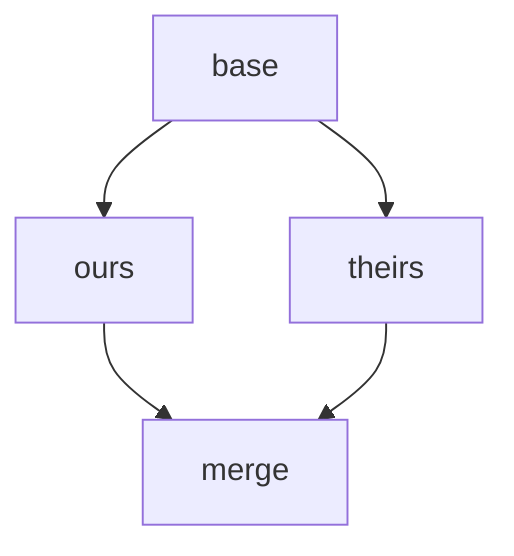
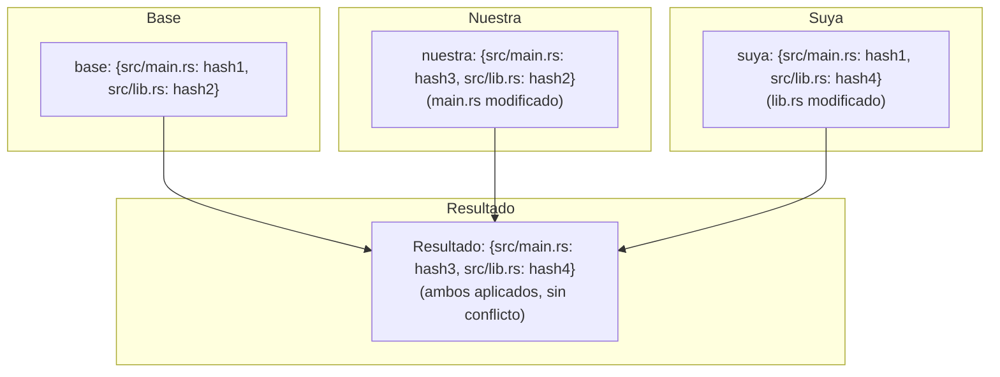
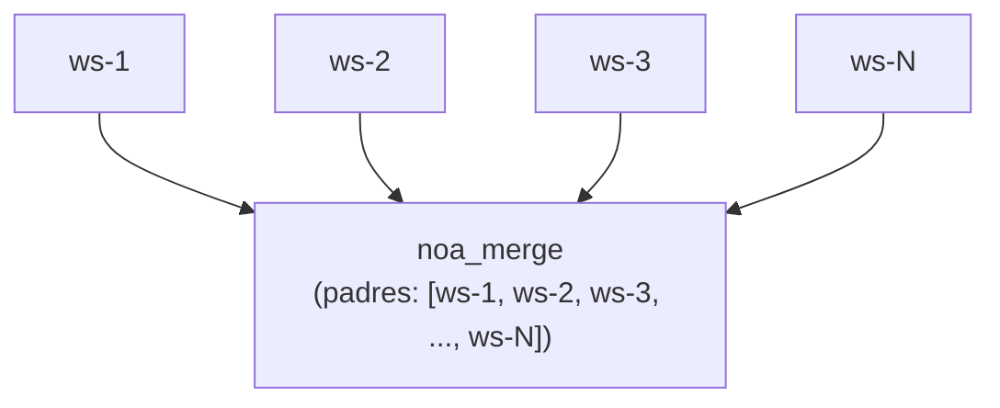
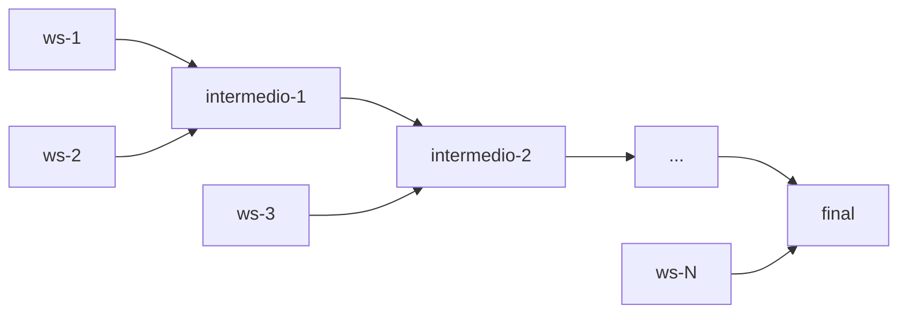

# Diseño de Estrategia de Fusión

## Descripción General

noa utiliza un algoritmo de fusión a tres vías con resolución de conflictos configurable.
El diseño prioriza el **progreso hacia adelante** sobre la intervención humana,
reflejando el caso de uso de agentes IA donde los cambios pueden regenerarse.

## Fusión a Tres Vías

### Algoritmo

Dadas dos instantáneas (nuestra, suya) con un ancestro común (base):



1. Diff `base` vs `nuestra` → cambios_A
2. Diff `base` vs `suya` → cambios_B
3. Para cada ruta modificada por cualquiera:
   - Mismo cambio en ambos lados → aplicar (sin conflicto)
   - Cambiado solo en A → aplicar A
   - Cambiado solo en B → aplicar B
   - Cambios diferentes en la misma ruta → **conflicto**

### Implementación

```rust
pub fn three_way_merge(
    base_tree: &Vec<TreeEntry>,
    ours_tree: &Vec<TreeEntry>,
    theirs_tree: &Vec<TreeEntry>,
) -> (Vec<TreeEntry>, Vec<Conflict>)
```

Las entradas del árbol se normalizan en mapas planos ruta→hash para comparación:



## Detección de Conflictos

```rust
pub struct Conflict {
    pub path: String,
    pub base_hash: Option<String>,
    pub ours_hash: Option<String>,
    pub theirs_hash: Option<String>,
}
```

Tipos de conflicto:
- **Modificar/Modificar**: Ambos lados cambiaron el mismo archivo de manera diferente
- **Añadir/Añadir**: Ambos lados añadieron un archivo en la misma ruta con contenido diferente
- **Eliminar/Modificar**: Un lado eliminó, el otro modificó

## Estrategias de Resolución

### upstream-wins (por defecto)

Cuando se detecta un conflicto, tomar la versión suya:

```rust
ConflictResolution::UpstreamWins => theirs_hash,
```

Justificación: En flujos de trabajo de agentes IA, el "upstream" (espacio de trabajo main/default)
representa el estado canónico. Los agentes pueden reaplicar sus cambios contra
la base actualizada.

### ours-wins

Tomar nuestra versión:

```rust
ConflictResolution::OursWins => ours_hash,
```

### fail (planificado)

Abortar fusión y devolver conflictos para resolución manual:

```rust
ConflictResolution::Fail => return Err(MergeError::Conflict(conflicts)),
```

## Flujo de Fusión de Espacios de Trabajo

```bash
noa workspace switch default          # establecer nuestra = default
noa workspace merge feature-1         # suya = feature-1
```

Pasos internos:
1. Cargar instantánea nuestra (cabeza de default)
2. Cargar instantánea suya (cabeza de feature-1)
3. Encontrar base de fusión (último ancestro común en el DAG)
4. Si no hay ancestro común, usar `noa_empty` como base
5. Realizar fusión a tres vías
6. Aplicar estrategia de resolución de conflictos
7. Crear instantánea de fusión con padres = [nuestra, suya]
8. Actualizar la cabeza de default a la instantánea de fusión

## Fusiones Multi-Padre

Las instantáneas de noa soportan padres ilimitados, permitiendo fusiones estilo pulpo:



Para fusiones de N vías, el algoritmo realiza fusiones por pares:



## Comparación con Git Merge

| Aspecto | noa | Git |
|--------|-----|-----|
| Algoritmo | Tres vías | Tres vías (mismo algoritmo central) |
| Marcadores de conflicto | Ninguno (auto-resolución) | `<<<<<<<` / `=======` / `>>>>>>>` |
| Resolución por defecto | upstream-wins | Ninguna (requiere humano) |
| Multi-padre | Ilimitado | Típicamente ≤2 |
| Rebase | No soportado | Soportado |
| Cherry-pick | No soportado | Soportado |
| Fast-forward | Automático | Opcional (–no-ff) |

## Comparación con SVN Merge

| Aspecto | noa | SVN |
|--------|-----|-----|
| Seguimiento de fusión | Integrado (DAG de padres) | Manual (propiedades mergeinfo) |
| Resolución de conflictos | Automática | Manual (archivos de conflicto) |
| Modelo de rama | Espacio de trabajo (ligero) | Basado en directorios (pesado) |
| Dirección de fusión | Cualquiera → cualquiera (DAG) | Típicamente rama → tronco |

## Justificación del Diseño: ¿Por Qué Auto-Resolver?

El VCS tradicional requiere resolución humana de conflictos porque:
1. El código escrito por humanos tiene significado semántico que solo los humanos entienden
2. Los conflictos pueden representar desacuerdos fundamentales de diseño
3. La resolución manual garantiza la corrección

Los cambios de agentes IA tienen características diferentes:
1. **Regenerables**: Los agentes pueden reaplicar cambios contra el estado más reciente
2. **Alta frecuencia**: Pausar para resolución humana bloquea todo el trabajo posterior
3. **No semántico**: Los cambios a nivel de archivo no requieren interpretación humana

Por lo tanto, la auto-resolución con una política clara (upstream-wins) es la
compensación correcta para el caso de uso de noa.
