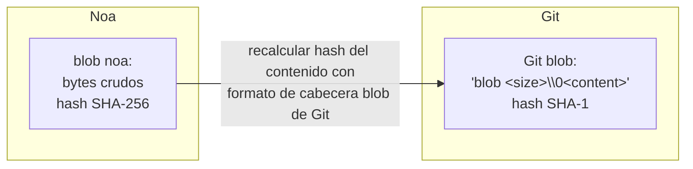
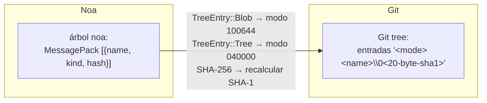
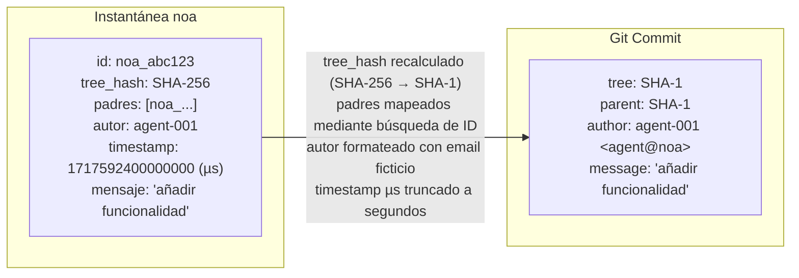
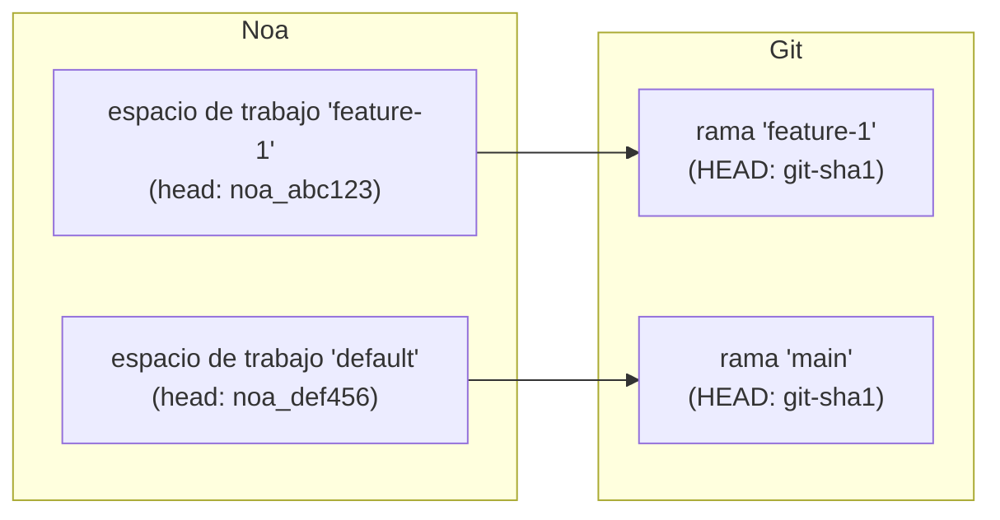
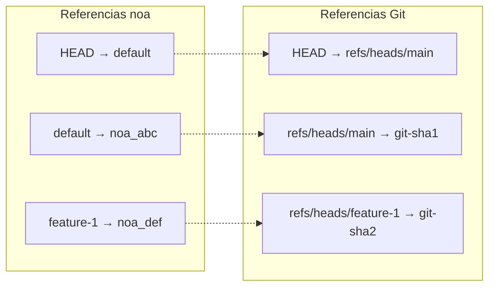
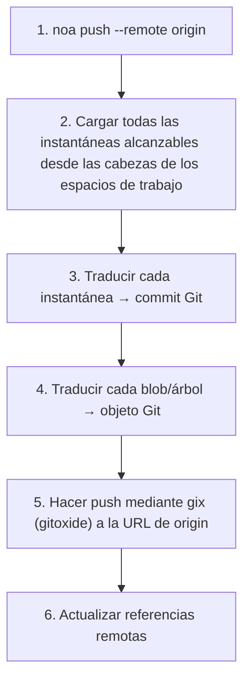
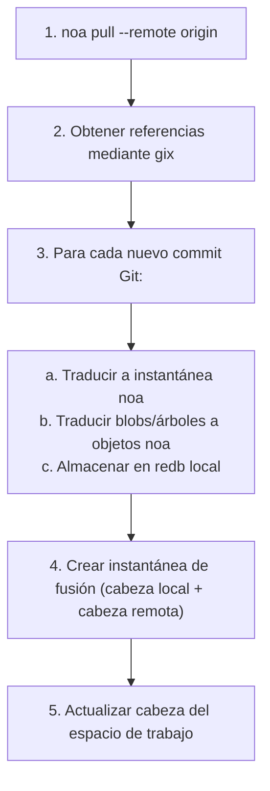
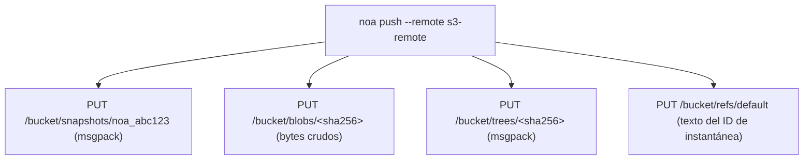

# Diseño de Interoperabilidad Remota

## Descripción General

noa soporta múltiples backends remotos para sincronizar instantáneas y objetos
entre máquinas y equipos. El objetivo principal de interoperabilidad es Git,
permitiendo una integración perfecta con flujos de trabajo existentes en GitHub, GitLab,
y Bitbucket.

## Trait de Backend Remoto

```rust
#[async_trait]
pub trait RemoteBackend: Send + Sync {
    async fn push_snapshots(&self, ids: &[SnapshotId]) -> Result<()>;
    async fn fetch_snapshots(&self, ids: &[SnapshotId]) -> Result<Vec<Snapshot>>;
    async fn push_objects(&self, ids: &[String]) -> Result<()>;
    async fn fetch_objects(&self, ids: &[String]) -> Result<()>;
    async fn list_refs(&self) -> Result<HashMap<String, SnapshotId>>;
    async fn update_ref(&self, name: &str, old: Option<&SnapshotId>, new: &SnapshotId) -> Result<()>;
}
```

## Capa de Traducción Git

El `GitTranslator` convierte entre el modelo de objetos de noa y el de Git:

### Blob ↔ Git Blob



### Árbol ↔ Git Tree



### Instantánea ↔ Git Commit



### Espacio de Trabajo ↔ Git Branch



### Mapeo de Referencias



## Flujo de Push



## Flujo de Pull



## Backend MinIO/S3

Para despliegues sin infraestructura Git:



Ventajas sobre Git remoto:
- Sin necesidad de traducción de árbol/Instantánea (formato nativo de noa)
- Almacenamiento directo de blobs (sin sobrecarga de archivos pack)
- Compatible con S3 (funciona con AWS, GCS, MinIO, Cloudflare R2)

## Configuración Remota

Almacenado en `.noa/config` (TOML):

```toml
[[remotes]]
name = "origin"
url = "https://github.com/example/repo.git"
backend = "git"

[[remotes]]
name = "s3"
url = "s3://my-bucket/noa-repo"
backend = "minio"
endpoint = "https://s3.amazonaws.com"
region = "us-east-1"
```

## Autenticación

| Backend | Método |
|---------|--------|
| Git HTTPS | Credenciales de `~/.git-credentials` o solicitud |
| Git SSH | Agente SSH o archivo de clave |
| MinIO/S3 | Clave de acceso + clave secreta (variables de entorno o configuración) |

## Comparación: Enfoques de Interoperabilidad Remota

| Enfoque | Usado por | Ventajas | Desventajas |
|----------|---------|------|------|
| Puente Git (gix) | noa | Compatibilidad universal | Sobrecarga de traducción, desajuste SHA-1/SHA-256 |
| Protocolo nativo | Git | Rápido, sin traducción | Solo funciona con Git |
| WebDAV | SVN | Estándar HTTP | Limitado, específico de SVN |
| API REST | Bitbucket | Moderno, flexible | Requiere servicio alojado |
| Almacenamiento compatible con S3 | noa | Escalable, nativo de la nube | Sin interoperabilidad Git sin puente |

noa soporta tanto el puente Git (para compatibilidad) como S3 nativo (para escalado).
