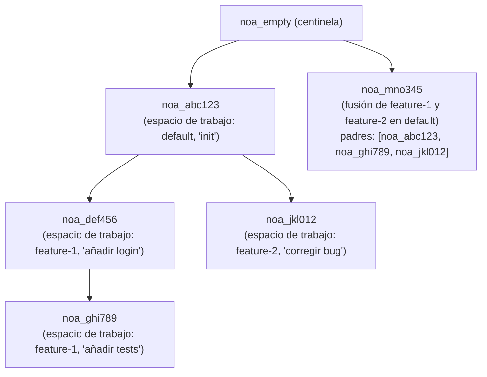
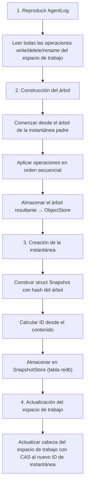

# Diseño del Modelo de Instantáneas

## Descripción General

Una instantánea es un registro inmutable y direccionado por contenido del estado
completo del árbol de archivos de un espacio de trabajo en un punto en el tiempo. Las instantáneas forman un
grafo acíclico dirigido (DAG) a través de referencias a padres.

## Estructura de la Instantánea

```rust
pub struct SnapshotId(pub String);  // "noa_<12-char-base62>"

pub struct Snapshot {
    pub id: SnapshotId,
    pub tree_hash: String,           // SHA-256 del árbol raíz
    pub parents: Vec<SnapshotId>,    // 0-N instantáneas padre
    pub workspace: String,           // espacio de trabajo de origen
    pub author: String,              // identificador del agente o humano
    pub timestamp: u64,              // microsegundos desde epoch
    pub message: String,             // descripción legible por humanos
}
```

## Generación de ID

Los IDs de instantánea usan una cadena base62 de 12 caracteres con el prefijo `noa_`:

```
noa_3kF8x2mP9aB1
```

Generación: `SHA256(tree_hash || parents || workspace || timestamp)[0..9]`
codificado como base62. Esto proporciona:
- 62^12 ≈ 3.2 × 10^21 IDs posibles
- Probabilidad de colisión efectivamente cero
- Determinístico: mismas entradas → mismo ID (permite deduplicación)

## DAG de Instantáneas



## Flujo de Creación de Instantáneas



## Almacén de Instantáneas

Las instantáneas se almacenan en una tabla redb indexada por ID:

```
Table: snapshots
  Key:   "noa_abc123" (SnapshotId como &str)
  Value: msgpack(Snapshot) como &[u8]
```

## Algoritmo de Diff

`diff_snapshots(base, other)` produce una lista de cambios a nivel de archivo:

```rust
pub struct FileDiff {
    pub path: String,
    pub kind: DiffKind, // Added, Removed, Modified
    pub old_blob: Option<String>,
    pub new_blob: Option<String>,
}
```

Algoritmo:
1. Cargar árboles raíz para ambas instantáneas
2. Recorrer recursivamente ambos árboles simultáneamente
3. Comparar hashes de blob en cada ruta
4. Hash diferente → Modificado; solo en uno → Añadido/Eliminado

Complejidad temporal: O(n) donde n = total de archivos en ambos árboles.

## Instantánea Centinela

`noa_empty` es un ID de instantánea reservado que representa un árbol vacío. Todos
los nuevos repositorios comienzan con esto como su base. Nunca se almacena
explícitamente — el gestor de espacios de trabajo lo reconoce como "sin instantáneas aún".

## Comparación con Commits de Git

| Aspecto | Instantánea noa | Commit Git |
|--------|-------------|------------|
| Formato de ID | `noa_<base62>` | SHA-1 hexadecimal |
| Límite de padres | Ilimitado (DAG de fusión) | Típicamente 1-2 |
| Formato de árbol | MessagePack | Binario personalizado |
| Marca de tiempo | Precisión de microsegundos | Precisión de segundos + zona horaria |
| Campo de autor | ID de agente o humano | nombre + email |
| Inmutabilidad | Aplicada por el almacén | Aplicada por hash |
| Firma GPG | No soportada | Soportada |
