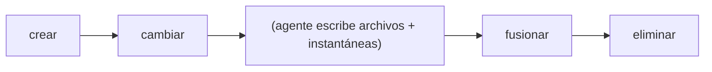

# Diseño de Aislamiento de Espacios de Trabajo

## Descripción General

Los espacios de trabajo proporcionan contextos de trabajo aislados para agentes y humanos.
Cada espacio de trabajo tiene un estado independiente (instantánea cabeza, registro de agente) mientras
comparte el almacén de objetos subyacente.

## Estructura del Espacio de Trabajo

```rust
pub struct Workspace {
    pub name: String,
    pub head: SnapshotId,     // instantánea actual
    pub base: SnapshotId,     // punto de bifurcación desde el espacio de trabajo padre
    pub agent_id: Option<String>,  // agente asociado
    pub created_at: u64,
    pub updated_at: u64,
}
```

## Ciclo de Vida del Espacio de Trabajo



### Creación

```bash
noa workspace create feature-1
```

1. Leer la instantánea cabeza del espacio de trabajo actual → se convierte en `base`
2. Nuevo espacio de trabajo: `head = base` (hereda el estado actual)
3. Crear archivo de registro del agente: `agent-logs/feature-1.log`
4. Registrar en WorkspaceStore

### Cambio

```bash
noa workspace switch feature-1
```

1. Verificar que el espacio de trabajo existe
2. Escribir el nombre del espacio de trabajo en `.noa/HEAD`
3. Guardar el espacio de trabajo anterior en `.noa/ORIG_HEAD`

### Fusión

```bash
noa workspace merge feature-1
```

1. Fusión a tres vías: base → nuestro (actual) vs suyo (feature-1)
2. Crear instantánea de fusión con ambos como padres
3. Actualizar la cabeza del espacio de trabajo actual

### Eliminación

```bash
noa workspace delete feature-1
```

1. Verificar que no es el espacio de trabajo activo
2. Eliminar la entrada del espacio de trabajo del almacén
3. Eliminar el archivo de registro del agente
4. Los objetos permanecen (compartidos, direccionados por contenido)

## Archivo HEAD

`.noa/HEAD` contiene el nombre del espacio de trabajo activo:

```
feature-1
```

`.noa/ORIG_HEAD` contiene el espacio de trabajo anterior (para deshacer):

```
default
```

## Almacén de Espacios de Trabajo

Los espacios de trabajo se almacenan en redb:

```
Table: workspaces
  Key:   "feature-1" (nombre del espacio de trabajo como &str)
  Value: msgpack(Workspace) como &[u8]
```

Las actualizaciones de la cabeza usan CAS (comparar e intercambiar):

```rust
async fn update_head(&self, name: &str, expected: &SnapshotId, new: &SnapshotId) -> Result<()>
```

Esto previene actualizaciones perdidas cuando múltiples procesos intentan actualizar el mismo
espacio de trabajo concurrentemente.

## Comparación con Ramas de Git

| Aspecto | Espacio de trabajo noa | Rama Git |
|--------|---------------|------------|
| Almacenamiento | Entrada de tabla redb | Archivo ref (`.git/refs/heads/`) |
| Aislamiento | Archivo de registro de agente propio | Índice compartido + árbol de trabajo |
| Cambio | Escritura atómica de HEAD | Checkout del árbol de trabajo (E/S de archivos) |
| Creación | O(1) — solo metadatos | O(1) — ligero |
| Eliminación | Eliminar del almacén | Eliminar ref, opcionalmente podar |
| Vinculación de agente | Campo agent_id opcional | Sin equivalente |
| Seguimiento de base | Campo base explícito | Implícito (base de fusión) |

## Comparación con Ramas de SVN

| Aspecto | Espacio de trabajo noa | Rama SVN |
|--------|---------------|------------|
| Almacenamiento | Entrada KV | Copia completa de directorio |
| Creación | O(1) metadatos | O(n) copia de archivos |
| Aislamiento | Lógico (objetos compartidos) | Físico (directorios separados) |
| Seguimiento de fusión | DAG de padres | Propiedades svn:mergeinfo |

## Justificación del Diseño

### ¿Por qué espacios de trabajo en lugar de ramas?

1. **Identidad del agente**: Los espacios de trabajo llevan un campo `agent_id` para atribución
2. **Aislamiento del registro del agente**: Cada espacio de trabajo tiene un archivo de registro dedicado
3. **Sin árbol de trabajo**: noa no mantiene un checkout — solo instantáneas
4. **Base explícita**: El campo `base` permite un cálculo rápido de la base de fusión

### ¿Por qué sin checkout del árbol de trabajo?

Las ramas de Git requieren un checkout del árbol de trabajo (E/S de archivos por cada archivo cambiado).
Los espacios de trabajo de noa solo cambian un puntero — la referencia del registro del agente y la instantánea.
Esto es O(1) independientemente del tamaño del repositorio.

La materialización de archivos (checkout) ocurre por separado cuando un agente necesita
leer o escribir archivos reales, usando el árbol de la instantánea como fuente de verdad.
