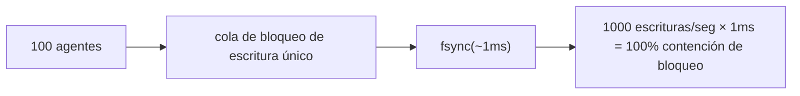
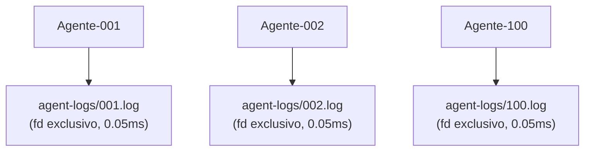

# Modelo de Concurrencia de Agentes

## Objetivos de Diseño

noa soporta decenas a cientos de agentes IA escribiendo simultáneamente con
**cero contención de bloqueos**.

## Problema: Cuello de Botella de Escritor Único

Las bases de datos embebidas tradicionales (incluyendo redb) usan un único bloqueo de escritura:



## Solución: Registros de Agente por Espacio de Trabajo

Cada espacio de trabajo tiene su propio archivo JSONL. Las escrituras usan `O_APPEND` que es
atómico en sistemas POSIX:



Total: 0.05ms por escritura, cero contención de bloqueos.

## Formato AgentLog

```jsonl
{"seq":1,"op":"write","path":"src/main.rs","blob":"abc123...","ts":1717592400000000}
{"seq":2,"op":"delete","path":"src/old.rs","ts":1717592401000000}
{"seq":3,"op":"rename","from":"src/foo.rs","to":"src/bar.rs","ts":1717592402000000}
{"seq":4,"op":"snapshot","snapshot_id":"noa_z7x9","parent":"noa_y6w8","message":"feat","ts":1717592405000000}
```

- `seq`: contador monótono por espacio de trabajo
- `ts`: marca de tiempo con precisión de microsegundos
- La consolidación ordena globalmente por `ts`

## Cuándo Usar redb vs AgentLog

| Componente | Almacenamiento | Razón |
|-----------|---------|--------|
| blobs, trees | redb | Direccionado por contenido, inmutable, lectura intensiva |
| snapshots, refs, workspaces | redb | Metadatos, baja frecuencia de escritura |
| registros incrementales de agentes | Archivo JSONL | Escrituras concurrentes de alta frecuencia |

## Consolidación

El `Consolidator` lee todos los registros de agentes, ordena por marca de tiempo y crea
una cadena de instantáneas unificada:

```rust
Consolidator::new(&engine)
    .consolidate("default", parent_ids, "agent", "batch update")
    .await?;
```

## noa-server para Concurrencia Multi-Proceso

Para escenarios multi-proceso reales (múltiples procesos CLI o agentes
distribuidos), usa la API HTTP de noa-server:

```bash
noa-server  # inicia en el puerto 3000

# Los agentes interactúan mediante REST:
POST /api/v1/repo/my-project/blobs
POST /api/v1/repo/my-project/snapshots
POST /api/v1/repo/my-project/agent-log
```

El servidor mantiene una única conexión de base de datos y serializa las escrituras
internamente, mientras maneja lecturas concurrentes mediante MVCC.
