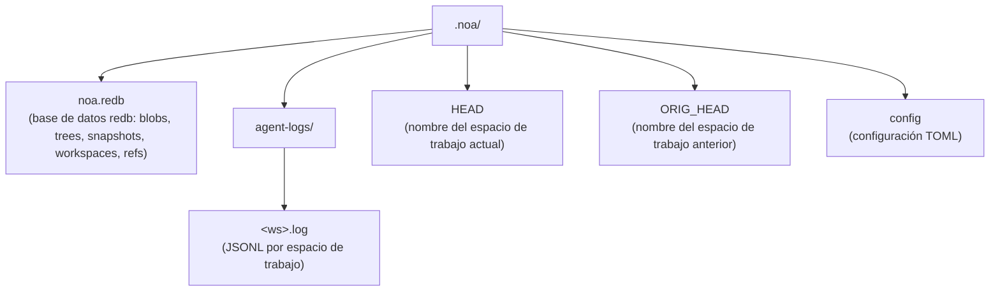
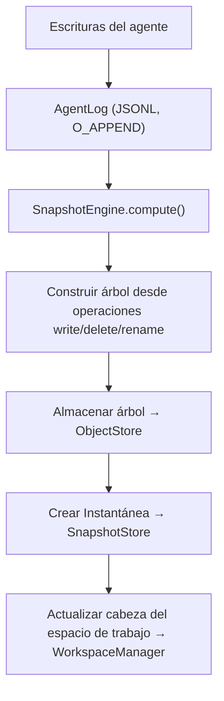

# Arquitectura

## Componentes Principales

### ObjectStore

Almacenamiento direccionado por contenido para blobs y árboles. El contenido se direcciona mediante hash SHA-256.

```
BlobId = SHA256(content)
TreeId = SHA256(msgpack(TreeEntries))
```

Implementaciones:
- **RedbObjectStore**: Almacenamiento local usando el almacén KV embebido redb
- **MinioObjectStore**: Almacenamiento remoto usando MinIO compatible con S3

### AgentLog

Registro de solo anexión por espacio de trabajo para escrituras concurrentes sin bloqueo. Cada espacio de trabajo
obtiene su propio archivo JSONL bajo `.noa/agent-logs/<ws>.log`.

Operaciones:
- **write**: Registrar una escritura de archivo con referencia al blob
- **delete**: Registrar una eliminación de archivo
- **rename**: Registrar un renombrado de archivo
- **snapshot**: Registrar una creación de instantánea
- **merge**: Registrar una fusión desde otro espacio de trabajo

### Instantánea

Estado puntual inmutable de un espacio de trabajo. Contiene un hash de árbol, instantáneas
padre, autor y mensaje.

```
Instantánea = {
    id: "noa_<12-caracteres-base62>"
    tree_hash: SHA256 del contenido del árbol
    parents: [SnapshotId, ...]
    workspace: nombre del espacio de trabajo
    author: identificador del agente
    timestamp: precisión de microsegundos
    message: descripción legible por humanos
}
```

### Espacio de Trabajo

Contexto de trabajo aislado para un agente. Rastrea la instantánea cabeza y la instantánea base.

### RefStore

Punteros con nombre a instantáneas con semántica de comparar e intercambiar (CAS) para
actualizaciones concurrentes seguras.

### Motor de Fusión

Fusión a tres vías comparando árboles base, nuestro y suyo:
- Mismo cambio en ambos lados → sin conflicto
- Cambio en un solo lado → aplicar
- Cambios diferentes en el mismo archivo → conflicto (por defecto: upstream-wins)

## Disposición de Almacenamiento



## Flujo de Datos


