# Compilando noa

## Prerrequisitos

- Rust 1.75+ (estable)
- Python 3.8+ (para scripts de compilación)
- Ejecutor de comandos `just`

## Configuración

```bash
git clone https://github.com/celestia-island/noa.git
cd noa
just init          # obtener dependencias de Rust
just build-dev     # compilación de desarrollo
```

## Desarrollo

```bash
just fmt            # formatear código
just clippy         # lint
just test           # ejecutar pruebas
just check          # comprobación de tipos
```

## Estructura del Proyecto

```mermaid
graph TD
    SRC["src/"] --> LIB["lib.rs<br/>(Raíz de la biblioteca)"]
    SRC --> ERR["error.rs<br/>(Tipos de error)"]
    SRC --> CFG["config.rs<br/>(Configuración)"]
    SRC --> REPO["repo.rs<br/>(Ciclo de vida del repositorio)"]
    SRC --> OBJ["object/<br/>(Trait ObjectStore + implementaciones)"]
    SRC --> LOG["log/<br/>(Trait AgentLog + implementaciones)"]
    SRC --> SNAP["snapshot/<br/>(Motor de instantáneas)"]
    SRC --> WS["workspace/<br/>(Gestor de espacios de trabajo)"]
    SRC --> REFS["refs.rs<br/>(Trait RefStore + implementación)"]
    SRC --> MERGE["merge/<br/>(Motor de fusión)"]
    SRC --> GIT["git/<br/>(Compatibilidad con Git)"]
    SRC --> REMOTE["remote.rs<br/>(Trait RemoteBackend)"]
    SRC --> CLI["cli/<br/>(Comandos CLI)"]
```


