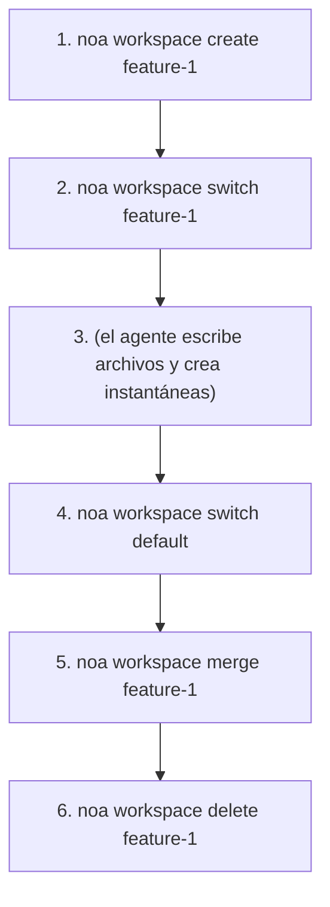
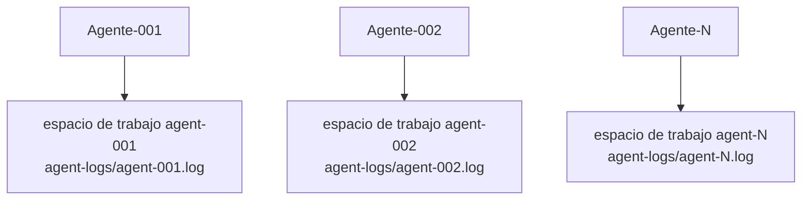

# Guía de Espacios de Trabajo

Los espacios de trabajo son contextos de trabajo aislados, similares a las ramas de Git. Cada
espacio de trabajo tiene su propia instantánea cabeza y registro de agente.

## Crear Espacios de Trabajo

```bash
noa workspace create feature-1
noa workspace create agent-debug --agent bot-42
```

La bandera `--agent` asocia el espacio de trabajo con un ID de agente específico.

## Cambiar de Espacio de Trabajo

```bash
noa workspace switch feature-1
noa status
# En el espacio de trabajo: feature-1 (cabeza: noa_abc123)
```

## Listar Espacios de Trabajo

```bash
noa workspace list
#   default             cabeza: noa_abc123 base: noa_empty
# * feature-1           cabeza: noa_def456 base: noa_abc123
```

El marcador `*` muestra el espacio de trabajo activo.

## Fusionar Espacios de Trabajo

```bash
noa workspace switch default
noa workspace merge feature-1
# Fusionado feature-1 en default -> noa_ghi789
```

Si se detectan conflictos:

```
Conflictos detectados:
  CONFLICTO: src/main.rs
Fusionado feature-1 en default -> noa_ghi789
```

La estrategia de resolución por defecto es upstream-wins (la versión suya). Versiones futuras
soportarán resolución manual de conflictos.

## Eliminar Espacios de Trabajo

```bash
noa workspace delete feature-1
# Eliminado espacio de trabajo 'feature-1'
```

No se puede eliminar el espacio de trabajo activo.

## Patrón de Flujo de Trabajo



## Patrón Multi-Agente

Cada agente obtiene su propio espacio de trabajo:



Cada espacio de trabajo tiene un registro de agente independiente (`.noa/agent-logs/agent-001.log`),
permitiendo escrituras concurrentes sin bloqueo. Un paso de consolidación fusiona todos los registros
por marca de tiempo para crear un historial unificado.

> **Nota**: redb usa un bloqueo exclusivo de archivo, por lo que múltiples procesos CLI
> no pueden abrir la misma base de datos concurrentemente. Para verdadera concurrencia
> multi-proceso, usa la API HTTP de noa-server.
