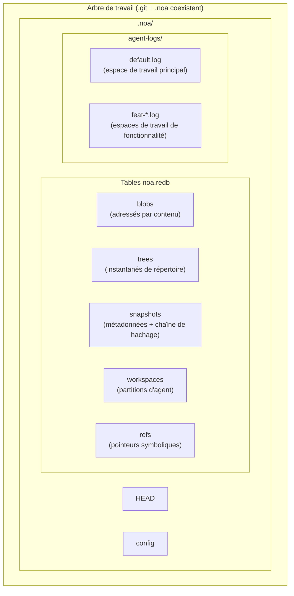
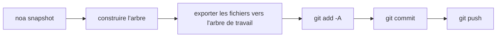
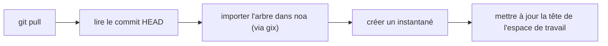
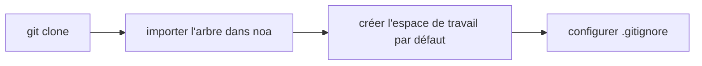

<div align="center"></div>
<h1 align="center">Noa</h1>
<div align="center">
  <strong>Système de contrôle de version distribué natif IA</strong>
</div>

<br />

<div align="center">
  <a href="https://github.com/celestia-island/noa/actions">
    
  </a>
  <a href="https://github.com/celestia-island/noa/actions">
    
  </a>
  <a href="https://crates.io/crates/libnoa">
    
  </a>
  <a href="https://docs.rs/libnoa">
    
  </a>
  <a href="../../LICENSE">
    
  </a>
  <a href="https://github.com/celestia-island/noa/releases">
    
  </a>
</div>

<div align="center">

**[English](../en/README.md)** &bull; **[简体中文](../zh-hans/README.md)** &bull;
**[繁體中文](../zh-hant/README.md)** &bull; **[日本語](../ja/README.md)** &bull;
**[한국어](../ko/README.md)** &bull; **[Français]** &bull;
**[Español](../es/README.md)** &bull; **[Русский](../ru/README.md)** &bull;
**[العربية](../ar/README.md)**

</div>

noa est un système de contrôle de version distribué natif IA. Il coexiste avec `.git` — git gère le code source, noa gère les données d'itération des agents IA — avec des journaux JSONL sans verrou par agent, un historique basé sur des instantanés et une compatibilité totale avec le protocole git.

## Table des matières

- [Pourquoi noa](#pourquoi-noa)
- [Architecture](#architecture)
- [Installation](#installation)
- [Démarrage rapide](#démarrage-rapide)
- [Commandes](#commandes)
- [Intégration Git](#intégration-git)
- [Compatibilité](#compatibilité)
- [API (libnoa)](#api-libnoa)
- [Compilation depuis les sources](#compilation-depuis-les-sources)
- [Projets associés](#projets-associés)
- [Licence](#licence)

## Pourquoi noa

Git traditionnel traite tous les contributeurs de la même manière — humain ou IA. Mais les agents IA ont des besoins fondamentalement différents :

| Défi | Réponse de Git | Réponse de noa |
|-----------|-------------|--------------|
| **Écritures concurrentes** | Fichiers de verrou, conflits de fusion | Journaux JSONL en ajout seul par agent |
| **Identité de l'agent** | Config user.name/email par dépôt | agent_id avec portée par espace de travail et partitions par agent |
| **Contributions partielles** | Un commit = toutes les modifications de l'arbre de travail | L'agent ne journalise que les fichiers qu'il a effectivement modifiés |
| **Suivi d'itération** | Rebase/squash détruit l'historique | Chaîne d'instantanés immuables par espace de travail |
| **Fusion multi-agent** | Fusion à trois voies sur le texte | Fusionne les instantanés, détecte les conflits au niveau des fichiers |
| **Compatibilité du protocole Git** | N/A | Interface CLI git système pour clone/push/pull/fetch |

## Architecture



**Concepts fondamentaux :**

- **Espace de travail** : Un espace de noms linéaire isolé pour un agent. Chacun possède son propre journal JSONL.
- **Instantané** : Un enregistrement à un instant T de l'arborescence d'un espace de travail (blobs + arbres adressés par contenu SHA-256).
- **Journal d'agent** : Fichier JSONL en ajout seul enregistrant les opérations atomiques sur les fichiers (`write`, `delete`, `rename`) avec les identifiants de blob et les horodatages.
- **Fusion** : Fusion à trois voies de deux instantanés d'espaces de travail par rapport à leur base commune.

## Installation

### Depuis les releases GitHub

```bash
# Téléchargez le binaire de la dernière release pour votre plateforme :
#   https://github.com/celestia-island/noa/releases

chmod +x noa
mv noa /usr/local/bin/
```

### Depuis les sources (nécessite Rust 1.85+)

```bash
git clone https://github.com/celestia-island/noa.git
cd noa
cargo build --release
# Binaires : target/release/noa, target/release/noa-server
```

### En tant que bibliothèque (Cargo)

```toml
[dependencies]
libnoa = { git = "https://github.com/celestia-island/noa" }
```

Note : Le nom du paquet sur crates.io est `libnoa` (le nom `noa` était déjà pris). Le binaire s'appelle toujours `noa`.

## Démarrage rapide

### Initialiser dans un dépôt git existant

```bash
cd my-git-project
noa init                              # crée .noa/ à côté de .git/
noa remote add origin "git@github.com:user/repo.git"
noa pull                              # importe le HEAD git actuel dans noa
```

### Créer des espaces de travail d'agent et itérer

```bash
# L'agent A travaille sur la fonctionnalité d'authentification
noa workspace create feat-auth -a agent-auth
noa workspace switch feat-auth

# L'agent écrit dans son journal d'agent
# (les agents IA écrivent du JSONL directement ; voici un exemple manuel)
cat >> .noa/agent-logs/feat-auth.log << EOF
{"seq":1,"op":"write","path":"src/auth.rs","blob_id":"<sha256>","ts":1717000000000000}
EOF

# Sauvegarder l'état de l'espace de travail
noa snapshot create -m "ajouter le module auth" -a agent-auth
```

### Fusionner les fonctionnalités et synchroniser avec git

```bash
noa workspace switch default
noa workspace merge feat-auth          # fusionne dans default
noa push                               # exporte en commit git + git push
```

## Commandes

### Gestion des espaces de travail

```bash
noa workspace create <nom> [-a <id-agent>]   # Créer un nouvel espace de travail
noa workspace switch <nom>                    # Changer l'espace de travail actif
noa workspace list                             # Lister tous les espaces de travail
noa workspace delete <nom>                     # Supprimer un espace de travail
noa workspace merge <depuis>                   # Fusionner un autre espace de travail dans le courant
```

### Gestion des instantanés

```bash
noa snapshot create -m <msg> [-a <auteur>]    # Créer un instantané depuis le journal d'agent
noa snapshot list                               # Lister les instantanés
noa snapshot diff <id-a> <id-b>                # Diff entre deux instantanés (niveau fichier)
```

### Opérations distantes

```bash
noa remote add <nom> <url>                     # Ajouter un dépôt distant
noa remote remove <nom>                        # Supprimer un dépôt distant
noa remote list                                 # Lister les dépôts distants
noa fetch [-r <distant>]                        # Lister les références distantes
noa pull [-r <distant>]                         # Git pull + réimporter dans noa
noa push [-r <distant>]                         # Exporter l'instantané → commit git → git push
```

### Opérations sur le dépôt

```bash
noa init [-p <chemin>] [--noa-remote <url>]   # Initialiser un dépôt .noa/
noa clone <url> [-p <chemin>]                  # Git clone + importer dans noa
noa clone --svn <url> [-p <chemin>]           # Export SVN → git init → importer dans noa
noa status                                       # Afficher le statut de l'espace de travail courant
noa log [-w <espace>] [-n <limite>]            # Afficher l'historique des instantanés
```

## Intégration Git

noa utilise la CLI système `git` pour toutes les opérations réseau. Cela garantit une compatibilité à 100 % avec n'importe quel dépôt distant git.

### Flux de travail Push



### Flux de travail Pull



### Flux de travail Clone



### Décisions de conception clés

- **L'export est additif** : Seuls les fichiers présents dans l'instantané noa sont écrits dans l'arbre de travail. Les fichiers existants suivis par git mais absents de l'instantané restent inchangés.
- **L'import utilise gix** : Pour le parcours d'arbre local (pas de réseau nécessaire). Les opérations réseau utilisent la CLI système `git`.
- **`.noa/` automatiquement gitignoré** : `noa init` ajoute `.noa/` à `.gitignore` pour que les données d'agent ne fuient jamais dans l'historique git.

## Compatibilité

### Plateformes testées

| Fournisseur | Protocole | Push | Pull | Clone | LFS |
|----------|----------|------|------|-------|-----|
| **GitHub** | HTTPS, SSH | ✓ | ✓ | ✓ | ✓ |
| **Bitbucket** | HTTPS, SSH | ✓ | ✓ | ✓ | ✓ |
| **GitLab** | HTTPS, SSH | ✓ | ✓ | ✓ | ✓ |
| **Dépôt bare local** | file:// | ✓ | ✓ | ✓ | ✓ |
| **SVN** | svn:// | Import uniquement | — | `--svn` | — |

### Git LFS

noa détecte automatiquement les dépôts Git LFS :

- `noa clone` : exécute `git lfs install` + `git lfs pull` pour les dépôts suivis par LFS
- `noa push` : exécute `git lfs push --all` après git push
- `noa pull` : exécute `git lfs pull` après git pull
- Les fichiers pointeurs LFS sont importés comme des blobs ordinaires dans noa

### SVN

```bash
noa clone --svn file:///chemin/vers/depot/svn -p ./mon-projet
```

Cela effectue `svn export trunk → git init → noa import`. Il s'agit d'un **import unique** — pour une synchronisation incrémentale, utilisez `svn export` + `noa snapshot create` de manière planifiée.

### Bitbucket

Les URL SSH (`git@bitbucket.org:ws/repo.git`) et HTTPS (`https://utilisateur@bitbucket.org/ws/repo.git`) sont prises en charge nativement via le pont git.

## API (libnoa)

libnoa expose une API Rust pour intégrer les fonctionnalités de noa dans d'autres outils :

```rust
use libnoa::repo::Repository;
use libnoa::snapshot::SnapshotEngine;
use libnoa::log::FileAgentLog;

// Ouvrir un dépôt
let repo = Repository::open(&path)?;

// Créer un espace de travail
let ws_mgr = repo.workspace_manager()?;
ws_mgr.create(&Workspace {
    name: "feat-x".into(),
    head: base_snap_id.clone(),
    base: base_snap_id.clone(),
    agent_id: Some("my-agent".into()),
    created_at: now,
    updated_at: now,
}).await?;

// Construire un instantané depuis les journaux d'agent
let engine = SnapshotEngine::new(
    FileAgentLog::new(&path, "my-agent")?,
    repo.snapshot_store()?,
    repo.object_store()?,
)
.with_repo_root(repo.root.clone());
let snapshot = engine.compute("feat-x", vec![], "author", "message").await?;

// Exporter l'instantané vers git
libnoa::git::export_noa_to_git(&repo.root, repo.db.clone()).await?;
```

Consultez `tests/smoke.rs` et `tests/compat.rs` pour plus d'exemples d'utilisation.

## Compilation depuis les sources

```bash
# Prérequis : Rust 1.85+, git, pkg-config (optionnel pour LFS/SVN)
git clone https://github.com/celestia-island/noa.git
cd noa

# Compiler
cargo build --release
# Sortie : target/release/noa (CLI), target/release/noa-server (serveur API)

# Exécuter les tests
cargo test -- --test-threads=1

# Démarrer le serveur noa
NOA_PORT=3000 NOA_DB_PATH=/data/noa/server.redb target/release/noa-server
```

## Projets associés

| Projet | Relation |
|---------|-------------|
| [entelecheia](https://github.com/celestia-island/entelecheia) | Plateforme d'orchestration multi-agent. Consomme noa pour le versionnement des espaces de travail d'agents. |
| [tairitsu](https://github.com/celestia-island/tairitsu) | Framework de modèle de composants WASM. Futur : client noa en tant que composant WASM. |
| [kirino](https://github.com/celestia-island/kirino) | Authentification/RBAC zero-trust. Utilisé par noa-server pour l'authentification. |

## Licence

Apache-2.0. Voir [LICENSE](../../LICENSE).
