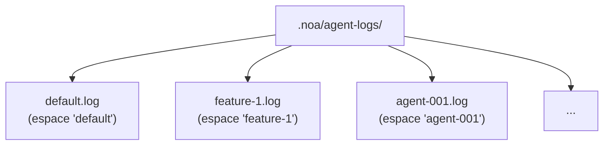
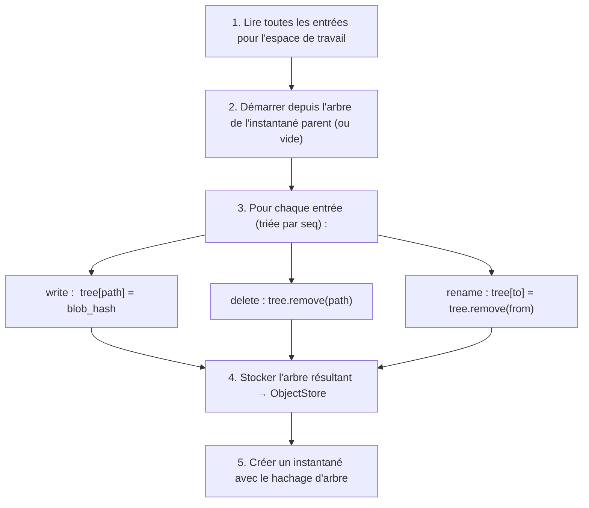
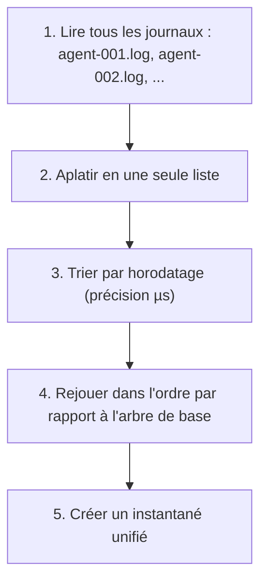

# Conception du journal d'agent

## Aperçu

L'AgentLog est la couche d'écriture à haut débit de noa. Il fournit des fichiers
JSONL en ajout seul pour chaque espace de travail, permettant des écritures
concurrentes sans verrou de la part de multiples agents IA.

## Format des entrées de journal

Chaque ligne est un objet JSON :

```jsonl
{"seq":1,"op":"write","path":"src/main.rs","blob":"a1b2c3...","ts":1717592400000000}
{"seq":2,"op":"delete","path":"src/old.rs","ts":1717592401000000}
{"seq":3,"op":"rename","from":"src/foo.rs","to":"src/bar.rs","ts":1717592402000000}
{"seq":4,"op":"snapshot","snapshot_id":"noa_z7x9","parent":"noa_y6w8","message":"feat","ts":1717592405000000}
{"seq":5,"op":"merge","from_workspace":"feature-1","from_snapshot":"noa_abc","base":"noa_def","ts":1717592408000000}
```

### Champs

| Champ | Type | Description |
|-------|------|-------------|
| `seq` | u64 | Numéro de séquence monotone par espace de travail |
| `op` | string | Type d'opération : write, delete, rename, snapshot, merge |
| `path` | string | Chemin du fichier cible (write, delete) |
| `blob` | string | Hachage du blob (write) |
| `from` | string | Chemin source (rename) |
| `to` | string | Chemin destination (rename) |
| `ts` | u64 | Horodatage Unix avec précision en microsecondes |

## Structure des fichiers



Chaque espace de travail reçoit exactement un fichier journal. Le nom du fichier
correspond au nom de l'espace de travail.

## Chemin d'écriture

```rust
async fn append(&self, workspace: &str, entry: &LogEntry) -> Result<()> {
    let file = self.get_or_create_file(workspace)?;
    let line = serde_json::to_string(entry)? + "\n";
    file.write_all(line.as_bytes())?;
    file.sync_data()?;  // fdatasync pour la durabilité
    Ok(())
}
```

Propriétés clés :
- **O_APPEND** : Le noyau garantit des ajouts atomiques
- **fsync par écriture** : Assure la durabilité après un crash
- **Un fd par espace** : Mis en cache en mémoire pour la performance

## Chemin de lecture

```rust
async fn read_all(&self, workspace: &str) -> Result<Vec<LogEntry>> {
    let path = self.log_dir.join(format!("{}.log", workspace));
    let content = tokio::fs::read_to_string(&path).await?;
    content.lines()
        .filter(|l| !l.is_empty())
        .map(|l| serde_json::from_str(l))
        .collect::<Result<Vec<_>, _>>()
        .map_err(|e| NoaError::Serialization(e.to_string()))
}
```

## Calcul d'instantané

Le `SnapshotEngine` rejoue les entrées du journal pour construire un arbre :



## Consolidation

Lorsque plusieurs journaux d'agents doivent être fusionnés :



## Comparaison : Pourquoi pas...

### SQLite pour les journaux d'agents ?

- **Amplification d'écriture** : Mises à jour B-tree SQLite pour des ajouts séquentiels
- **Verrouillage** : SQLite utilise des verrous WAL (écrivain unique)
- **Surcharge fsync** : SQLite émet plusieurs fsync par transaction
- **Surdimensionné** : Les journaux d'agents sont en ajout seul — pas de lectures ou mises à jour aléatoires

### redb pour les journaux d'agents ?

- **Écrivain unique** : Le MVCC de redb nécessite une transaction d'écriture
- **Contention** : Plusieurs agents écrivant dans la même DB → sérialisés
- **Non optimisé pour l'ajout** : redb est un magasin KV généraliste

### Tampon en mémoire ?

- **Durabilité** : Un crash de processus perd toutes les écritures en mémoire tampon
- **Pression mémoire** : 100 agents × 1000 écritures = 100K entrées en mémoire
- **Complexité** : Nécessite un thread de vidage en arrière-plan avec récupération après crash

### JSONL simple avec O_APPEND ?

✅ C'est ce que noa utilise :
- **Surcharge minimale** : Une écriture + un fsync par entrée
- **Atomicité garantie par le noyau** : O_APPEND sur POSIX
- **Récupération après crash** : Seule la dernière entrée peut être partielle (détectée par le retour à la ligne final)
- **Lisible par un humain** : JSONL est inspectable avec des outils standard
- **Zéro contention de verrou** : Un fichier par espace de travail

## Performance

Benchmark (ext4, SSD, Linux) :

| Métrique | Valeur |
|--------|-------|
| Latence d'écriture unique | ~0,05ms (ajout + fdatasync) |
| Débit (1 espace de travail) | ~20 000 écritures/s |
| Débit (100 espaces de travail) | ~10 000+ écritures/s |
| Taille de fichier pour 1M d'entrées | ~200 Mo (moyenne 200 octets/entrée) |

## Récupération après crash

Au démarrage, analyser chaque fichier journal :
1. Lire toutes les lignes complètes (se terminant par `\n`)
2. Ignorer la dernière ligne si tronquée (écriture incomplète)
3. Vérifier que `seq` est monotone croissant
4. Reconstruire l'état en mémoire à partir des entrées valides

Cela garantit qu'aucune entrée partielle ou corrompue n'est utilisée pour le calcul
d'instantané.
