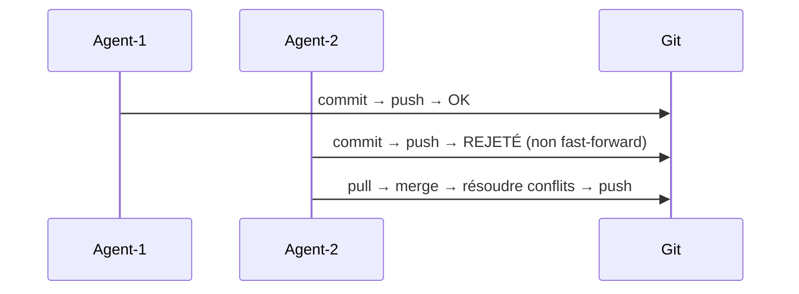
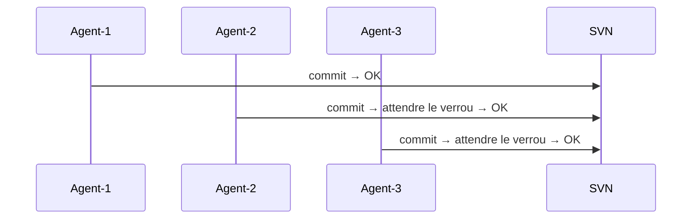
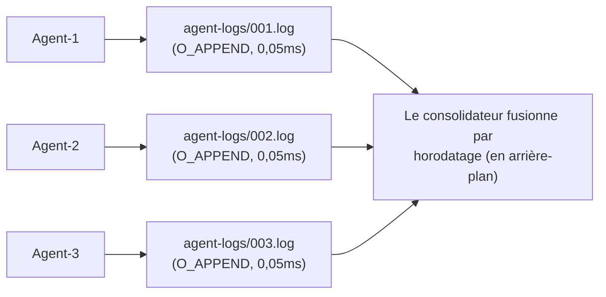
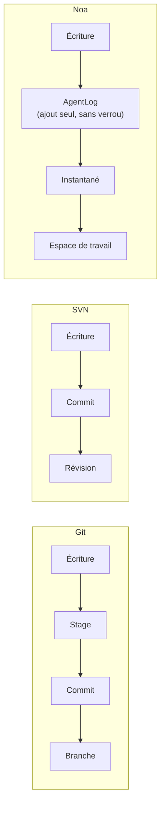
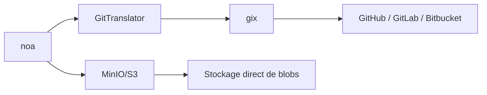

# noa vs Git vs SVN vs Bitbucket : Une analyse comparative

## Résumé exécutif

noa est un système de contrôle de version conçu spécifiquement pour les flux de
travail des agents IA. Contrairement à Git, SVN et Bitbucket (qui encapsulent
Git/SVN), noa optimise les **écritures concurrentes à haute fréquence par des
acteurs non humains** — des dizaines à des centaines d'agents IA modifiant des
fichiers simultanément sans contention de verrous.

---

## Matrice de comparaison des fonctionnalités

| Fonctionnalité | noa | Git | SVN | Bitbucket |
|---------|-----|-----|-----|-----------|
| **Architecture** | KV embarqué + journaux en ajout seul | DAG adressé par contenu | Stockage delta centralisé | Hébergement Git/SVN |
| **Modèle de concurrence** | Journaux en ajout seul par espace (zéro verrou) | Verrouillage au niveau branche (conflits de fusion) | Serveur central sérialise | Identique à Git/SVN |
| **Stratégie de fusion** | Trois voies, upstream-wins par défaut | Trois voies, résolution manuelle | Fusion manuelle | Identique à Git/SVN |
| **Granularité d'instantané** | Horodatages en microsecondes, par agent | Par commit (cadence humaine) | Par révision | Identique à Git/SVN |
| **Natif agent** | Oui — espace par agent, journaux d'agent | Non — conçu pour les flux humains | Non | Non |
| **Backend de stockage** | Enfichable (redb local, MinIO/S3 distant) | Fichiers pack + objets libres | Berkeley DB / FSFS | Stockage côté serveur |
| **Distribué** | Oui (push/pull distant via pont Git) | Oui (natif) | Non (centralisé) | Oui (hébergé) |
| **Diff binaire** | Blobs adressés par contenu (pas de delta) | Compression delta au niveau pack | Delta côté serveur | Identique à Git/SVN |
| **Verrouillage** | Aucun pour les écritures (journaux en ajout seul) | Verrous consultatifs uniquement | `svn:needs-lock` | Identique à Git/SVN |
| **API HTTP** | Intégrée (noa-server) | git-http-backend | WebDAV | API REST |
| **Courbe d'apprentissage** | Minimale (6 commandes) | Raide (~40 commandes) | Modérée | Modérée |

---

## Comparaison détaillée

### 1. Concurrence

**Git** : Une branche = un rédacteur à la fois. Les rédacteurs concurrents créent
des historiques divergents qui doivent être réconciliés par fusion. Les conflits
de fusion nécessitent une intervention humaine.



**SVN** : Le serveur central sérialise tous les commits. Le verrouillage au niveau
fichier est disponible mais crée des goulots d'étranglement.



**noa** : Chaque agent écrit dans son propre fichier journal en ajout seul. Zéro
contention de verrou par conception. La consolidation se fait de manière asynchrone.



### 2. Modèle de données

**Git** : Blob → Arbre → Commit → Branche → Ref. Adressé par contenu avec SHA-1.
Objets immuables. Les branches sont des pointeurs mutables.

**SVN** : Fichier/Répertoire → Révision. Numéros de révision linéaires. Les chemins
sont des entités de première classe.

**noa** : Blob → Arbre → Instantané → Espace de travail. Adressé par contenu avec
SHA-256. Les instantanés sont immuables. Les espaces de travail sont des pointeurs
mutables avec mises à jour CAS.

Différence clé : la couche **AgentLog** de noa se situe entre les écritures de
l'agent et la couche d'instantanés immuables, fournissant un tampon pour les
opérations à haute fréquence.



### 3. Philosophie de fusion

**Git** : Fusion à trois voies avec résolution humaine des conflits. Les conflits
bloquent la progression jusqu'à résolution.

**SVN** : Suivi de fusion manuel. La résolution des conflits est au niveau fichier.

**noa** : Fusion à trois voies avec auto-résolution configurable (par défaut :
upstream-wins). Conçue pour les agents IA qui peuvent réappliquer leurs modifications
plutôt que de résoudre manuellement les conflits.

Justification : Les agents IA n'ont pas besoin de voir les marqueurs de conflit —
ils peuvent régénérer leurs modifications par rapport à l'état le plus récent. La
stratégie « upstream-wins » garantit le progrès continu.

### 4. Efficacité du stockage

**Git** : Fichiers pack avec compression delta. Optimisé pour une fréquence de
commit à échelle humaine (~10-100 commits/jour).

**SVN** : Stockage delta côté serveur. Efficace pour les gros fichiers binaires.

**noa** : Blobs adressés par contenu sans compression delta. Les instantanés sont
encodés en msgpack. Compromis : implémentation plus simple, écritures plus rapides,
stockage plus important. Acceptable car :
- Les artefacts des agents IA sont souvent régénérés (les anciennes versions sont éphémères)
- Le stockage est bon marché ; le débit des agents est coûteux
- Le backend MinIO/S3 gère la déduplication

### 5. Interopérabilité distante

**Git** : Protocole natif (git://, https://, ssh://). Universel.

**SVN** : svn://, http://. Lié à Apache/Subversion.

**noa** : Pont Git via `gix` (gitoxide). Peut pousser/tirer depuis n'importe quel
distant Git. Prend également en charge le backend natif MinIO/S3 pour le stockage
direct d'objets.



### 6. Contrôle d'accès

**Git** : Permissions du système de fichiers ou hooks côté serveur (pre-receive, etc.).

**SVN** : ACLs basées sur les chemins, intégrées au protocole.

**Bitbucket** : Permissions de branche, vérifications de fusion, exigences de revue de code.

**noa** : Isolation au niveau de l'espace de travail. Chaque agent ne peut écrire que
dans son espace de travail assigné. La fusion vers des branches partagées nécessite
une action explicite. Authentification côté serveur via noa-server.

---

## Quand utiliser quoi

| Scénario | Meilleur choix | Raison |
|----------|-------------|--------|
| Développement logiciel humain | Git | Écosystème mature, outillage universel |
| Génération de code par agent IA (10+ agents) | noa | Écritures concurrentes sans verrou |
| Conformité entreprise + audit | SVN | Centralisé, ACLs basées sur les chemins |
| Collaboration d'équipe + CI/CD | Bitbucket | Pipelines intégrés, PRs, revues |
| Orchestration d'agents IA + revue humaine | noa → pont Git | Les agents travaillent dans noa, les humains révisent via Git |
| Gros actifs binaires | SVN ou Git LFS | Compression delta pour les binaires |
| Appareils embarqués / edge | noa | Binaire unique, redb embarqué, pas de démon |

---

## Chemins de migration

### noa ↔ Git

```bash
# Exporter les instantanés noa vers Git
noa remote add origin https://github.com/exemple/repo.git
noa push --remote origin

# Importer l'historique Git dans noa
noa clone https://github.com/exemple/repo.git
```

Le `GitTranslator` convertit entre le format blob/arbre de noa et le format d'objet
de Git. Les instantanés correspondent aux commits Git ; les espaces de travail
correspondent aux branches.

### Git → noa

Pas un remplacement — noa est un **complément** à Git pour les flux de travail des
agents IA. Utilisez les deux :
1. Les agents IA travaillent dans les espaces de travail noa
2. Les modifications approuvées sont fusionnées vers Git via push
3. Les développeurs humains continuent d'utiliser Git comme avant
