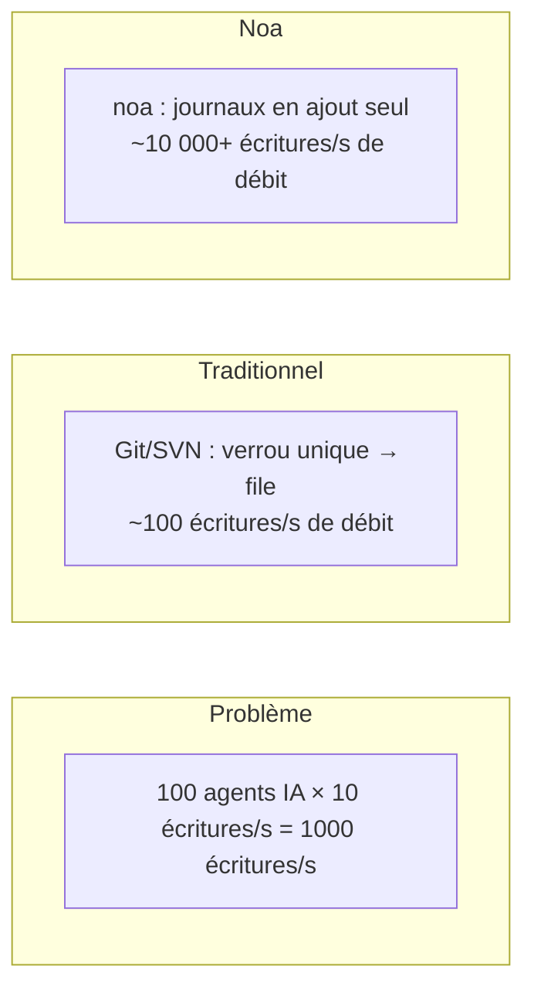
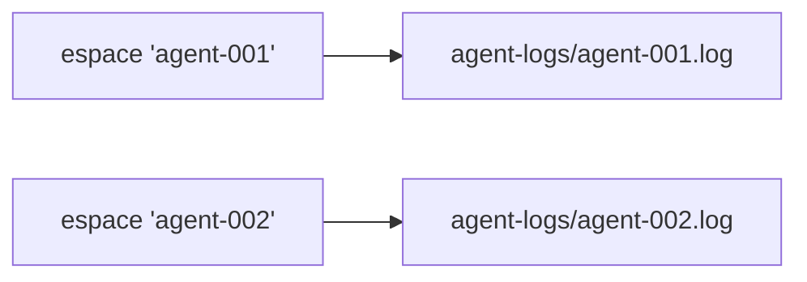
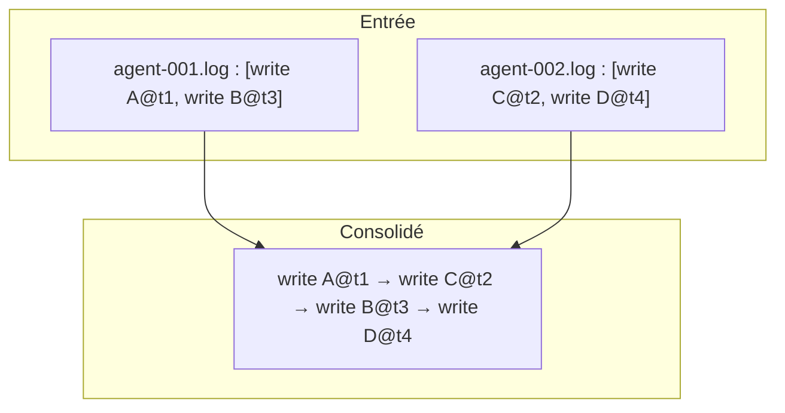
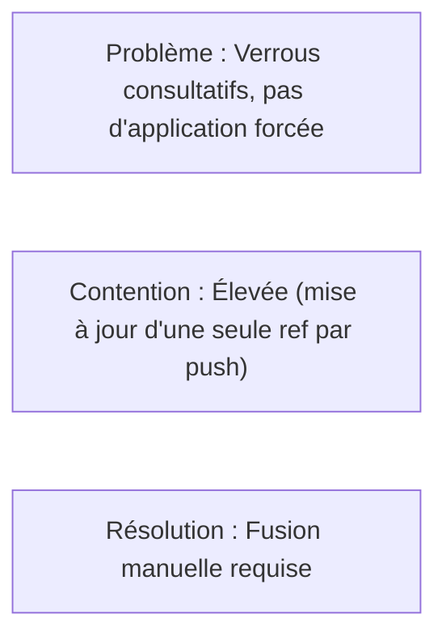
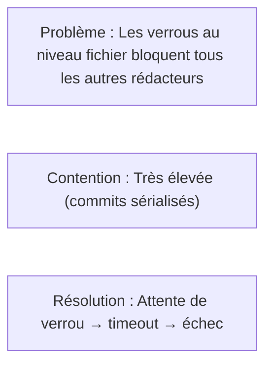
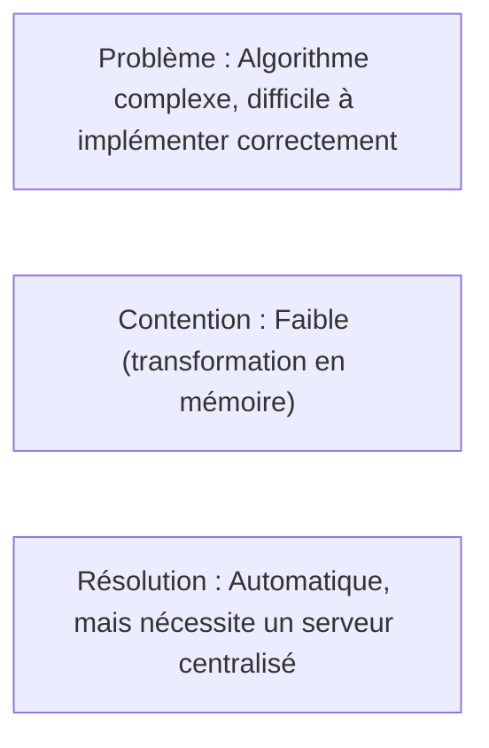
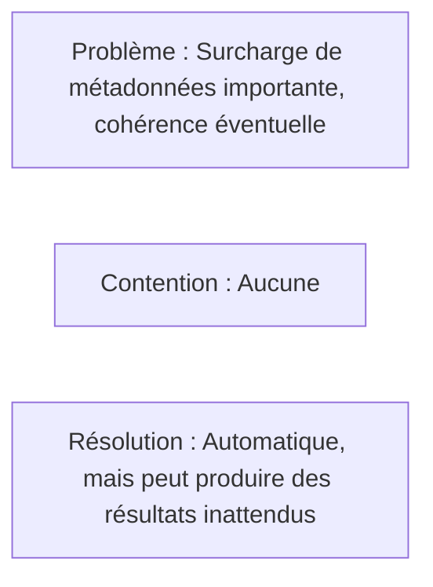
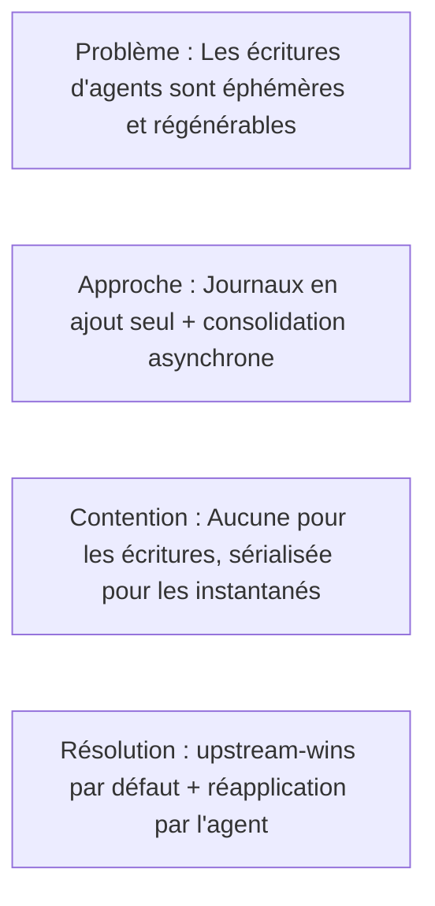

# Conception de la concurrence

## Énoncé du problème

Les systèmes VCS traditionnels sérialisent les écritures via un verrou unique ou une
file d'attente de fusion. Cela fonctionne pour les flux de travail à échelle humaine
(10-100 commits/jour) mais s'effondre avec des agents IA produisant des milliers de
modifications de fichiers par minute.



## Architecture

### Couche 1 : AgentLog (Chemin d'écriture)

Chaque espace de travail possède un fichier JSONL dédié sous `.noa/agent-logs/`.



Les écritures utilisent le drapeau `O_APPEND`, qui fournit :
- **Atomicité** : Le noyau garantit l'atomicité de l'écriture entière pour les ajouts
- **Ordonnancement** : Les écritures sont sérialisées par fichier (par espace de travail)
- **Pas de verrouillage** : Aucun fcntl/flock requis entre différents fichiers

```rust
pub trait AgentLog: Send + Sync {
    async fn append(&self, workspace: &str, entry: &LogEntry) -> Result<()>;
    async fn read_all(&self, workspace: &str) -> Result<Vec<LogEntry>>;
}
```

### Couche 2 : Magasin d'instantanés (Chemin de lecture)

Les instantanés sont stockés dans redb avec MVCC (contrôle de concurrence multi-version) :
- Les écritures sont sérialisées via la transaction d'écrivain unique de redb
- Les lectures ne bloquent jamais les écritures (isolation d'instantané)
- Plusieurs lecteurs peuvent accéder simultanément

### Couche 3 : Consolidation (Chemin de fusion)

Le `Consolidator` lit tous les journaux d'agents à travers les espaces de travail,
trie par horodatage et produit une chaîne d'instantanés unifiée :



Cela s'exécute de manière asynchrone et ne bloque pas les écritures des agents.

## Garanties de concurrence

| Garantie | Mécanisme |
|-----------|-----------|
| Aucune perte de données | O_APPEND + fsync par écriture |
| Ordonnancement par espace | Fichier unique par espace de travail |
| Ordonnancement inter-espaces | Horodatages en microsecondes |
| Cohérence de lecture | Isolation d'instantané MVCC de redb |
| Sécurité de tête d'espace | Mises à jour CAS (compare-and-swap) |

## Analyse de scalabilité

### Mono-processus (Embarqué)

| Agents | 1-100 (même processus) |
| Débit | ~10 000 écritures/s |
| Goulot | E/S disque (fsync par écriture) |

### Multi-processus (noa-server)

| Agents | 100-1000 (processus séparés) |
| Débit | ~5 000 écritures/s |
| Goulot | Sérialisation des écritures côté serveur |

Le serveur détient une seule connexion à la base de données et sérialise les
écritures. Les journaux d'agents restent par fichier pour l'ingestion parallèle.

### Distribué (Backend MinIO)

| Agents | 1000+ |
| Débit | Limite de débit S3 PUT (~3 500/s par préfixe) |
| Goulot | réseau + limites de débit S3 |

## Comparaison avec les alternatives

### Git + Verrouillage de fichiers



### SVN + svn:needs-lock



### Transformation opérationnelle (OT)



### CRDT (Types de données répliqués sans conflit)



### L'approche de noa



## Stratégie fsync

Chaque écriture dans le journal d'agent suit ce modèle :

```rust
file.write_all(data)?;   // ajouter au fichier
file.flush()?;           // vider le tampon utilisateur
file.sync_data()?;       // fsync — garantir la durabilité sur disque
```

Sur Linux, `sync_data()` évite la synchronisation des métadonnées (fdatasync),
réduisant la latence d'environ 30 % par rapport à un fsync complet.

## Futur : Regroupement par lots du journal de pré-écriture

Actuel : un fsync par écriture.
Planifié : regrouper plusieurs écritures en un seul fsync :

```rust
// L'agent met en mémoire tampon les écritures
agent.buffer(write_a);
agent.buffer(write_b);
agent.buffer(write_c);
agent.flush(); // un seul fsync pour les trois
```

Amélioration de débit attendue : 3-5x pour les écritures en rafale.
