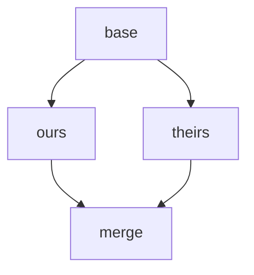
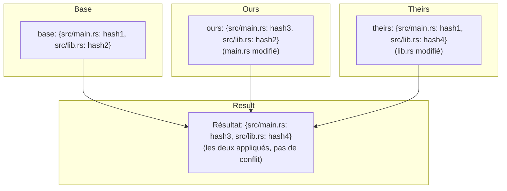
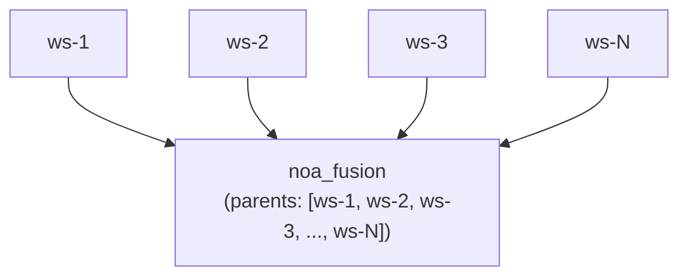
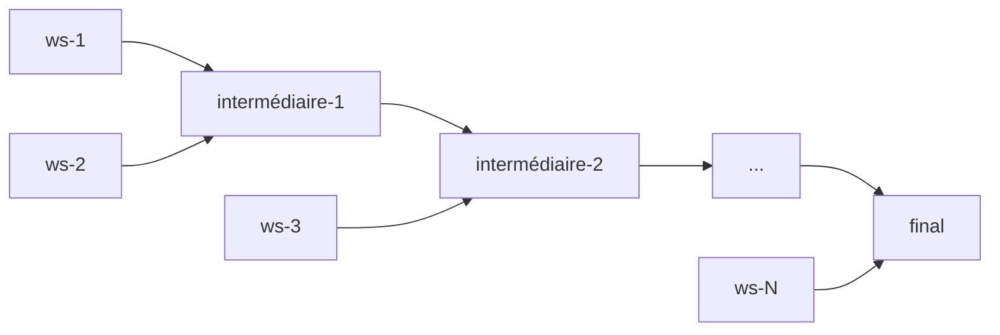

# Conception de la stratégie de fusion

## Aperçu

noa utilise un algorithme de fusion à trois voies avec résolution de conflits
configurable. La conception privilégie le **progrès continu** plutôt que
l'intervention humaine, reflétant le cas d'usage des agents IA où les
modifications peuvent être régénérées.

## Fusion à trois voies

### Algorithme

Étant donnés deux instantanés (le nôtre, le leur) avec un ancêtre commun (base) :



1. Diff `base` vs `ours` → changements_A
2. Diff `base` vs `theirs` → changements_B
3. Pour chaque chemin modifié par l'un ou l'autre :
   - Même changement des deux côtés → appliquer (pas de conflit)
   - Modifié seulement dans A → appliquer A
   - Modifié seulement dans B → appliquer B
   - Modifications différentes sur le même chemin → **conflit**

### Implémentation

```rust
pub fn three_way_merge(
    base_tree: &Vec<TreeEntry>,
    ours_tree: &Vec<TreeEntry>,
    theirs_tree: &Vec<TreeEntry>,
) -> (Vec<TreeEntry>, Vec<Conflict>)
```

Les entrées d'arbre sont normalisées en maps plates chemin→hachage pour la comparaison :



## Détection de conflit

```rust
pub struct Conflict {
    pub path: String,
    pub base_hash: Option<String>,
    pub ours_hash: Option<String>,
    pub theirs_hash: Option<String>,
}
```

Types de conflits :
- **Modifier/Modifier** : Les deux côtés ont modifié différemment le même fichier
- **Ajouter/Ajouter** : Les deux côtés ont ajouté un fichier au même chemin avec un contenu différent
- **Supprimer/Modifier** : Un côté a supprimé, l'autre a modifié

## Stratégies de résolution

### upstream-wins (par défaut)

Lorsqu'un conflit est détecté, prendre la version de leur côté :

```rust
ConflictResolution::UpstreamWins => theirs_hash,
```

Justification : Dans les flux de travail des agents IA, le côté « amont »
(espace de travail main/default) représente l'état canonique. Les agents peuvent
réappliquer leurs modifications par rapport à la base mise à jour.

### ours-wins

Prendre notre version :

```rust
ConflictResolution::OursWins => ours_hash,
```

### fail (planifié)

Abandonner la fusion et retourner les conflits pour résolution manuelle :

```rust
ConflictResolution::Fail => return Err(MergeError::Conflict(conflicts)),
```

## Flux de fusion d'espace de travail

```bash
noa workspace switch default          # définit le nôtre = default
noa workspace merge feature-1         # le leur = feature-1
```

Étapes internes :
1. Charger l'instantané du nôtre (tête de default)
2. Charger l'instantané du leur (tête de feature-1)
3. Trouver la base de fusion (ancêtre commun le plus récent dans le DAG)
4. Si aucun ancêtre commun, utiliser `noa_empty` comme base
5. Effectuer la fusion à trois voies
6. Appliquer la stratégie de résolution de conflit
7. Créer un instantané de fusion avec parents = [le nôtre, le leur]
8. Mettre à jour la tête de default vers l'instantané de fusion

## Fusions multi-parents

Les instantanés noa prennent en charge un nombre illimité de parents, permettant
des fusions de style octopus :



Pour les fusions à N voies, l'algorithme effectue des fusions par paires :



## Comparaison avec la fusion Git

| Aspect | noa | Git |
|--------|-----|-----|
| Algorithme | Trois voies | Trois voies (même algorithme de base) |
| Marqueurs de conflit | Aucun (auto-résolution) | `<<<<<<<` / `=======` / `>>>>>>>` |
| Résolution par défaut | upstream-wins | Aucune (nécessite un humain) |
| Multi-parent | Illimité | Généralement ≤2 |
| Rebase | Non supporté | Supporté |
| Cherry-pick | Non supporté | Supporté |
| Fast-forward | Automatique | Optionnel (–no-ff) |

## Comparaison avec la fusion SVN

| Aspect | noa | SVN |
|--------|-----|-----|
| Suivi de fusion | Intégré (DAG parent) | Manuel (propriétés mergeinfo) |
| Résolution de conflit | Automatique | Manuel (fichiers de conflit) |
| Modèle de branche | Espace de travail (léger) | Basé sur les répertoires (lourd) |
| Direction de fusion | N'importe → n'importe (DAG) | Généralement branche → tronc |

## Justification : Pourquoi l'auto-résolution ?

Les VCS traditionnels nécessitent une résolution humaine des conflits car :
1. Le code écrit par des humains a une signification sémantique que seuls les humains comprennent
2. Les conflits peuvent représenter des désaccords fondamentaux de conception
3. La résolution manuelle garantit l'exactitude

Les modifications des agents IA ont des caractéristiques différentes :
1. **Régénérables** : Les agents peuvent réappliquer leurs modifications par rapport à l'état le plus récent
2. **Haute fréquence** : Mettre en pause pour une résolution humaine bloque tout le travail en aval
3. **Non sémantiques** : Les modifications au niveau des fichiers ne nécessitent pas d'interprétation humaine

Par conséquent, l'auto-résolution avec une politique claire (upstream-wins) est le bon
compromis pour le cas d'usage de noa.
