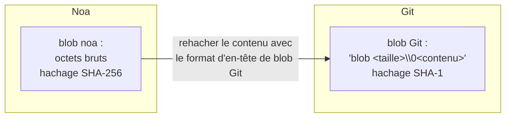
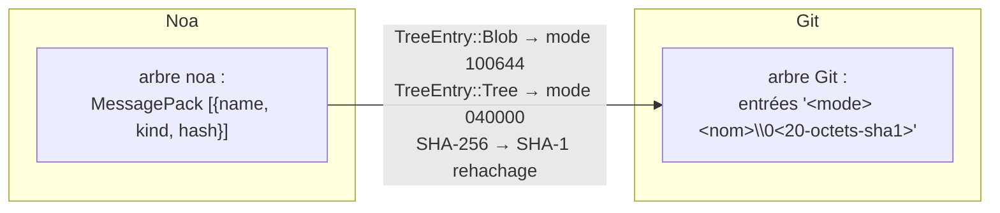
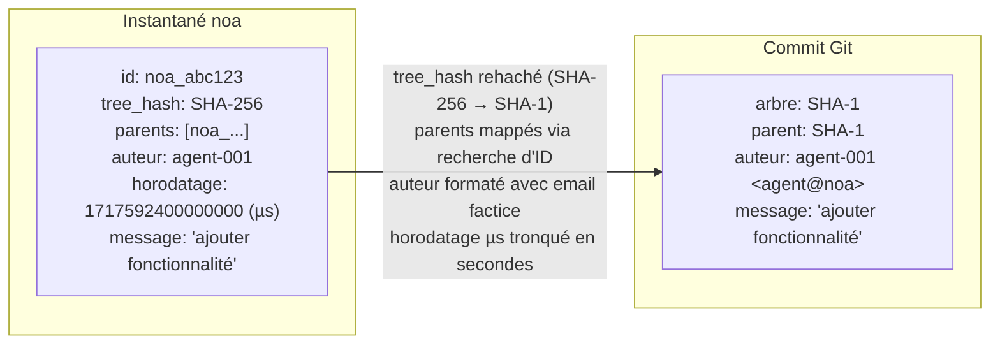
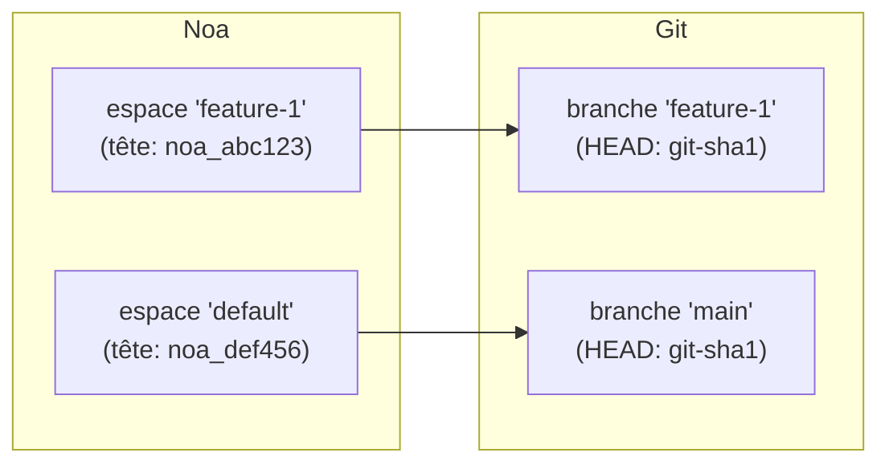
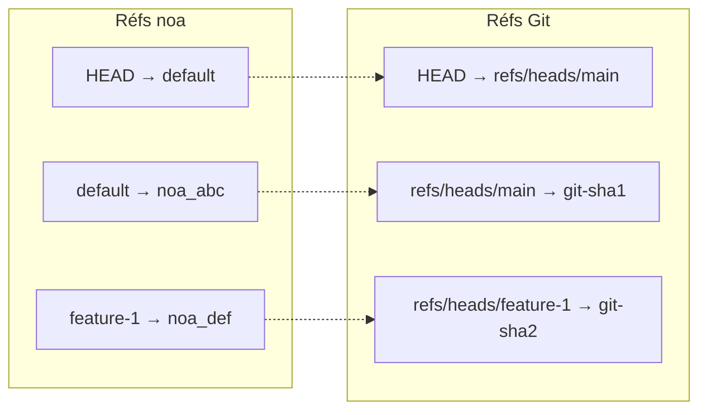
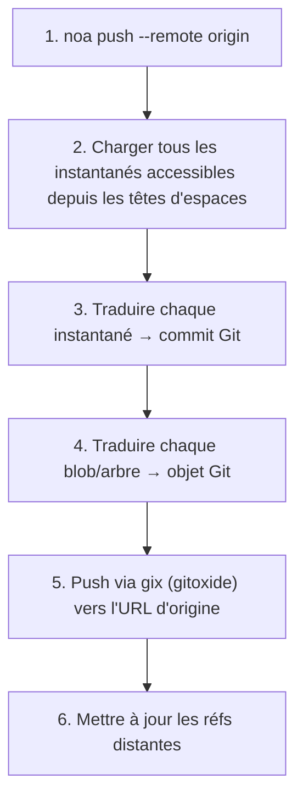
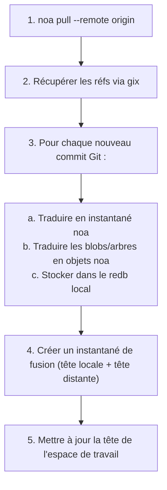
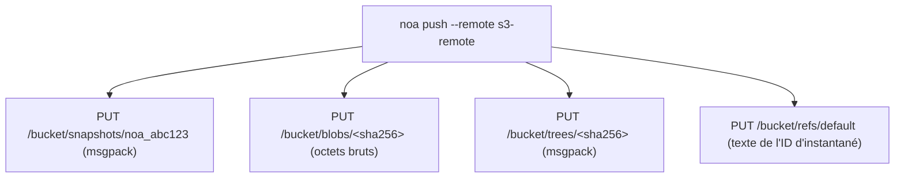

# Conception de l'interopérabilité distante

## Aperçu

noa prend en charge plusieurs backends distants pour synchroniser les instantanés
et les objets entre machines et équipes. La cible d'interopérabilité principale est
Git, permettant une intégration transparente avec les flux de travail existants sur
GitHub, GitLab et Bitbucket.

## Trait de backend distant

```rust
#[async_trait]
pub trait RemoteBackend: Send + Sync {
    async fn push_snapshots(&self, ids: &[SnapshotId]) -> Result<()>;
    async fn fetch_snapshots(&self, ids: &[SnapshotId]) -> Result<Vec<Snapshot>>;
    async fn push_objects(&self, ids: &[String]) -> Result<()>;
    async fn fetch_objects(&self, ids: &[String]) -> Result<()>;
    async fn list_refs(&self) -> Result<HashMap<String, SnapshotId>>;
    async fn update_ref(&self, name: &str, old: Option<&SnapshotId>, new: &SnapshotId) -> Result<()>;
}
```

## Couche de traduction Git

Le `GitTranslator` convertit entre le modèle d'objets de noa et celui de Git :

### Blob ↔ Blob Git



### Arbre ↔ Arbre Git



### Instantané ↔ Commit Git



### Espace de travail ↔ Branche Git



### Mappage des réfs



## Flux Push



## Flux Pull



## Backend MinIO/S3

Pour les déploiements sans infrastructure Git :



Avantages par rapport au distant Git :
- Pas de traduction arbre/Instantané nécessaire (format noa natif)
- Stockage direct des blobs (pas de surcharge de fichier pack)
- Compatible S3 (fonctionne avec AWS, GCS, MinIO, Cloudflare R2)

## Configuration des distants

Stockée dans `.noa/config` (TOML) :

```toml
[[remotes]]
name = "origin"
url = "https://github.com/exemple/repo.git"
backend = "git"

[[remotes]]
name = "s3"
url = "s3://mon-bucket/noa-repo"
backend = "minio"
endpoint = "https://s3.amazonaws.com"
region = "us-east-1"
```

## Authentification

| Backend | Méthode |
|---------|--------|
| Git HTTPS | Identifiants depuis `~/.git-credentials` ou invite |
| Git SSH | Agent SSH ou fichier de clé |
| MinIO/S3 | Clé d'accès + clé secrète (variables d'env ou config) |

## Comparaison : Approches d'interopérabilité distante

| Approche | Utilisée par | Avantages | Inconvénients |
|----------|---------|------|------|
| Pont Git (gix) | noa | Compatibilité universelle | Surcharge de traduction, discordance SHA-1/SHA-256 |
| Protocole natif | Git | Rapide, pas de traduction | Fonctionne uniquement avec Git |
| WebDAV | SVN | Standard HTTP | Limité, spécifique à SVN |
| API REST | Bitbucket | Moderne, flexible | Nécessite un service hébergé |
| Stockage compatible S3 | noa | Évolutif, cloud-native | Pas d'interopérabilité Git sans pont |

noa prend en charge à la fois le pont Git (pour la compatibilité) et le S3 natif
(pour le passage à l'échelle).
