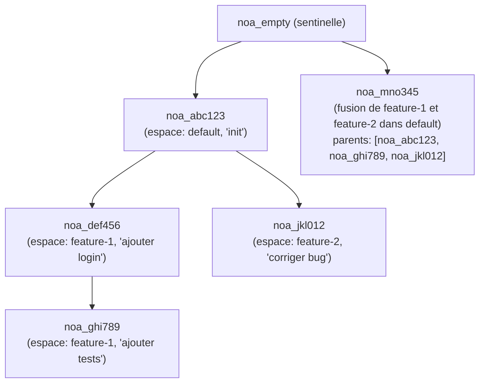
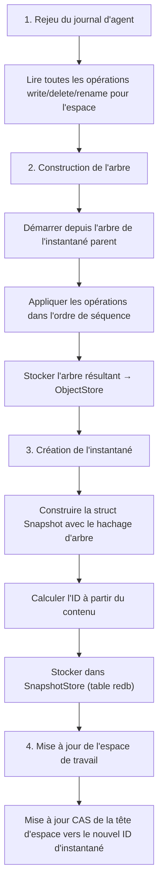

# Conception du modèle d'instantané

## Aperçu

Un instantané est un enregistrement immuable et adressé par contenu de l'état
complet de l'arborescence de fichiers d'un espace de travail à un instant donné.
Les instantanés forment un graphe acyclique orienté (DAG) via les références parentes.

## Structure d'un instantané

```rust
pub struct SnapshotId(pub String);  // "noa_<12-caractères-base62>"

pub struct Snapshot {
    pub id: SnapshotId,
    pub tree_hash: String,           // SHA-256 de l'arbre racine
    pub parents: Vec<SnapshotId>,    // 0-N instantanés parents
    pub workspace: String,           // espace de travail d'origine
    pub author: String,              // identifiant de l'agent ou humain
    pub timestamp: u64,              // microsecondes depuis l'époque
    pub message: String,             // description lisible par un humain
}
```

## Génération d'ID

Les identifiants d'instantané utilisent une chaîne base62 de 12 caractères préfixée
par `noa_` :

```
noa_3kF8x2mP9aB1
```

Génération : `SHA256(tree_hash || parents || workspace || timestamp)[0..9]`
encodé en base62. Cela fournit :
- 62^12 ≈ 3,2 × 10^21 identifiants possibles
- Probabilité de collision effectivement nulle
- Déterministe : mêmes entrées → même ID (permet la déduplication)

## DAG d'instantanés



## Flux de création d'un instantané



## Magasin d'instantanés

Les instantanés sont stockés dans une table redb indexée par ID :

```
Table : snapshots
  Clé :   "noa_abc123" (SnapshotId en &str)
  Valeur : msgpack(Snapshot) en &[u8]
```

## Algorithme de diff

`diff_snapshots(base, other)` produit une liste de modifications au niveau fichier :

```rust
pub struct FileDiff {
    pub path: String,
    pub kind: DiffKind, // Added, Removed, Modified
    pub old_blob: Option<String>,
    pub new_blob: Option<String>,
}
```

Algorithme :
1. Charger les arbres racines pour les deux instantanés
2. Parcourir récursivement les deux arbres simultanément
3. Comparer les hachages de blob à chaque chemin
4. Hachage différent → Modifié ; présent dans un seul → Ajouté/Supprimé

Complexité temporelle : O(n) où n = nombre total de fichiers dans les deux arbres.

## Instantané sentinelle

`noa_empty` est un ID d'instantané réservé représentant un arbre vide. Tous les
nouveaux dépôts commencent avec celui-ci comme base. Il n'est jamais explicitement
stocké — le gestionnaire d'espaces de travail le reconnaît comme « pas encore
d'instantanés ».

## Comparaison avec les commits Git

| Aspect | Instantané noa | Commit Git |
|--------|-------------|------------|
| Format d'ID | `noa_<base62>` | SHA-1 hex |
| Limite de parents | Illimitée (DAG de fusion) | Généralement 1-2 |
| Format d'arbre | MessagePack | Binaire personnalisé |
| Horodatage | Précision en microsecondes | Précision en secondes + fuseau horaire |
| Champ auteur | ID d'agent ou humain | nom + email |
| Immuabilité | Appliquée par le magasin | Appliquée par le hachage |
| Signature GPG | Non supportée | Supportée |
