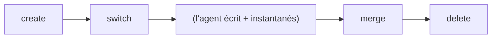

# Conception de l'isolation des espaces de travail

## Aperçu

Les espaces de travail fournissent des contextes de travail isolés pour les agents
et les humains. Chaque espace de travail possède un état indépendant (instantané
de tête, journal d'agent) tout en partageant le magasin d'objets sous-jacent.

## Structure d'un espace de travail

```rust
pub struct Workspace {
    pub name: String,
    pub head: SnapshotId,     // instantané courant
    pub base: SnapshotId,     // point de fork depuis l'espace parent
    pub agent_id: Option<String>,  // agent associé
    pub created_at: u64,
    pub updated_at: u64,
}
```

## Cycle de vie d'un espace de travail



### Création

```bash
noa workspace create feature-1
```

1. Lire l'instantané de tête de l'espace courant → devient `base`
2. Nouvel espace : `head = base` (hérite de l'état courant)
3. Créer le fichier journal d'agent : `agent-logs/feature-1.log`
4. Enregistrer dans le WorkspaceStore

### Changement

```bash
noa workspace switch feature-1
```

1. Vérifier que l'espace de travail existe
2. Écrire le nom de l'espace dans `.noa/HEAD`
3. Sauvegarder l'espace précédent dans `.noa/ORIG_HEAD`

### Fusion

```bash
noa workspace merge feature-1
```

1. Fusion à trois voies : base → nôtre (courant) vs leur (feature-1)
2. Créer un instantané de fusion avec les deux comme parents
3. Mettre à jour la tête de l'espace de travail courant

### Suppression

```bash
noa workspace delete feature-1
```

1. Vérifier que ce n'est pas l'espace de travail actif
2. Supprimer l'entrée de l'espace du magasin
3. Supprimer le fichier journal d'agent
4. Les objets restent (partagés, adressés par contenu)

## Fichier HEAD

`.noa/HEAD` contient le nom de l'espace de travail actif :

```
feature-1
```

`.noa/ORIG_HEAD` contient l'espace de travail précédent (pour annulation) :

```
default
```

## Magasin d'espaces de travail

Les espaces de travail sont stockés dans redb :

```
Table : workspaces
  Clé :   "feature-1" (nom de l'espace en &str)
  Valeur : msgpack(Workspace) en &[u8]
```

Les mises à jour de tête utilisent CAS (compare-and-swap) :

```rust
async fn update_head(&self, name: &str, expected: &SnapshotId, new: &SnapshotId) -> Result<()>
```

Cela empêche les mises à jour perdues lorsque plusieurs processus tentent de modifier
le même espace de travail simultanément.

## Comparaison avec les branches Git

| Aspect | Espace de travail noa | Branche Git |
|--------|---------------|------------|
| Stockage | Entrée de table redb | Fichier ref (`.git/refs/heads/`) |
| Isolation | Fichier journal d'agent dédié | Index + arbre de travail partagés |
| Changement | Écriture atomique de HEAD | Extraction de l'arbre de travail (E/S fichier) |
| Création | O(1) — métadonnées uniquement | O(1) — léger |
| Suppression | Retirer du magasin | Supprimer la ref, élagage optionnel |
| Liaison d'agent | Champ agent_id optionnel | Pas d'équivalent |
| Suivi de base | Champ base explicite | Implicite (base de fusion) |

## Comparaison avec les branches SVN

| Aspect | Espace de travail noa | Branche SVN |
|--------|---------------|------------|
| Stockage | Entrée KV | Copie complète de répertoire |
| Création | O(1) métadonnées | O(n) copie de fichiers |
| Isolation | Logique (objets partagés) | Physique (répertoires séparés) |
| Suivi de fusion | DAG parent | Propriétés svn:mergeinfo |

## Justification de la conception

### Pourquoi des espaces de travail plutôt que des branches ?

1. **Identité d'agent** : Les espaces de travail portent un champ `agent_id` pour l'attribution
2. **Isolation du journal d'agent** : Chaque espace de travail a un fichier journal dédié
3. **Pas d'arbre de travail** : noa ne maintient pas d'extraction — uniquement des instantanés
4. **Base explicite** : Le champ `base` permet un calcul rapide de la base de fusion

### Pourquoi pas d'extraction de l'arbre de travail ?

Les branches Git nécessitent une extraction de l'arbre de travail (E/S fichier pour
chaque fichier changé). Les espaces de travail noa ne changent qu'un pointeur — la
référence du journal d'agent et de l'instantané. C'est O(1) quelle que soit la taille
du dépôt.

La matérialisation des fichiers (extraction) se produit séparément lorsqu'un agent
a besoin de lire ou d'écrire des fichiers réels, en utilisant l'arbre de l'instantané
comme source de vérité.
