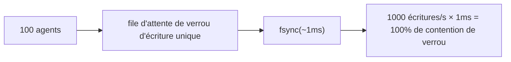
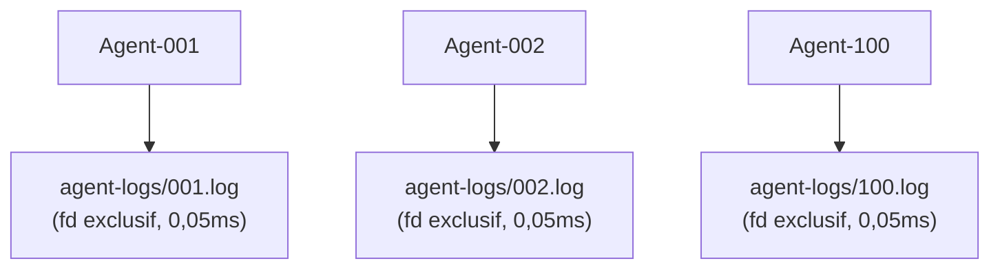

# Modèle de concurrence des agents

## Objectifs de conception

noa prend en charge des dizaines à des centaines d'agents IA écrivant simultanément
avec **zéro contention de verrou**.

## Problème : Goulot d'étranglement de l'écrivain unique

Les bases de données embarquées traditionnelles (y compris redb) utilisent un verrou
d'écriture unique :



## Solution : Journaux d'agent par espace de travail

Chaque espace de travail reçoit son propre fichier JSONL. Les écritures utilisent
`O_APPEND` qui est atomique sur les systèmes POSIX :



Total : 0,05ms par écriture, zéro contention de verrou.

## Format AgentLog

```jsonl
{"seq":1,"op":"write","path":"src/main.rs","blob":"abc123...","ts":1717592400000000}
{"seq":2,"op":"delete","path":"src/old.rs","ts":1717592401000000}
{"seq":3,"op":"rename","from":"src/foo.rs","to":"src/bar.rs","ts":1717592402000000}
{"seq":4,"op":"snapshot","snapshot_id":"noa_z7x9","parent":"noa_y6w8","message":"feat","ts":1717592405000000}
```

- `seq` : compteur monotone par espace de travail
- `ts` : horodatage avec précision en microsecondes
- La consolidation trie globalement par `ts`

## Quand utiliser redb vs AgentLog

| Composant | Stockage | Raison |
|-----------|---------|--------|
| blobs, trees | redb | Adressé par contenu, immuable, lecture intensive |
| snapshots, refs, workspaces | redb | Métadonnées, faible fréquence d'écriture |
| journaux incrémentaux d'agent | Fichier JSONL | Écritures concurrentes à haute fréquence |

## Consolidation

Le `Consolidator` lit tous les journaux d'agents, trie par horodatage et crée une
chaîne d'instantanés unifiée :

```rust
Consolidator::new(&engine)
    .consolidate("default", parent_ids, "agent", "mise à jour par lot")
    .await?;
```

## noa-server pour la concurrence multi-processus

Pour les vrais scénarios multi-processus (plusieurs processus CLI ou agents
distribués), utilisez l'API HTTP de noa-server :

```bash
noa-server  # démarre sur le port 3000

# Les agents interagissent via REST :
POST /api/v1/repo/my-project/blobs
POST /api/v1/repo/my-project/snapshots
POST /api/v1/repo/my-project/agent-log
```

Le serveur détient une seule connexion à la base de données et sérialise les
écritures en interne, tout en gérant les lectures concurrentes via MVCC.
