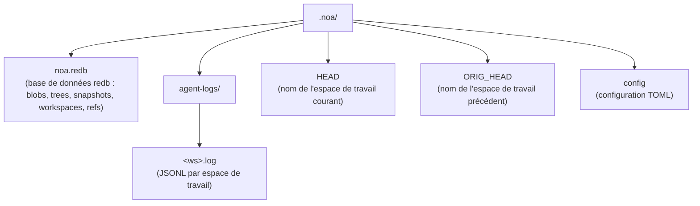
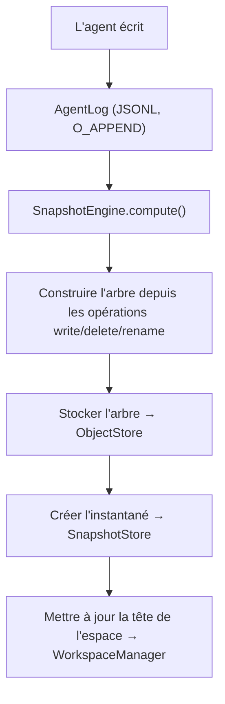

# Architecture

## Composants principaux

### ObjectStore

Stockage adressé par contenu pour les blobs et les arbres. Le contenu est adressé
par hachage SHA-256.

```
BlobId = SHA256(contenu)
TreeId = SHA256(msgpack(TreeEntries))
```

Implémentations :
- **RedbObjectStore** : Stockage local utilisant le magasin KV embarqué redb
- **MinioObjectStore** : Stockage distant utilisant MinIO compatible S3

### AgentLog

Journal en ajout seul par espace de travail pour des écritures concurrentes sans
verrou. Chaque espace de travail reçoit son propre fichier JSONL sous
`.noa/agent-logs/<ws>.log`.

Opérations :
- **write** : Enregistrer une écriture de fichier avec référence de blob
- **delete** : Enregistrer une suppression de fichier
- **rename** : Enregistrer un renommage de fichier
- **snapshot** : Enregistrer une création d'instantané
- **merge** : Enregistrer une fusion depuis un autre espace de travail

### Instantané (Snapshot)

État immuable à un instant T d'un espace de travail. Contient un hachage d'arbre,
des instantanés parents, un auteur et un message.

```
Snapshot = {
    id: "noa_<12-caractères-base62>"
    tree_hash: SHA256 du contenu de l'arbre
    parents: [SnapshotId, ...]
    workspace: nom de l'espace de travail
    author: identifiant de l'agent
    timestamp: précision en microsecondes
    message: description lisible par un humain
}
```

### Espace de travail (Workspace)

Contexte de travail isolé pour un agent. Suit l'instantané de tête et l'instantané
de base.

### RefStore

Pointeurs nommés vers des instantanés avec sémantique compare-and-swap (CAS) pour
des mises à jour concurrentes sûres.

### Moteur de fusion (Merge Engine)

Fusion à trois voies comparant les arbres de base, le nôtre et le leur :
- Même modification des deux côtés → pas de conflit
- Modification d'un seul côté → appliquer
- Modifications différentes sur le même fichier → conflit (défaut : upstream-wins)

## Organisation du stockage



## Flux de données


