# Compilation de noa

## Prérequis

- Rust 1.75+ (stable)
- Python 3.8+ (pour les scripts de build)
- Exécuteur de commandes `just`

## Configuration

```bash
git clone https://github.com/celestia-island/noa.git
cd noa
just init          # récupérer les dépendances Rust
just build-dev     # build de développement
```

## Développement

```bash
just fmt            # formater le code
just clippy         # lint
just test           # exécuter les tests
just check          # vérification de type
```

## Structure du projet

```mermaid
graph TD
    SRC["src/"] --> LIB["lib.rs<br/>(Racine de la bibliothèque)"]
    SRC --> ERR["error.rs<br/>(Types d'erreur)"]
    SRC --> CFG["config.rs<br/>(Configuration)"]
    SRC --> REPO["repo.rs<br/>(Cycle de vie du dépôt)"]
    SRC --> OBJ["object/<br/>(Trait ObjectStore + implémentations)"]
    SRC --> LOG["log/<br/>(Trait AgentLog + implémentations)"]
    SRC --> SNAP["snapshot/<br/>(Moteur d'instantanés)"]
    SRC --> WS["workspace/<br/>(Gestionnaire d'espaces de travail)"]
    SRC --> REFS["refs.rs<br/>(Trait RefStore + impl)"]
    SRC --> MERGE["merge/<br/>(Moteur de fusion)"]
    SRC --> GIT["git/<br/>(Compatibilité Git)"]
    SRC --> REMOTE["remote.rs<br/>(Trait RemoteBackend)"]
    SRC --> CLI["cli/<br/>(Commandes CLI)"]
```


