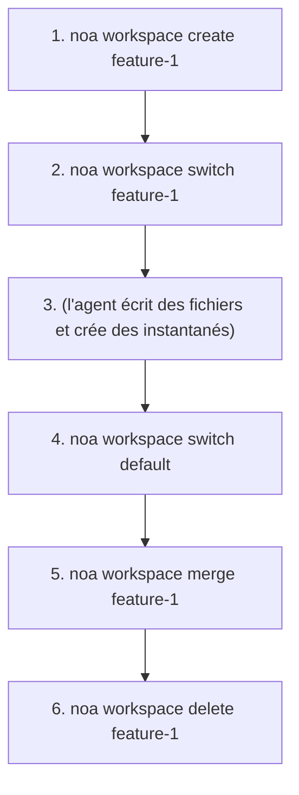
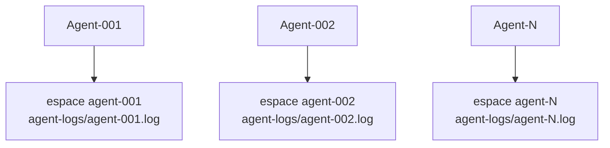

# Guide des espaces de travail

Les espaces de travail sont des contextes de travail isolés, similaires aux branches
Git. Chaque espace de travail possède son propre instantané de tête et son journal
d'agent.

## Création d'espaces de travail

```bash
noa workspace create feature-1
noa workspace create agent-debug --agent bot-42
```

Le drapeau `--agent` associe l'espace de travail à un identifiant d'agent spécifique.

## Changement d'espace de travail

```bash
noa workspace switch feature-1
noa status
# Sur l'espace : feature-1 (tête : noa_abc123)
```

## Liste des espaces de travail

```bash
noa workspace list
#   default             tête : noa_abc123 base : noa_empty
# * feature-1           tête : noa_def456 base : noa_abc123
```

Le marqueur `*` indique l'espace de travail actif.

## Fusion d'espaces de travail

```bash
noa workspace switch default
noa workspace merge feature-1
# Fusionné feature-1 dans default -> noa_ghi789
```

Si des conflits sont détectés :

```
Conflits détectés :
  CONFLIT : src/main.rs
Fusionné feature-1 dans default -> noa_ghi789
```

La stratégie de résolution par défaut est upstream-wins (le leur). Les versions
futures prendront en charge la résolution manuelle des conflits.

## Suppression d'espaces de travail

```bash
noa workspace delete feature-1
# Espace de travail 'feature-1' supprimé
```

Vous ne pouvez pas supprimer l'espace de travail actif.

## Modèle de flux de travail



## Modèle multi-agent

Chaque agent reçoit son propre espace de travail :



Chaque espace de travail possède un journal d'agent indépendant
(`.noa/agent-logs/agent-001.log`), permettant des écritures concurrentes sans verrou.
Une étape de consolidation fusionne tous les journaux par horodatage pour créer un
historique unifié.

> **Note** : redb utilise un verrou de fichier exclusif, donc plusieurs processus CLI
> ne peuvent pas ouvrir la même base de données simultanément. Pour une véritable
> concurrence multi-processus, utilisez l'API HTTP de noa-server.
