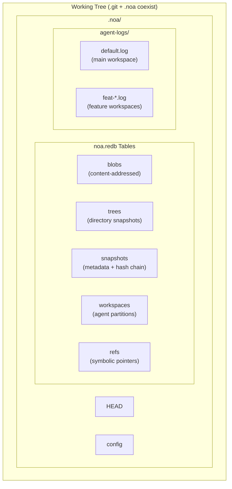
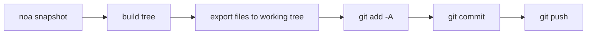
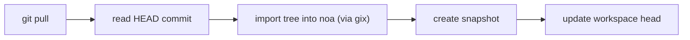
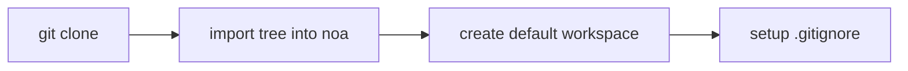

<div align="center"></div>
<h1 align="center">Noa</h1>
<div align="center">
 <strong>AIネイティブな分散バージョン管理システム</strong>
</div>

<br />

<div align="center">
  <a href="https://github.com/celestia-island/noa/actions">
    
  </a>
  <a href="https://github.com/celestia-island/noa/actions">
    
  </a>
  <a href="https://crates.io/crates/libnoa">
    
  </a>
  <a href="https://docs.rs/libnoa">
    
  </a>
  <a href="../../LICENSE">
    
  </a>
  <a href="https://github.com/celestia-island/noa/releases">
    
  </a>
</div>

<div align="center">

**[English](../en/README.md)** &bull; **[简体中文](../zh-hans/README.md)** &bull;
**[繁體中文](../zh-hant/README.md)** &bull; **[日本語]** &bull;
**[한국어](../ko/README.md)** &bull; **[Français](../fr/README.md)** &bull;
**[Español](../es/README.md)** &bull; **[Русский](../ru/README.md)** &bull;
**[العربية](../ar/README.md)**

</div>

noaはAIネイティブな分散バージョン管理システムです。`.git`と共存し、gitはソースコードを管理し、noaはAIエージェントの反復データを管理します。エージェントごとのゼロロックJSONLログ、スナップショットベースの履歴、完全なGitプロトコル互換性を備えています。

## 目次

- [noaの特徴](#noaの特徴)
- [アーキテクチャ](#アーキテクチャ)
- [インストール](#インストール)
- [クイックスタート](#クイックスタート)
- [コマンド](#コマンド)
- [Git統合](#git統合)
- [互換性](#互換性)
- [API (libnoa)](#api-libnoa)
- [ソースからのビルド](#ソースからのビルド)
- [関連プロジェクト](#関連プロジェクト)
- [ライセンス](#ライセンス)

## noaの特徴

従来のgitは、人間もAIもすべての貢献者を同じように扱います。しかし、AIエージェントには根本的に異なるニーズがあります。

| 課題 | Gitの回答 | noaの回答 |
|-----------|-------------|--------------|
| **同時書き込み** | ロックファイル、マージコンフリクト | エージェントごとの追記専用JSONLログ |
| **エージェント識別** | リポジトリごとにuser.name/emailを設定 | ワークスペーススコープのagent_idとエージェントごとのパーティション |
| **部分的な貢献** | 1コミット = ワーキングツリーの全変更 | エージェントが実際に触れたファイルのみをログに記録 |
| **反復追跡** | リベース/スクワッシュで履歴が破壊される | ワークスペースごとの不変スナップショットチェーン |
| **マルチエージェントマージ** | テキストの3方向マージ | スナップショットのマージ、ファイルレベルの競合検出 |
| **Gitプロトコル互換性** | N/A | システムgit CLIブリッジによるclone/push/pull/fetch |

## アーキテクチャ



**コアコンセプト:**

- **ワークスペース**: 1つのエージェントのための独立した線形名前空間。それぞれ独自のJSONLログを持つ。
- **スナップショット**: ワークスペースツリーのある時点の記録（SHA-256コンテンツアドレス型blob + ツリー）。
- **エージェントログ**: 追記専用のJSONLファイルで、blob IDとタイムスタンプを含むアトミックなファイル操作（`write`, `delete`, `rename`）を記録する。
- **マージ**: 共通ベースに対する2つのワークスペーススナップショットの3方向マージ。

## インストール

### GitHub Releasesから

```bash
# お使いのプラットフォーム向けの最新リリースバイナリをダウンロード:
#   https://github.com/celestia-island/noa/releases

chmod +x noa
mv noa /usr/local/bin/
```

### ソースから (Rust 1.85+が必要)

```bash
git clone https://github.com/celestia-island/noa.git
cd noa
cargo build --release
# バイナリ: target/release/noa, target/release/noa-server
```

### ライブラリとして (Cargo)

```toml
[dependencies]
libnoa = { git = "https://github.com/celestia-island/noa" }
```

注意: crates.ioでのパッケージ名は`libnoa`です（`noa`という名前は既に使用されていました）。バイナリ名は引き続き`noa`です。

## クイックスタート

### 既存のgitリポジトリで初期化

```bash
cd my-git-project
noa init                              # .git/の隣に.noa/を作成
noa remote add origin "git@github.com:user/repo.git"
noa pull                              # 現在のgit HEADをnoaにインポート
```

### エージェントワークスペースの作成と反復

```bash
# エージェントAが認証機能に取り組む
noa workspace create feat-auth -a agent-auth
noa workspace switch feat-auth

# エージェントがエージェントログに書き込む
# (AIエージェントはJSONLを直接書き込みます。以下は手動の例です)
cat >> .noa/agent-logs/feat-auth.log << EOF
{"seq":1,"op":"write","path":"src/auth.rs","blob_id":"<sha256>","ts":1717000000000000}
EOF

# ワークスペースの状態を保存
noa snapshot create -m "add auth module" -a agent-auth
```

### 機能のマージとgitとの同期

```bash
noa workspace switch default
noa workspace merge feat-auth          # defaultにマージ
noa push                               # gitコミットとしてエクスポート + git push
```

## コマンド

### ワークスペース管理

```bash
noa workspace create <name> [-a <agent-id>]   # 新しいワークスペースを作成
noa workspace switch <name>                    # アクティブなワークスペースを切り替え
noa workspace list                              # すべてのワークスペースを一覧表示
noa workspace delete <name>                     # ワークスペースを削除
noa workspace merge <from>                      # 別のワークスペースを現在のワークスペースにマージ
```

### スナップショット管理

```bash
noa snapshot create -m <msg> [-a <author>]     # エージェントログからスナップショットを作成
noa snapshot list                               # スナップショットを一覧表示
noa snapshot diff <id-a> <id-b>                # 2つのスナップショットの差分（ファイルレベル）
```

### リモート操作

```bash
noa remote add <name> <url>                     # リモートを追加
noa remote remove <name>                        # リモートを削除
noa remote list                                 # リモートを一覧表示
noa fetch [-r <remote>]                         # リモート参照を一覧表示
noa pull [-r <remote>]                          # Git pull + noaへの再インポート
noa push [-r <remote>]                          # スナップショットのエクスポート → gitコミット → git push
```

### リポジトリ操作

```bash
noa init [-p <path>] [--noa-remote <url>]      # .noa/リポジトリを初期化
noa clone <url> [-p <path>]                     # Gitクローン + noaへのインポート
noa clone --svn <url> [-p <path>]              # SVNエクスポート → git init → noaへのインポート
noa status                                       # 現在のワークスペースの状態を表示
noa log [-w <workspace>] [-n <limit>]          # スナップショット履歴を表示
```

## Git統合

noaはすべてのネットワーク操作にシステムの`git` CLIを使用します。これにより、あらゆるGitリモートとの100%の互換性が保証されます。

### Pushワークフロー



### Pullワークフロー



### Cloneワークフロー



### 主要な設計判断

- **エクスポートは追加的**: noaスナップショット内のファイルのみがワーキングツリーに書き込まれます。スナップショットに含まれない既存のgit追跡ファイルはそのまま残ります。
- **インポートにはgixを使用**: ローカルツリー走査用（ネットワーク不要）。ネットワーク操作にはシステム`git` CLIを使用。
- **`.noa/`は自動でgitignore**: `noa init`は`.noa/`を`.gitignore`に追加し、エージェントデータがgit履歴に漏れないようにします。

## 互換性

### テスト済みプラットフォーム

| プロバイダ | プロトコル | Push | Pull | Clone | LFS |
|----------|----------|------|------|-------|-----|
| **GitHub** | HTTPS, SSH | ✓ | ✓ | ✓ | ✓ |
| **Bitbucket** | HTTPS, SSH | ✓ | ✓ | ✓ | ✓ |
| **GitLab** | HTTPS, SSH | ✓ | ✓ | ✓ | ✓ |
| **ローカルbareリポジトリ** | file:// | ✓ | ✓ | ✓ | ✓ |
| **SVN** | svn:// | インポートのみ | — | `--svn` | — |

### Git LFS

noaはGit LFSリポジトリを自動的に検出します:

- `noa clone`: LFS追跡リポジトリに対して`git lfs install` + `git lfs pull`を実行
- `noa push`: git push後に`git lfs push --all`を実行
- `noa pull`: git pull後に`git lfs pull`を実行
- LFSポインタファイルは通常のblobとしてnoaにインポートされます

### SVN

```bash
noa clone --svn file:///path/to/svn/repo -p ./my-project
```

これは`svn export trunk → git init → noa import`を実行します。これは**1回限りのインポート**です。増分同期には、スケジュールに従って`svn export` + `noa snapshot create`を使用してください。

### Bitbucket

SSH (`git@bitbucket.org:ws/repo.git`) とHTTPS (`https://user@bitbucket.org/ws/repo.git`) の両方のURLが、Gitブリッジを通じてネイティブにサポートされています。

## API (libnoa)

libnoaは、noaの機能を他のツールに組み込むためのRust APIを公開しています:

```rust
use libnoa::repo::Repository;
use libnoa::snapshot::SnapshotEngine;
use libnoa::log::FileAgentLog;

// リポジトリを開く
let repo = Repository::open(&path)?;

// ワークスペースを作成
let ws_mgr = repo.workspace_manager()?;
ws_mgr.create(&Workspace {
    name: "feat-x".into(),
    head: base_snap_id.clone(),
    base: base_snap_id.clone(),
    agent_id: Some("my-agent".into()),
    created_at: now,
    updated_at: now,
}).await?;

// エージェントログからスナップショットを構築
let engine = SnapshotEngine::new(
    FileAgentLog::new(&path, "my-agent")?,
    repo.snapshot_store()?,
    repo.object_store()?,
)
.with_repo_root(repo.root.clone());
let snapshot = engine.compute("feat-x", vec![], "author", "message").await?;

// スナップショットをgitにエクスポート
libnoa::git::export_noa_to_git(&repo.root, repo.db.clone()).await?;
```

より多くの使用例については`tests/smoke.rs`と`tests/compat.rs`を参照してください。

## ソースからのビルド

```bash
# 前提条件: Rust 1.85+, git, pkg-config (LFS/SVN用にオプション)
git clone https://github.com/celestia-island/noa.git
cd noa

# ビルド
cargo build --release
# 出力: target/release/noa (CLI), target/release/noa-server (APIサーバー)

# テストの実行
cargo test -- --test-threads=1

# noaサーバーの起動
NOA_PORT=3000 NOA_DB_PATH=/data/noa/server.redb target/release/noa-server
```

## 関連プロジェクト

| プロジェクト | 関係 |
|---------|-------------|
| [entelecheia](https://github.com/celestia-island/entelecheia) | マルチエージェントオーケストレーションプラットフォーム。エージェントワークスペースのバージョン管理にnoaを使用。 |
| [tairitsu](https://github.com/celestia-island/tairitsu) | WASMコンポーネントモデルフレームワーク。将来: WASMコンポーネントとしてnoaクライアント。 |
| [kirino](https://github.com/celestia-island/kirino) | ゼロトラスト認証/RBAC。noa-serverの認証に使用。 |

## ライセンス

Apache-2.0。[LICENSE](../../LICENSE)を参照してください。
