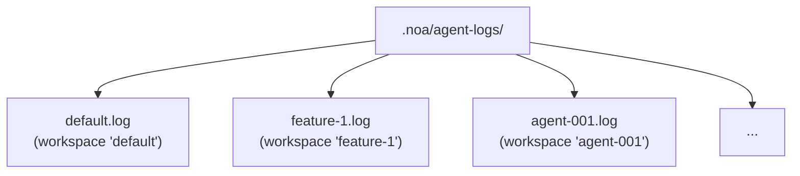
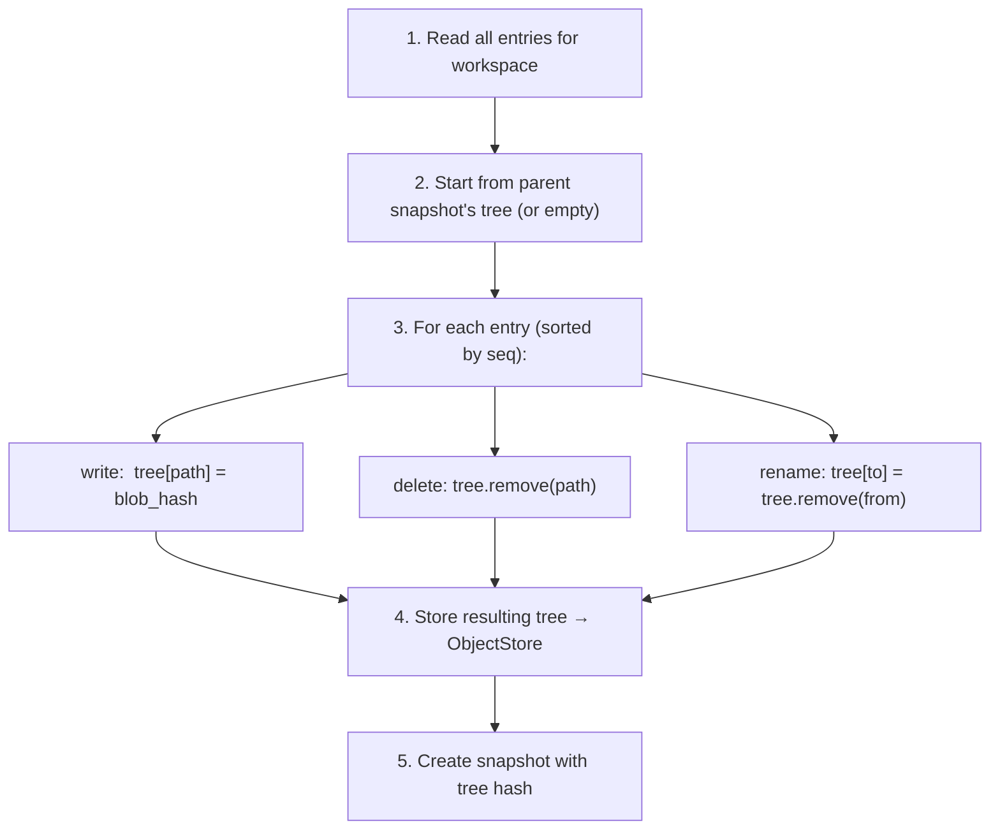
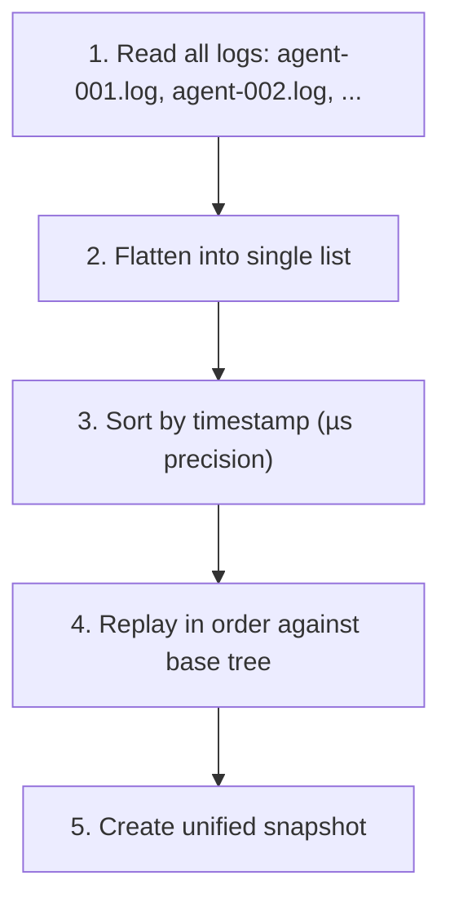

# エージェントログの設計

## 概要

AgentLogはnoaの高スループット書き込みレイヤーです。各ワークスペースに追記専用のJSONLファイルを提供し、複数のAIエージェントからのゼロロック同時書き込みを可能にします。

## ログエントリ形式

各行はJSONオブジェクトです:

```jsonl
{"seq":1,"op":"write","path":"src/main.rs","blob":"a1b2c3...","ts":1717592400000000}
{"seq":2,"op":"delete","path":"src/old.rs","ts":1717592401000000}
{"seq":3,"op":"rename","from":"src/foo.rs","to":"src/bar.rs","ts":1717592402000000}
{"seq":4,"op":"snapshot","snapshot_id":"noa_z7x9","parent":"noa_y6w8","message":"feat","ts":1717592405000000}
{"seq":5,"op":"merge","from_workspace":"feature-1","from_snapshot":"noa_abc","base":"noa_def","ts":1717592408000000}
```

### フィールド

| フィールド | 型 | 説明 |
|-------|------|-------------|
| `seq` | u64 | ワークスペースごとの単調増加シーケンス番号 |
| `op` | string | 操作タイプ: write, delete, rename, snapshot, merge |
| `path` | string | 対象ファイルパス (write, delete) |
| `blob` | string | Blobハッシュ (write) |
| `from` | string | ソースパス (rename) |
| `to` | string | 宛先パス (rename) |
| `ts` | u64 | マイクロ秒精度のUnixタイムスタンプ |

## ファイル構造



各ワークスペースには正確に1つのログファイルがあります。ファイル名はワークスペース名と一致します。

## 書き込みパス

```rust
async fn append(&self, workspace: &str, entry: &LogEntry) -> Result<()> {
    let file = self.get_or_create_file(workspace)?;
    let line = serde_json::to_string(entry)? + "\n";
    file.write_all(line.as_bytes())?;
    file.sync_data()?;  // 永続性のためのfdatasync
    Ok(())
}
```

主な特性:
- **O_APPEND**: カーネルがアトミックな追記を保証
- **書き込みごとのfsync**: クラッシュ後の永続性を保証
- **ワークスペースごとに1つのfd**: パフォーマンスのためにメモリにキャッシュ

## 読み取りパス

```rust
async fn read_all(&self, workspace: &str) -> Result<Vec<LogEntry>> {
    let path = self.log_dir.join(format!("{}.log", workspace));
    let content = tokio::fs::read_to_string(&path).await?;
    content.lines()
        .filter(|l| !l.is_empty())
        .map(|l| serde_json::from_str(l))
        .collect::<Result<Vec<_>, _>>()
        .map_err(|e| NoaError::Serialization(e.to_string()))
}
```

## スナップショット計算

`SnapshotEngine`はログエントリを再生してツリーを構築します:



## 統合

複数のエージェントログをマージする必要がある場合:



## 比較: なぜ〜ではないのか

### エージェントログにSQLite?

- **書き込み増幅**: 逐次追記にSQLite B-tree更新
- **ロック**: SQLiteはWALロックを使用 (シングルライター)
- **fsyncオーバーヘッド**: SQLiteはトランザクションごとに複数のfsyncを発行
- **過剰**: エージェントログは追記専用 — ランダム読み取りや更新がない

### エージェントログにredb?

- **シングルライター**: redbのMVCCは書き込みトランザクションが必要
- **競合**: 複数のエージェントが同じDBに書き込む → 直列化
- **追記最適化なし**: redbは汎用KVストア

### インメモリバッファ?

- **永続性**: プロセスクラッシュでバッファリングされた書き込みがすべて失われる
- **メモリ負荷**: 100エージェント × 1000書き込み = メモリ内に100Kエントリ
- **複雑さ**: クラッシュリカバリ付きのバックグラウンドフラッシュスレッドが必要

### O_APPEND付きプレーンJSONL?

✅ これがnoaの採用する方式です:
- **最小オーバーヘッド**: エントリごとに1書き込み + 1 fsync
- **カーネル保証のアトミック性**: POSIX上のO_APPEND
- **クラッシュリカバリ**: 最後のエントリのみが部分的である可能性 (末尾の改行で検出)
- **人間可読**: JSONLは標準ツールで検査可能
- **ロック競合ゼロ**: ワークスペースごとに1ファイル

## パフォーマンス

ベンチマーク (ext4, SSD, Linux):

| 指標 | 値 |
|--------|-------|
| 単一書き込みレイテンシ | ~0.05ms (追記 + fdatasync) |
| スループット (1ワークスペース) | ~20,000 書き込み/秒 |
| スループット (100ワークスペース) | ~10,000+ 書き込み/秒 |
| 100万エントリあたりのファイルサイズ | ~200MB (平均200バイト/エントリ) |

## クラッシュリカバリ

起動時に、各ログファイルをスキャン:
1. すべての完全な行を読み取り (`\n`で終わる)
2. 切り捨てられた場合、最後の行を破棄 (不完全な書き込み)
3. `seq`が単調増加していることを検証
4. 有効なエントリからインメモリ状態を再構築

これにより、部分的または破損したエントリがスナップショット計算に使用されないことを保証します。
