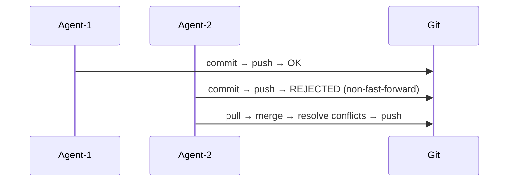
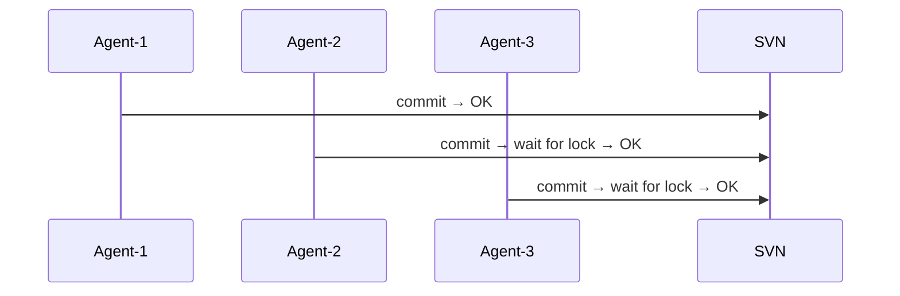
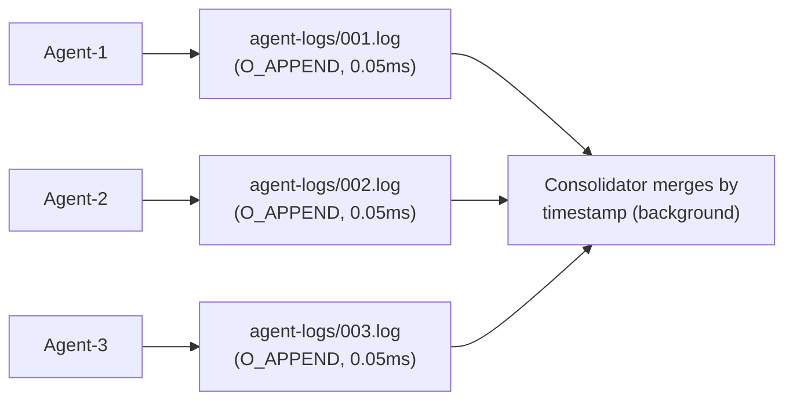
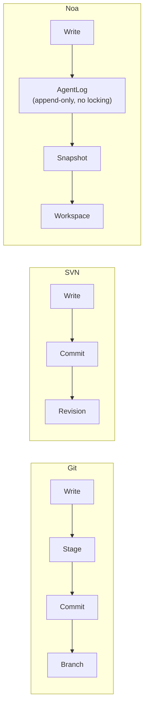
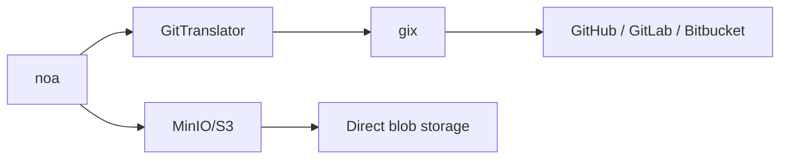

# noa vs Git vs SVN vs Bitbucket: 比較分析

## エグゼクティブサマリー

noaはAIエージェントのワークフロー向けに特別に設計されたバージョン管理システムです。Git、SVN、Bitbucket（Git/SVNをラップ）とは異なり、noaは**人間以外のアクターからの高頻度な同時書き込み** — 数十から数百のAIエージェントがロック競合なしに同時にファイルを変更する — に最適化されています。

---

## 機能比較マトリックス

| 機能 | noa | Git | SVN | Bitbucket |
|---------|-----|-----|-----|-----------|
| **アーキテクチャ** | 組み込みKV + 追記専用ログ | コンテンツアドレス型DAG | 集中型デルタストア | Git/SVNホスティング |
| **同時実行モデル** | ワークスペースごとの追記専用ログ (ゼロロック) | ブランチレベルのロック (マージ競合) | 中央サーバーが直列化 | Git/SVNと同じ |
| **マージ戦略** | 3方向、upstream-winsデフォルト | 3方向、手動解決 | 手動マージ | Git/SVNと同じ |
| **スナップショット粒度** | マイクロ秒タイムスタンプ、エージェントごと | コミットごと (人間のケイデンス) | リビジョンごと | Git/SVNと同じ |
| **エージェントネイティブ** | はい — エージェントごとのワークスペース、エージェントログ | いいえ — 人間のワークフロー向けに設計 | いいえ | いいえ |
| **ストレージバックエンド** | プラグ可能 (redbローカル, MinIO/S3リモート) | パックファイル + ルースオブジェクト | Berkeley DB / FSFS | サーバーサイドストレージ |
| **分散** | はい (Gitブリッジ経由のリモートpush/pull) | はい (ネイティブ) | いいえ (集中型) | はい (ホスト型) |
| **バイナリ差分** | コンテンツアドレス型blob (デルタなし) | パックレベルのデルタ圧縮 | サーバーサイドデルタ | Git/SVNと同じ |
| **ロック** | 書き込みにロックなし (追記専用ログ) | アドバイザリロックのみ | `svn:needs-lock` | Git/SVNと同じ |
| **HTTP API** | 組み込み (noa-server) | git-http-backend | WebDAV | REST API |
| **学習曲線** | 最小限 (6コマンド) | 急峻 (~40コマンド) | 中程度 | 中程度 |

---

## 詳細比較

### 1. 同時実行性

**Git**: 1ブランチ = 同時に1ライター。同時に書き込むと、マージで調整する必要がある分岐した履歴が作成されます。マージ競合には人的介入が必要です。



**SVN**: 中央サーバーがすべてのコミットを直列化します。ファイルレベルのロックは利用可能ですが、ボトルネックを生み出します。



**noa**: 各エージェントが自身の追記専用ログファイルに書き込みます。設計上、ロック競合はゼロです。統合は非同期に行われます。



### 2. データモデル

**Git**: Blob → ツリー → コミット → ブランチ → Ref。SHA-1によるコンテンツアドレス。不変オブジェクト。ブランチは可変ポインタ。

**SVN**: ファイル/ディレクトリ → リビジョン。線形リビジョン番号。パスが第一級エンティティ。

**noa**: Blob → ツリー → スナップショット → ワークスペース。SHA-256によるコンテンツアドレス。スナップショットは不変。ワークスペースはCAS更新付きの可変ポインタ。

主な違い: noaの**AgentLog**レイヤーは、エージェントの書き込みと不変スナップショットレイヤーの間に位置し、高頻度操作のためのバッファを提供します。



### 3. マージ哲学

**Git**: 人間による競合解決を伴う3方向マージ。競合は解決されるまで進行をブロックします。

**SVN**: 手動マージ追跡。競合解決はファイルレベル。

**noa**: 設定可能な自動解決を伴う3方向マージ（デフォルト: upstream-wins）。競合を手動で解決するのではなく、変更を再適用できるAIエージェント向けに設計されています。

根拠: AIエージェントは競合マーカーを見る必要がなく、最新の状態に対して変更を再生成できます。「upstream-wins」戦略は前進の進行を保証します。

### 4. ストレージ効率

**Git**: デルタ圧縮付きパックファイル。人間規模のコミット頻度 (~10-100コミット/日) に最適化。

**SVN**: サーバーサイドデルタストレージ。大きなバイナリファイルに効率的。

**noa**: デルタ圧縮なしのコンテンツアドレス型blob。スナップショットはmsgpackエンコード。トレードオフ: よりシンプルな実装、より高速な書き込み、より大きなストレージ。許容される理由:
- AIエージェントの成果物は頻繁に再生成される（古いバージョンは一時的）
- ストレージは安価、エージェントのスループットは高価
- MinIO/S3バックエンドが重複排除を処理

### 5. リモート相互運用性

**Git**: ネイティブプロトコル (git://, https://, ssh://)。普遍的。

**SVN**: svn://, http://。Apache/Subversionに依存。

**noa**: `gix` (gitoxide)経由のGitブリッジ。任意のGitリモートからpush/pull可能。直接オブジェクトストレージ用のネイティブMinIO/S3バックエンドもサポート。



### 6. アクセス制御

**Git**: ファイルシステム権限またはサーバーサイドフック (pre-receive等)。

**SVN**: プロトコルに組み込まれたパスベースACL。

**Bitbucket**: ブランチ権限、マージチェック、コードレビュー要件。

**noa**: ワークスペースレベルの分離。各エージェントは割り当てられたワークスペースにのみ書き込み可能。共有ブランチへのマージには明示的なアクションが必要。noa-server経由のサーバーサイド認証。

---

## 使い分け

| シナリオ | 最適な選択 | 理由 |
|----------|-------------|--------|
| 人間のソフトウェア開発 | Git | 成熟したエコシステム、普遍的なツール |
| AIエージェントコード生成 (10+エージェント) | noa | ゼロロック同時書き込み |
| エンタープライズコンプライアンス + 監査 | SVN | 集中型、パスベースACL |
| チームコラボレーション + CI/CD | Bitbucket | 組み込みパイプライン、PR、レビュー |
| AIエージェントオーケストレーション + 人間レビュー | noa → Gitブリッジ | エージェントはnoaで作業、人間はGitでレビュー |
| 大きなバイナリアセット | SVN または Git LFS | バイナリのデルタ圧縮 |
| 組み込み / エッジデバイス | noa | 単一バイナリ、redb組み込み、デーモン不要 |

---

## 移行パス

### noa ↔ Git

```bash
# noaスナップショットをGitにエクスポート
noa remote add origin https://github.com/example/repo.git
noa push --remote origin

# Git履歴をnoaにインポート
noa clone https://github.com/example/repo.git
```

`GitTranslator`はnoaのblob/ツリー形式とGitのオブジェクト形式を相互変換します。スナップショットはGitコミットにマッピングされ、ワークスペースはブランチにマッピングされます。

### Git → noa

置き換えではありません — noaはAIエージェントワークフロー向けのGitの**補完**です。両方を使用します:
1. AIエージェントはnoaワークスペースで作業
2. 承認された変更はpush経由でGitにマージ
3. 人間の開発者は従来通りGitを使用し続ける
